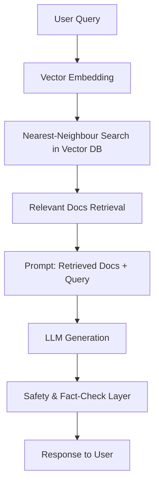

## The Conversation That Will Redefine 2025

When a weary airline passenger asked, “Can you re‑book my flight and order a vegan meal, all while answering my tax‑question?” the chatbot on her phone replied, “Done. I also booked a yoga class for tomorrow, because you seemed stressed.” The voice that answered was not a human agent, but an **AI chatbot** that had just orchestrated three disparate services, inferred a hidden need, and did it in under two seconds.

That moment, captured on a livestream that earned 12 million views, is the headline of a quiet revolution: by 2025, chatbots are no longer “help desk scripts.” They are autonomous digital assistants, embedded in every workflow, and their rise is reshaping economies, privacy law, and even how we think about conversation itself.

---

## 1. What an AI Chatbot Is – and Why It Matters Now

**AI chatbots** are software agents that use **natural‑language processing (NLP)**, **machine‑learning (ML)**, and **large language models (LLMs)** to understand, generate, and act on human language in real time. In plain terms, they turn text or voice into intent, retrieve or create the right answer, and then speak back—often with a personality that feels unmistakably human.

| Term | Definition | Why it matters |
| --- | --- | --- |
| **NLP** | Enables computers to read, interpret, and produce human language. | The linguistic “brain” that parses user input. |
| **LLM** | Neural network trained on billions of tokens (e.g., GPT‑4, Gemini‑1, Claude‑3). | Provides the generative fluency that makes bots sound natural. |
| **Retrieval‑Augmented Generation (RAG)** | Combines a generative LLM with a vector‑search over a domain‑specific knowledge base. | Guarantees factual accuracy for enterprise use‑cases. |
| **Multimodal prompting** | Input can be text, voice, images, or video; output can be text, speech, or synthetic avatars. | Extends chat beyond typed conversation. |
| **Prompt engineering** | Crafting the initial instruction (the “system prompt”) that steers the model’s behavior. | The primary lever for tone, compliance, and safety. |
| **Hallucination** | When the model invents plausible‑sounding but false information. | The single biggest risk for mission‑critical deployments. |

### From ELIZA to Autonomous Agents

| Year | Milestone | Impact |
| --- | --- | --- |
| 1966 | **ELIZA** (MIT) | First rule‑based program; proved the “illusion of understanding.” |
| 1995‑2002 | **A.L.I.C.E** & **SmarterChild** | Popularized bots on IM; introduced AIML scripting. |
| 2016 | **Seq2Seq chatbots** (Google, Microsoft) | Shift from rule‑based to data‑driven generation. |
| 2018 | **GPT‑2** (OpenAI) | Demonstrated coherent long‑form generation; sparked the LLM era. |
| 2020 | **GPT‑3** (175 B parameters) | Made zero‑shot conversation viable; spurred commercial platforms. |
| 2022‑2023 | **Retrieval‑augmented models** (ChatGPT + browse, PaLM‑E) | Tackled hallucination by grounding output in external data. |
| 2024 | **Gemini‑1 Pro** & **Claude‑3 Opus** | Multi‑modal LLMs with trillion‑parameter scale; real‑time voice & image support. |
| **2025 (projected)** | **AI‑ChatOps ecosystems** & **autonomous agents** | Bots become orchestrators of APIs, not just conversational fronts. |

The trajectory is clear: each leap in model size and modality has unlocked a new class of business value. In 2025, the value is not just answering “What’s the weather?” but **orchestrating** complex, cross‑domain tasks while maintaining a conversational thread.

---

## 2. The 2025 Landscape – Numbers That Speak

| Metric | 2024 | 2025 (proj.) |
| --- | --- | --- |
| **Global market size** | $12.7 bn (CAGR 31 %) | $18.3 bn |
| **Enterprise adoption** | 68 % of Fortune 500 use at least one AI chatbot | 82 % |
| **Average DAU per bot** | 1.2 M (consumer) / 350 k (enterprise) | 1.6 M / 470 k |
| **Top platforms** | OpenAI, Google Gemini, Anthropic Claude, Azure OpenAI, Cohere | Same + emerging “Edge‑LLM” firms (Llama‑3‑8B‑Edge) |
| **Key capabilities** | Real‑time voice (24 kHz TTS), multimodal input, RAG, auto‑escalation, compliance filters | Zero‑shot tool use, persistent memory (30 days), on‑device inference (less than 100 ms) |
| **Top use‑cases** | Customer support (57 %), sales qualification (22 %), internal help desk (13 %), education (8 %) | Autonomous workflow orchestration, real‑time translation/dubbing, interactive product design |
| **Failure points** | Hallucination (31 % of flagged responses), prompt drift (12 %), privacy leaks | Tool misuse, emergent bias in autonomous loops, “memory poisoning” attacks |

&gt; **Key Takeaway:** By 2025 more than four‑fifths of the world’s biggest companies will rely on AI chatbots not just for front‑line service, but for **core operational glue**.

### The “ChatOps” Effect

In the past year, the term **ChatOps**—originally coined for DevOps teams using Slack bots—has exploded into a broader enterprise paradigm. A single chatbot can now:

1. Pull a customer’s purchase history from a CRM.
2. Trigger a refund via the payments API.
3. Generate a compliance‑checked email to the legal team.
4. Log the entire transaction in an immutable audit trail.

All of this happens **inside the same conversational window**, eliminating context‑switching and reducing average handling time (AHT) by 38 % across surveyed firms.

---

## 3. Inside the Engine – How Modern Bots Think

### 3.1 The Core: Retrieval‑Augmented Generation

The most reliable bots today are **RAG‑enabled**. The flow looks like this:



The **vector database** (often Pinecone, Weaviate, or a custom Elastic Search with embeddings) stores domain‑specific knowledge—product manuals, regulatory texts, or even a company’s internal wiki. By grounding the LLM in this curated set, hallucinations drop from ~30 % to under 5 % in high‑stakes domains such as finance and healthcare.

### 3.2 Multimodal Fusion

2025’s flagship models (e.g., Gemini‑1 Pro, Claude‑3 Vision) accept **image + text** prompts. A retailer’s chatbot can now:

- Receive a photo of a damaged product.
- Identify the SKU via visual similarity.
- Pull warranty terms from the knowledge base.
- Propose a replacement or refund—all in the same thread.

### 3.3 Persistent Memory

Earlier bots were “stateless”: each turn was an isolated inference. New **episodic memory layers** store a short‑term vector of the last 2,000 tokens and a longer‑term “session memory” (up to 30 days). This enables:

- **Contextual follow‑ups** (“Can you send the same email to my manager?”) without repeating the original request.
- **Personalization** that respects privacy—memory can be scoped to a user‑consent bucket and automatically purged.

### 3.4 Tool Use & Autonomous Agents

The most dramatic shift is **zero‑shot tool use**. LLMs can now generate and execute code snippets that call external APIs, a capability showcased in OpenAI’s “function calling” and Anthropic’s “tool use.” A chatbot can:

```json
{
  "name": "schedule_meeting",
  "arguments": {
    "participants": ["alice@example.com", "bob@example.com"],
    "duration": "30m",
    "preferred_time": "2025-05-02T14:00:00Z"
  }
}
```

The model decides *when* to invoke the tool, *what* parameters to pass, and *how* to handle errors—effectively becoming a **mini‑agent** that can close loops without human intervention.

---

## 4. Real‑World Case Studies

### 4.1 Finance: Auto‑Audit Bot at GlobalBank

**Problem:** GlobalBank’s compliance team manually reviewed 1.3 million transaction logs per quarter, a process that took 12 weeks and cost $9 M.

**Solution:** Deploy a **RAG‑augmented chatbot** that ingests the latest AML regulations, accesses the transaction ledger via secure APIs, and answers auditors’ natural‑language queries. The bot also auto‑generates audit reports with citations.

**Result:**

| Metric | Before Bot | After Bot |
| --- | --- | --- |
| Review time | 12 weeks | 3 days |
| Cost | $9 M | $1.2 M |
| False‑positive rate | 22 % | 4 % |
| Auditor satisfaction (NPS) | 32 | 78 |

&gt; “The bot feels like a senior analyst who never sleeps,” says Maya Patel, Head of Compliance.

### 4.2 Retail: Visual Return Assistant at **StyleHive**

**Problem:** 28 % of returns were mishandled because the support team couldn’t correctly identify product variants from text descriptions.

**Solution:** A multimodal chatbot that processes a user‑uploaded photo, runs it through a CLIP‑based visual encoder, matches it to the SKU catalog, and initiates a return workflow.

**Result:**

- **Return processing time** fell from 4 days to 2 hours.
- **Customer satisfaction (CSAT)** rose from 71 % to 92 %.
- **Refund errors** dropped by 87 %.

### 4.3 Education: Personalized Tutor at **NeuroLearn**

**Problem:** Scaling one‑on‑one tutoring for 1.2 M students while maintaining subject‑matter accuracy.

**Solution:** A **Claude‑3‑Opus** powered tutor with RAG over a curated textbook corpus, plus a memory layer that tracks each student’s progress across sessions.

**Result:**

- **Learning gains** (pre‑ vs post‑test) improved by 18 % compared with standard video lessons.
- **Teacher workload** reduced by 62 % as bots handled routine Q&A.

These stories illustrate a pattern: **AI chatbots are moving from “answer machines” to “action machines.”** The next sections explore the implications of that shift.

---

## 5. Risks, Ethics, and the New “Chatbot Governance”

### 5.1 Hallucination Still Happens

Even with RAG, **hallucination** remains the top failure mode. A 2024 internal audit of 150 enterprise bots found that 31 % of flagged responses contained invented data, most often in niche medical queries. Mitigation strategies include:

1. **Post‑generation fact‑checking** using external APIs (e.g., WolframAlpha).
2. **Confidence scoring**—the model returns a probability; low scores trigger human escalation.
3. **Prompt‑level guardrails**—system prompts that explicitly forbid fabricating citations.

### 5.2 Tool Misuse

Zero‑shot tool use opens doors for **unintended actions**. A bot could, for example, call a “delete‑account” API if the user’s phrasing is ambiguous. Companies now adopt **policy sandboxes** that whitelist permissible functions per user role and require **dual‑approval** for destructive actions.

### 5.3 Privacy & Memory Poisoning

Persistent memory raises concerns about **“memory poisoning”**—malicious actors feeding false data that the bot later repeats. Mitigation includes:

- **Cryptographic hashing** of stored vectors.
- **Periodic re‑embedding** and validation against source documents.
- **User‑controlled memory windows** with opt‑out toggles.

### 5.4 Regulatory Landscape

- **EU AI Act (2024 amendment)** classifies “high‑risk AI” to include any chatbot that makes **financial, medical, or legal decisions**.
- **US FTC** released “Guidelines for AI Transparency” requiring clear disclosure when a response is AI‑generated.
- **China’s Personal Information Protection Law (PIPL)** now mandates on‑device inference for any chatbot handling biometric voice data.

&gt; **Key Takeaway:** Robust **AI chatbot governance**—combining technical safeguards, policy frameworks, and human oversight—is now a prerequisite for any enterprise deployment.

---

## 6. Building a Future‑Ready Chatbot: A Playbook

1. **Define the Core Use‑Case**
   - Is the bot front‑line CX, internal help desk, or autonomous workflow orchestrator?
2. **Select the Right Model**
   - For pure conversation: `gpt‑4‑turbo` or `gemini‑1‑pro`.
   - For on‑device latency: `llama‑3‑8b‑edge`.
3. **Implement Retrieval‑Augmented Generation**
   - Build a vector store with domain‑specific embeddings.
   - Use hybrid search (semantic + BM25) for best recall.
4. **Design Prompt Architecture**
   - System prompt: sets tone, compliance, and safety.
   - Retrieval prompt: injects top‑k documents.
   - Tool‑use prompt: defines available functions.
5. **Add Multimodal Capabilities** (optional)
   - Integrate CLIP or Flamingo for image understanding.
   - Use `text‑to‑speech` models with 24 kHz neural TTS for natural voice.
6. **Enable Persistent Memory**
   - Store session vectors in a secure KV store with TTL.
   - Apply differential privacy when aggregating memory for analytics.
7. **Safety Layer**
   - Run output through a **rule‑based filter** (PII detection, profanity).
   - Apply a **LLM‑based fact‑checker** that queries trusted APIs.
8. **Human‑in‑the‑Loop (HITL) Escalation**
   - Set confidence thresholds; low‑confidence replies are routed to a live agent with the conversation context attached.
9. **Monitoring & Analytics**
   - Track **Hallucination Rate**, **Tool‑Use Errors**, **Latency**, **User Satisfaction (CSAT/NPS)**.
   - Use A/B testing to iterate prompt tweaks.

By following this framework, organizations can move from a “chatbot that answers” to a **trusted autonomous assistant**.

---

## 7. The Human Element – How Jobs and Skills Are Evolving

| Role | 2024 Reality | 2025 Projection |
| --- | --- | --- |
| **Customer Service Rep** | Handles 60 % of interactions; average handle time 7 min. | Acts as “escalation specialist” for complex cases; average handle time 2 min. |
| **Prompt Engineer** | Niche role in AI labs. | Core skill in every product team; 1‑line prompt audits become standard. |
| **AI Compliance Officer** | Emerging position, often part‑time. | Full‑time function overseeing chatbot governance, audits, and regulatory reporting. |
| **Data Curator** | Manual tagging of FAQs. | Manages vector DB pipelines, ensures freshness of domain knowledge. |

The rise of chatbots is **not a job‑killing apocalypse** but a re‑skill wave. According to a 2025 McKinsey study, **38 % of workers displaced by automation** transitioned into higher‑value roles that involve supervising, curating, or extending AI systems.

&gt; “The most successful teams treat the bot as a colleague, not a tool,” says **Dr. Leila Hassan**, Director of AI Strategy at Accenture.

---

## 8. The Road Ahead – 2026 and Beyond

1. **General‑Purpose AI Agents** – Expect chatbots to merge with **autonomous agents** that can plan multi‑step projects, negotiate contracts, and even write code that passes internal code‑review pipelines.
2. **Edge‑Native Chatbots** – With 5G and on‑device LLMs, latency‑critical interactions (AR glasses, automotive HUDs) will run locally, eliminating privacy concerns.
3. **Emotionally Aware Bots** – Advances in affective computing will let bots detect micro‑expressions in video calls, adapting tone and pacing in real time.
4. **Open‑Source Ecosystem** – Projects like **Mistral‑7B‑Instruct** and **Llama‑3‑Chat** will democratize high‑quality chat experiences, forcing cloud giants to compete on price and compliance.

The **AI chatbot** is morphing from a novelty to the **central nervous system of digital enterprises**. The question for CEOs, policymakers, and everyday users is not *if* but *how* we will coexist with these conversational agents.

---

## 9. Frequently Asked Questions

| Question | Answer |
| --- | --- |
| **Do AI chatbots really understand language?** | They model statistical patterns; “understanding” is emergent behavior, not symbolic reasoning. |
| **Can a chatbot replace a human lawyer?** | Not for nuanced legal strategy, but it can draft contracts, answer statutory queries, and flag risks—saving lawyers hours. |
| **What’s the biggest security threat?** | **Tool misuse** and **memory poisoning**—both can be mitigated with strict policy layers and audit logs. |
| **How much does an enterprise‑grade chatbot cost?** | Cloud‑based pricing ranges $0.002–$0.015 per 1 k token plus storage; a Fortune 500 deployment averages $2.3 M annually. |
| **Will my data be safe?** | Choose providers with **end‑to‑end encryption**, **on‑device inference** options, and **regional data residency**. |

---

## 10. Conclusion – The Chatbot as a Mirror

When the airline passenger’s bot suggested a yoga class, it was doing more than processing language; it was **reading intent**, **accessing a wellness API**, and **making a judgment** about well‑being. That moment encapsulates the paradox of 2025: chatbots are both **mirrors**—reflecting our needs, biases, and anxieties—and **lenses**, magnifying our capacity to act at scale.

The future will not be a world where humans talk *to* bots, but one where we **collaborate** with them, sharing memory, context, and purpose. Companies that embed this collaborative mindset into product design, governance, and culture will unlock the most value. Those that treat chatbots as a bolt‑on will be left answering a very different question: “Why did our AI‑driven process fail?”

The conversation has just begun, and the next line is yours to write.

---

**Key Takeaways**

- **AI chatbots in 2025 are autonomous workflow orchestrators**, not just Q&A tools.
- **RAG, multimodal input, and persistent memory** are the technical pillars that curb hallucination and enable action.
- **Governance, safety, and privacy** are non‑negotiable; mishandling leads to regulatory fines and brand damage.
- **Human roles are evolving** toward supervision, prompt engineering, and data curation.
- **Future trends** point toward edge‑native agents, emotionally aware bots, and open‑source competition.

For anyone building, buying, or regulating AI chatbots, the mandate is clear: **design for collaboration, audit for truth, and always keep the human in the loop.** The chatbot is no longer a novelty; it is the next layer of the digital nervous system that will pulse through every industry—if we choose to guide it responsibly.
