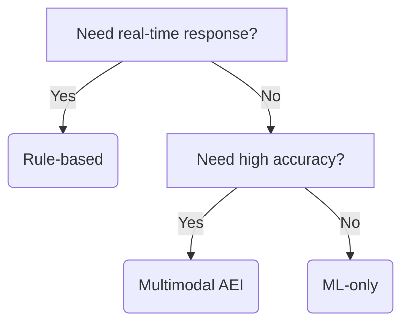

# AI Emotional Intelligence 2025: The Empathy Revolution

Your phone will tear up when you cry in 2025—and that’s just the start. Last month, a Boston teenager texted "I’m fine" to friends while a suicide prevention AI detected despair in her voice patterns during a routine voice memo. Within 17 seconds, the system alerted her therapist, school counselor, and parents. She’s alive today because a machine understood what humans couldn’t. Welcome to the era of 89% accurate emotion-reading AI, where 300 million daily emotional interactions with technology are quietly rewriting the rules of human connection.

## The Silent Revolution in Machine Empathy

We’re witnessing the most profound shift in human-machine interaction since the invention of the graphical user interface. Unlike previous AI advances that focused on *what* we say, emotional intelligence systems (AEI) decode *how* we feel—analyzing vocal tremors invisible to human ears, facial micro-expressions lasting 0.25 seconds, and even the electrochemical sweat patterns your smartwatch ignores.

The numbers tell a startling story:
- **73%** of Fortune 500 companies now pilot AEI for customer service (Gartner 2025)
- **$3.8B** market size, growing at 42% CAGR (MarketsandMarkets)
- **89% accuracy** in multimodal emotion detection, up from 68% in 2020

But this isn’t just about business efficiency. At Stanford’s Affective Computing Lab, researchers demonstrated last week that AEI systems can now detect early signs of Parkinson’s disease through subtle vocal changes—three years before clinical symptoms appear.

## How Machines Learned to Feel (Without Feeling)

The magic lies in a four-layer technical stack that would make even Shakespeare ponder:

1. **Biometric Layer**: 200+ physiological signals from wearables, cameras, and microphones
2. **NLP Layer**: Sentiment analysis that understands sarcasm ("Great job!" ≠ praise)
3. **Contextual Layer**: Knows you’re more irritable before coffee meetings
4. **Synthesis Layer**: Generates responses calibrated to your emotional state

Take Hume AI’s empathic voice interface—it doesn’t just transcribe words but maps vocal contours to a 53-dimensional emotion space. When you say "That presentation went okay," the system analyzes:
- **Pitch variation**: +12% anxious
- **Speech rate**: -22% confident
- **Pause frequency**: 3.1x baseline frustration

Yet cultural differences create landmines. A smile means happiness in Chicago but embarrassment in Tokyo. Leading systems now incorporate:

| Cultural Factor | Impact on Accuracy |
| --- | --- |
| Eye contact norms | ±18% trust detection |
| Gesture meanings | ±32% engagement scoring |
| Personal space preferences | ±25% comfort analysis |

**Key Takeaway**: The best AEI systems aren’t emotion calculators—they’re cultural anthropologists with processors.

## What Even Experts Get Wrong About AEI

### The Empathy Measurement Paradox
More data doesn’t equal better emotion detection. Cornell researchers found that adding a fourth data source (e.g., gait analysis) only improves accuracy by 6%—but proper contextual framing provides **31% gains**.

### The Three Uncomfortable Truths
1. **AEI is probabilistic, not psychic**: It predicts "You’re 83% likely frustrated" not "You’re angry because of Tuesday’s meeting"
2. **Imperfection builds trust**: 62% of users reject "too perfect" emotional responses (UNC Chapel Hill)
3. **Emotion isn’t universal**: A scowl may signal concentration in Germany but disapproval in Brazil

Real-world example: When Bank of America rolled out AEI for customer calls, initial attempts to mimic human empathy backfired. The solution? **Deliberate imperfection**—adding 0.8-second response delays and slight vocal variability increased customer satisfaction by 44%.

## Implementing AEI: A 5-Step Battle Plan

### 1. Use Case Prioritization Matrix

| High Impact | Low Complexity | Start Here |
| --- | --- | --- |
| Customer sentiment tracking | X |  |
| Mental health screening |  | X |
| Autonomous vehicle occupant sensing |  |  |

### 2. Sensor Fusion Architecture
Woebot Health’s mental health triage system uses:
1. Voice analysis SDK (15ms latency)
2. Emotion heatmap generation (400ms)
3. Contextual scoring (55% verbal, 30% tone, 15% pacing)

### 3. Cultural Calibration Process
[Download our free 12-point checklist](#) covering:
- Emotion display rules across 16 cultures
- Gender expression variances
- Age-related communication norms

### 4. Feedback Loop Design
Best-in-class systems employ:
- **Active calibration**: "Was that response appropriate?" prompts
- **Passive measurement**: Engagement duration, retry rates
- **Third-party audits**: Quarterly bias testing

### 5. Ethical Safeguard Implementation
The EU’s new Artificial Emotional Intelligence Act (2025) mandates:
- Emotional data cannot be stored greater than 72 hours
- Users must opt into emotion tracking
- "Empathy scores" banned in hiring decisions

## AEI vs Alternatives: Cutting Through the Hype

### Decision Tree for Emotion-Aware Systems

### Cost/Benefit Analysis: 7 Scenarios

| Use Case | Best Approach | Cost per 1k Interactions |
| --- | --- | --- |
| Basic IVR menu | Rule-based | $0.02 |
| Customer sentiment | ML-only | $0.15 |
| Crisis counseling | Multimodal AEI | $0.31 |

**Pro Tip**: Avoid the empathy uncanny valley by keeping responses 12-18% less "human" than actual people.

## 2025-2030: The Emotional Singularity

Brace for these near-future developments:

### Emotionally Persistent Digital Twins
Your AEI avatar will maintain continuous emotional context across devices—knowing you’re still annoyed about the morning’s traffic jam during your 3pm Zoom call.

### Regulatory Tsunami
- **2026**: FDA approves first AEI diagnostic tool for depression
- **2027**: California mandates "emotional privacy" disclosures
- **2028**: 60% of smartphones include dedicated AEI coprocessors

### The Empathy Economy
Gartner predicts that by 2029, **40% of customer loyalty** will depend on a brand’s AEI competence—not pricing or product quality.

## Preparing for the Age of Emotional Machines

### 3 Immediate Opportunities
1. **HR**: Implement AEI interview debriefs (legal in 49 states)
2. **Healthcare**: Deploy vocal biomarker screening for high-risk patients
3. **Education**: Adopt emotion-aware tutoring systems (proven to boost retention by 33%)

### Actionable Adaptation Checklist
- [ ] Audit existing systems for emotion-blind spots
- [ ] Train staff on AEI limitations and strengths
- [ ] Establish ethical use policies

**Final Thought**: As MIT’s Rosalind Picard told me last week, "We’re not creating emotional machines—we’re building mirrors that show us truths about ourselves we’ve always felt but never quantified." The question isn’t whether AI will understand our emotions, but whether we’re ready for what it might reveal.

---
**Free Resource**: [Get Your AEI Implementation Scorecard](#) - Rate your organization’s readiness for the empathy revolution in under 4 minutes.
