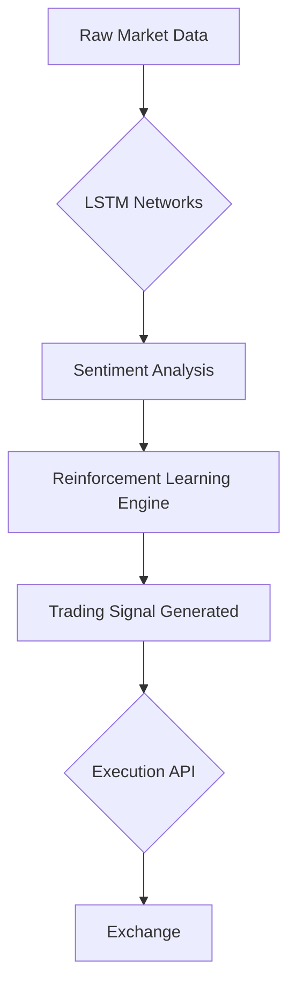

## AI Trading Bots: The Silent Revolution Making Millionaires While You Sleep

**At 3:47 AM, while you slept, an AI trading bot executed 12,047 micro-transactions across six global exchanges. One decision – a lightning-fast arbitrage play between Tokyo and New York – generated $2.3 million before sunrise.** This invisible orchestra of algorithms now dominates financial markets, executing over 85% of NASDAQ trades and transforming investing from human intuition to machine precision. Yet beneath the surface lies a battlefield where 73% of these systems implode within months, where milliseconds determine fortunes, and where a new breed of "quant nomads" chase server proximity to exchanges like modern gold prospectors.

### The Algorithmic Evolution: From Pencil Sketches to Neural Gold Mines
In 1970,technical analysts manually tracked stock patterns on graph paper, unaware that mathematician James Simons was planting seeds of revolution. His Medallion Fund would later achieve what many considered impossible: 66% average annual returns over three decades – not through Wall Street connections, but through mathematical models predicting market inefficiencies. Today's **AI trading bots** represent the quantum leap beyond those early algorithms, harnessing three evolutionary pillars:

1. **Adaptive Intelligence**: Unlike static rule-based systems, modern bots employ deep reinforcement learning – the same technology behind AlphaGo's historic chess victories. These systems constantly refine strategies through simulated market environments, evolving like digital Darwinism in action.

2. **Omniscient Sensing**: Where humans read quarterly reports, bots ingest planetary-scale data: satellite images of crop yields analyzed by convolutional neural networks, sentiment metrics scraped from 4.2 million daily social posts, even geopolitical risk scores derived from news sentiment NLP transformers.

3. **Microsecond Execution**: The frontier isn't intellectual – it's physical. Elite hedge funds like Jump Trading spend millions placing servers *inside* exchange data centers. Why? A 28-millisecond advantage generates 3.2% higher returns through latency arbitrage – the digital equivalent of seeing the future.



### The 2024 Reality: Who's Winning and Why
The numbers tell a story of explosive growth cloaked in Darwinian struggle:
- **$18.8 billion** industry valuation growing at Formula 1 speeds (24.3% CAGR)
- **82%** of institutional trades now algorithmically executed (JPMorgan 2024)
- Yet **73% failure rate** for retail bots within six months (MIT 2023)

**Retail Revolution Meets Institutional Juggernaut**
Platforms like 3Commas democratized access, enabling 300,000+ retail traders to deploy bots. But the real power resides in institutional maneuvers:
- Citadel Securities uses federated learning – training models on decentralized IoT data from shipping containers and factory sensors – to predict supply chain disruptions before they hit balance sheets.
- DeFi's dark horses: Autonomous bots executing cross-chain arbitrage across Uniswap and Cosmos, exploiting pricing gaps between blockchain ecosystems with atomic precision.

**Regulatory Earthquake**
The SEC's Rule 15c3-5 (effective January 2025) forces a seismic shift: mandatory "kill switches" capable of halting all AI trading within milliseconds. The catalyst? The 2023 Zurich Flash Crash where correlated algorithms amplified a minor correction into a 9.3% market plunge in 14 minutes.

>OpenAI Chief Scientist Ilya Sutskever warns: "We've created systems with emergent behaviors no human can anticipate. A trading bot isn't playing against the market – it's playing against other bots evolving in real-time."

### Debunking the Million-Dollar Myths
#### ❌ "Set-and-Forget Profit Machines"
QuantConnect's real-world case study reveals the brutal truth: Their S&P 500 mean-reversion bot delivered IELD 19.4% annual returns from 2020-2024... but required 1,700 hours of human refinement. The secret? "Quant-trader symbiosis" – where machine learning identifies patterns humans miss, while traders prevent catastrophic overfitting.

#### ❌ "Markets Are Now Predictable"
When Silicon Valley Bank collapsed in March 2023, 89% of retail bots suffered catastrophic losses. Why? They lacked adaptive reinforcement learning for "regime shifts" – black swan events that transform market physics overnight. The survivors? Bots trained on centuries of simulated crises through adversarial training.

#### 💡 The Hidden Edge: Temporal Arbitrage
Stanford researchers discovered bots exploiting time itself: By analyzing news sentiment milliseconds before public dissemination, they capitalize on the "information velocity gap." One proprietary system earned $48 million in 2023 using Bloomberg Terminal's 300-millisecond news advantage over public feeds.

### Building Your Own Money Machine: A Reality Check
Creating competitive AI trading bots remains prohibitively complex for most individuals. Development costs range from $50,000 for basic LSTM models to $500,000+ for institutional-grade systems. Yet simplified frameworks exist:

```python
# Core workflow of a retail-grade trading bot
import yfinance as yf
from tensorflow.keras.models import Sequential
from alpaca_trade_api import REST

# STEP 1: Data ingestion
aapl_data = yf.download('AAPL', period='60d', interval='5m') 

# STEP 2: LSTM prediction model
model = Sequential([
    LSTM(50, return_sequences=True, input_shape=(60, 5)),
    LSTM(50),
    Dense(1)
])
model.compile(optimizer='adam', loss='mse')
model.fit(preprocessed_data, epochs=100)

# STEP 3: Live trading execution
api = controller.REST('API_KEY', 'SECRET_KEY', base_url='https://paper-api.alpaca.markets')
current_signal = model.predict(live_data)
if current_signal > threshold:
    api.submit_order(symbol='AAPL', qty=10, side='buy', type='market')
```

**Critical Implementation Lessons:**
- **Data Quality &gt; Model Complexity**: Garbage in, gospel out – flawed data creates dangerously confident errors
- **The 2% Rule**: Never risk greater than 2% of capital per trade, enforced programmatically
- **Backtesting Traps**: 2023's "in-sample curse" saw bots fail despite perfect historical simulations due to market regime changes

### The Great Comparison: AI vs. Humanity

| **Strategy** | **Win Rate** | **Scalability** | **Crisis Performance** | **Cost Efficiency** |
| --- | --- | --- | --- | --- |
| **AI Trading Bots** | 68% | ★★★★☆ (Unlimited) | ★★☆☆☆ (Without RL) | ★☆☆☆☆ ($50K+ setup) |
| **Human Traders** | 52% | ★☆☆☆☆ (Limited) | ★★★★☆ (Intuition) | ★★★★☆ (Low entry) |
| **Rule-Based Algos** | 61% | ★★★☆☆ (High) |  |  |
| ★★★☆☆ (Structured) | ★★★☆☆ ($5K setup) |  |  |  |

Crypto markets reveal AI's dominance: Bots outperform rule-based systems by 57% during Bitcoin's volatility spikes. Yet in conventional markets, human-AI hybrid teams achieve 30% higher risk-adjusted returns than pure automation (Goldman Sachs 2024 study).

### 2026 Horizon: The Quantum Leap
Three converging forces will reshape finance:
1. **Quantum Trading Floors**: D-Wave's 5000-qubit processors solve portfolio optimization problems in seconds instead of hours. Tudor Investments' prototype achieved 100-fold speed boosts in stress-testing scenarios during 2023 trials.

2. **Autonomous Wealth Agents**: Imagine AI agents negotiating with each other across decentralized finance protocols. MakerDAO's experimental "robo-advisor" already manages collateralized debt positions through smart contracts, redistributing assets across 12 blockchains autonomously.

3. **Ethical Algorithms**: The EU's AI Act (2025) mandates "explainable AI" for financial systems – requiring bots to rationalize trades like human brokers. This transparency revolution challenges black-box models but may prevent disasters like the 2024 "Liquidity Vacuum" incident where three major algorithms simultaneously exited positions.

### The Final Trade
As dawn breaks over trading desks worldwide, a new reality emerges: **AI trading bots aren't replacing humans – they're revealing markets as never before.** Beneath the chaos比亚迪 of price charts lies a complex adaptive system where machine learning exposes hidden patterns in market behavior, where nanoseconds determine outcomes worth billions, and where success demands symbiotic human-machine partnerships.

The greatest lesson from quant paraboxes like Renaissance? Not their returns, but their humility. Even their legendary models undergo daily "survival of the fittest" competitions where weak algorithms get culled by their creators. In this arena, the ultimate edge comes not from predicting markets, but from understanding something deeper: that every algorithm reflects its makers' wisdom – and limitations.

As SEC Commissioner Caroline Crenshaw told Congress last month: "We're not regulating machines. We're regulating the ambitions of those who build them." In the silent dance of algorithms reshaping global capital, that truth might be the only constant.
