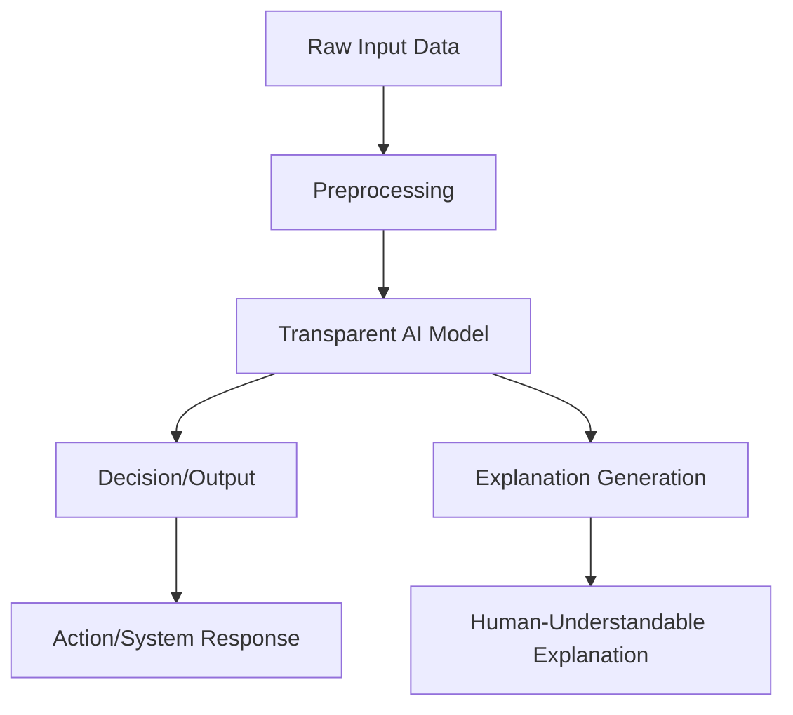

# The Invisible Hand: Demystifying AI Transparency in an Age of Black-Box Decision Making

In a dimly lit conference room in Brussels, 2024, a European Parliament member leans forward, her brow furrowed with concern. "Madam Representative," she asks, pointing at a complex algorithm, "can you explain to me exactly why this system denied my constituent's social benefits application?" The representative pauses, her fingers hovering over a tablet displaying the AI's decision. "The algorithm," she finally responds, "has determined that the applicant's profile doesn't match our success criteria." "But what are those criteria?" persists the Parliament member. The representative's fingers stop moving. "That's proprietary information."

This scene plays out daily across the globe as artificial intelligence increasingly governs our lives—from determining job prospects to diagnosing illnesses, from approving loans to assessing criminal risk. Yet for all its sophistication, AI remains stubbornly opaque, its decision-making processes often inscrutable even to its creators. As AI systems become more powerful and pervasive, the demand for transparency has evolved from a technical curiosity to an urgent ethical and societal imperative. What exactly is AI Transparency, why does it matter, and how can we achieve it in a world increasingly dependent on algorithms we don't fully understand?

## What is AI Transparency?

At its core, AI Transparency refers to the degree to which artificial intelligence systems are open, explainable, and understandable. It involves making AI decision-making processes and models transparent, accountable, and fair. In practical terms, it's the difference between knowing that an AI system made a decision and understanding how and why it reached that conclusion.

The three pillars of AI Transparency are:

**Explainability**: The ability to provide insights into AI decision-making processes. This means being able to articulate the reasoning behind an AI's output in human-understandable terms.

**Interpretability**: The ability to understand the relationships between input and output variables. Interpretability focuses on mapping how specific inputs influence the AI's outputs.

**Accountability**: The ability to assign responsibility for AI-driven decisions. This establishes clear lines of responsibility when AI systems cause harm or make errors.

AI Transparency emerged from the field of explainable AI (XAI), which gained prominence in the mid-2010s as machine learning models grew increasingly complex. Early AI systems, particularly decision trees and linear regressions, were inherently transparent—their decision paths were visible and traceable. But as neural networks with millions of parameters became the norm, AI entered a "black box" era, where even developers struggled to understand exactly how inputs translated to outputs.

The shift from transparent to opaque AI systems accelerated with the advent of deep learning around 2012. Models like Google's AlphaGo, which defeated world champion Go player Lee Sedol in 2016, could make brilliant moves that even top human players couldn't explain. This demonstrated AI's growing capability but also highlighted its opacity—a paradox that continues to define the field today.

&gt; "The most dangerous thing about AI isn't that it's evil, but that it's inscrutable. When we can't understand why a system made a particular decision, we can't trust it, fix it, or learn from it." — Fei-Fei Li, Stanford University and AI Now Institute

## Expert Insights: Debunking Common Misconceptions

Despite growing attention, AI Transparency remains widely misunderstood. Experts emphasize that the common perception—that transparency is merely about explaining AI decisions in simple terms—fundamentally misses the mark.

"What people get wrong about AI Transparency is that it's not just about explaining AI decisions, but also about understanding the context and potential biases," explains Dr. Joy Buolamwini, founder of the Algorithmic Justice League. "A transparent AI system should provide not just a decision, but the societal context in which that decision operates, including historical data patterns that may reflect existing biases."

This contextual understanding requires examining AI systems through multiple lenses:

**Social Context**: AI systems operate within social structures that contain historical biases and power imbalances. A transparent AI must acknowledge how these factors influence its decisions.

**Cultural Context**: Different cultures interpret and value different outcomes. What constitutes a "fair" decision can vary significantly across cultural contexts.

**Environmental Context**: AI systems operate in specific environments with unique constraints and requirements. Transparency requires understanding how these environmental factors influence decision-making.

Another critical, often overlooked aspect of AI Transparency is its role in human-AI collaboration. "Transparency is crucial for effective human-AI collaboration," argues Dr. Been Kim, a senior research scientist at Google Brain. "When humans can understand and trust AI-driven decisions, they can leverage AI's capabilities while maintaining appropriate oversight. This isn't just about explanation—it's about creating a shared understanding that enables true partnership."

The human-AI collaboration paradigm represents a significant shift from viewing AI as a replacement for human judgment to seeing it as a tool that enhances human capabilities. This perspective emphasizes transparency not as an end in itself, but as a means to more effective and responsible AI deployment.

## The Current State of AI Transparency (2024-2025)

The landscape of AI Transparency has evolved dramatically in recent years, driven by regulatory pressure, public demand, and technological innovation. Today, we stand at a pivotal moment where transparency is moving from a niche concern to a mainstream requirement.

### Regulatory Efforts

The European Union's AI Regulation, implemented in 2024, represents the most comprehensive legal framework for AI Transparency to date. The regulation categorizes AI systems by risk level, with "high-risk" applications—including those used in hiring, credit scoring, and criminal justice—required to demonstrate comprehensive transparency measures. These include:

- Documentation of training data sources and characteristics
- Explanation of decision-making processes in human-understandable terms
- Disclosure of system limitations and potential failure modes
- Mechanisms for human oversight and intervention

In the United States, while no comprehensive federal AI legislation exists, the AI Bill of Rights, issued by the White House in 2023, establishes principles for responsible AI development and deployment. Though not legally binding, it has influenced industry practices and state-level regulations. Notably, California's AI Accountability Act, passed in 2024, requires businesses to provide clear explanations for AI-based decisions that significantly impact consumers.

Globally, at least 35 countries have introduced or are considering AI-specific legislation that addresses transparency requirements. This patchwork of regulations reflects both growing awareness of AI risks and varying cultural approaches to technological governance.

### Industry Adoption

The business case for AI Transparency has strengthened significantly. According to McKinsey's 2025 Global AI Survey, 71% of organizations now consider AI Transparency a top priority, with 61% already implementing transparency measures. This represents a dramatic shift from 2020, when fewer than 20% of enterprises reported dedicated transparency initiatives.

Industry leaders across sectors are recognizing that transparency isn't just a regulatory requirement but a competitive advantage. Financial institutions like JPMorgan Chase and Bank of America have implemented transparent AI systems for loan approvals, reporting improved customer satisfaction and reduced regulatory scrutiny. Healthcare providers like Mayo Clinic and Cleveland Clinic have adopted explainable AI for diagnostic support, enabling doctors to understand and verify AI recommendations.

Even tech giants once criticized for opaque AI systems are now embracing transparency. In 2024, Google introduced "Model Cards" for its AI services, providing standardized documentation about training data, performance metrics, and limitations. Similarly, Facebook (now Meta) implemented its "AI Transparency Center," which publishes research papers, documentation, and tools related to its AI systems.

### Technological Advancements

The rapid advancement of explainability techniques has made AI Transparency increasingly feasible. Today's toolkit includes:

- **Model interpretability techniques**: Methods like feature importance analysis, partial dependence plots, and SHAP (SHapley Additive exPlanations) values help identify which inputs most influence AI decisions.

- **Explainable AI frameworks**: Tools like LIME (Local Interpretable Model-agnostic Explanations), Anchor, and TreeExplainer provide model-agnostic explanations that work across different AI architectures.

- **Transparent neural networks**: New architectures like attention-based models and sparse neural networks maintain performance while offering better interpretability.

- **Counterfactual explanations**: These systems generate "what if" scenarios that show how changing inputs would affect outputs, helping users understand decision boundaries.

Perhaps the most significant technological development has been the emergence of "self-explaining" AI systems—models that inherently produce interpretable outputs rather than requiring post-hoc analysis. These systems, often based on attention mechanisms or rule-based components, maintain high performance while providing transparent decision paths.

This diagram illustrates how modern transparent AI systems generate both outputs and explanations simultaneously, enabling human understanding without compromising performance.

## Practical Applications: How AI Transparency Works

Implementing AI Transparency isn't merely a technical exercise—it requires organizational commitment, process redesign, and cultural change. The following framework provides a practical approach to achieving meaningful transparency in AI systems.

### Step 1: Identifying AI Use Cases and Stakeholders

The first step in implementing AI Transparency is mapping AI applications across the organization and identifying all stakeholders. This process typically involves:

- **Inventory Creation**: Documenting all AI systems in use, their purposes, and decision-making scope.
- **Stakeholder Mapping**: Identifying individuals and groups affected by AI decisions, including customers, employees, regulators, and community members.
- **Risk Assessment**: Evaluating the potential impact of AI decisions on stakeholders and the broader society.

For example, a financial institution might identify its AI-driven loan approval system as a high-priority transparency initiative. Stakeholders would include loan applicants, loan officers, regulators, and compliance teams. The risk assessment might reveal that the system's decisions significantly impact applicants' financial lives and the institution's regulatory standing.

### Step 2: Developing Transparent AI Models and Explanations

With use cases and stakeholders identified, organizations can develop transparent AI systems through:

**Model Selection**: Choosing inherently interpretable models where possible. For instance, using decision trees or linear models instead of deep neural networks for critical applications.

**Hybrid Approaches**: Combining opaque, high-performance models with interpretable "surrogate" models that approximate their behavior while providing explanations.

**Explanation Techniques**: Implementing appropriate explanation methods based on the use case. For example:
- For individual decisions, counterfactual explanations might show applicants what factors would have changed their loan outcome.
- For system-level insights, feature importance analysis could reveal which variables most influence approval rates.

**Documentation**: Creating comprehensive documentation including:
- Data sources and collection methods
- Model architecture and training process
- Performance metrics and limitations
- Decision logic and boundary conditions

Amazon provides a compelling example of this approach in its AI recruitment tool. After facing criticism for gender bias in its hiring algorithm, the company developed a transparent system that:
- Documented all training data sources and characteristics
- Implemented bias detection and mitigation techniques
- Provided explanations for candidate recommendations
- Enabled human recruiters to override AI suggestions

### Step 3: Deploying and Monitoring AI Systems

Transparency doesn't end with development—continuous monitoring and improvement are essential:

**Real-time Monitoring**: Implementing systems to track AI performance, detect drift, and identify potential biases.

**Feedback Loops**: Creating mechanisms for users and stakeholders to provide feedback on AI decisions and explanations.

**Periodic Audits**: Conducting regular reviews by independent third parties to assess transparency and fairness.

IBM's AI Fairness 360 toolkit exemplifies this approach, providing tools to detect and mitigate bias throughout the AI lifecycle. The company uses these tools internally for its AI systems and offers them to clients, creating a feedback loop that continuously improves transparency practices.

### Step 4: Continuously Evaluating and Improving AI Transparency

AI Transparency is an ongoing process rather than a one-time implementation. Key activities include:

**Impact Assessment**: Evaluating how transparency measures affect user trust, system performance, and organizational outcomes.

**Best Practice Sharing**: Collaborating with industry peers and academic researchers to identify and disseminate emerging transparency techniques.

**Regulatory Alignment**: Keeping abreast of evolving regulatory requirements and adjusting transparency practices accordingly.

The Partnership on AI, a consortium of tech companies, academic institutions, and civil society organizations, facilitates this continuous improvement through working groups that develop and share best practices for transparent AI development.

## Comparisons: Black-Box vs. Transparent AI

The choice between opaque and transparent AI systems involves significant trade-offs. Understanding these differences is crucial for organizations developing AI applications.

### Black-Box AI

Black-box AI systems prioritize performance and efficiency over explainability. These systems typically use complex neural networks or ensemble methods that achieve state-of-the-art results but provide limited insight into their decision-making processes.

**Advantages**:
- **Performance**: Often achieve higher accuracy on complex tasks
- **Efficiency**: Require less computational overhead for explanation generation
- **Competitive Edge**: May provide temporary advantages in fast-moving markets

**Disadvantages**:
- **Trust Deficits**: Users struggle to trust systems they don't understand
- **Regulatory Risk**: Increasingly subject to legal restrictions
- **Debugging Challenges**: Difficult to identify and correct errors
- **Bias Reinforcement**: May amplify and obscure existing biases

### Transparency-by-Design

Transparency-by-Design approaches prioritize explainability throughout the development process, often accepting some performance trade-offs.

**Advantages**:
- **Trust and Adoption**: Users more readily accept and trust transparent systems
- **Regulatory Compliance**: Better positioned to meet evolving transparency requirements
- **Error Detection**: Easier to identify and correct issues
- **Bias Mitigation**: Greater ability to detect and address biases

**Disadvantages**:
- **Performance Limitations**: May achieve lower accuracy on complex tasks
- **Development Complexity**: Requires additional expertise and resources
- **Explanation Overhead**: Generating explanations increases computational costs
- **Privacy Concerns**: Explanations may reveal sensitive data patterns

| Comparison Factor | Black-Box AI | Transparent AI |
| --- | --- | --- |
| Performance | High accuracy on complex tasks | Good accuracy, potentially lower on complex tasks |
| Trust | Low user trust | High user trust |
| Regulatory Risk | High (increasing) | Low (decreasing) |
| Development Speed | Faster development | Slower development |
| Debugging Difficulty | Difficult | Easier |
| Bias Detection | Limited | Enhanced |
| Computational Cost | Lower for inference | Higher due to explanations |

The optimal approach depends on the specific application domain, risk tolerance, and stakeholder requirements. In high-stakes domains like healthcare or criminal justice, transparency typically outweighs pure performance considerations. In low-stakes applications like entertainment recommendations, the balance may tilt toward performance.

## Future Trends in AI Transparency

The field of AI Transparency continues to evolve rapidly, driven by technological innovation, regulatory developments, and shifting societal expectations. Several key trends are shaping the future of this critical domain.

### Increased Regulation

The coming years will likely bring more comprehensive and specific regulations governing AI Transparency. The European Union's AI Regulation represents just the beginning—other regions are likely to implement similar frameworks tailored to their contexts.

Emerging regulatory trends include:

- **Standardized Transparency Metrics**: Governments may develop standardized metrics for evaluating AI transparency, enabling consistent assessment across applications.

- **Mandatory Impact Assessments**: Organizations may be required to conduct thorough transparency and fairness assessments before deploying AI systems in sensitive domains.

- **Third-Party Auditing**: Independent evaluation of AI systems for transparency and fairness may become mandatory in regulated industries.

These developments will create both challenges and opportunities for organizations. While compliance will require significant investment, it will also establish clearer guidelines for responsible AI development and reduce regulatory uncertainty.

### Advances in Explainability

Technological innovation will continue to improve our ability to make AI systems transparent. Several promising directions include:

- **Self-Explaining AI**: Models that inherently generate explanations without requiring separate analysis tools. These systems will maintain high performance while providing interpretable outputs.

- **Multimodal Explanations**: Explanations that combine natural language, visualization, and interactive elements to enhance understanding across different user groups.

- **Causal AI**: Systems that not only identify correlations but understand causal relationships, enabling more meaningful explanations of why decisions are made.

- **Federated Explainability**: Techniques for generating explanations across distributed AI systems while protecting data privacy—a critical advancement for healthcare and other sensitive domains.

These technological advances will make transparency more achievable across a wider range of applications, reducing the trade-off between performance and explainability.

### Human-AI Collaboration

As AI systems become more capable, the focus will shift from simple explanation to genuine human-AI collaboration. This evolution will emphasize:

- **Shared Understanding**: Creating AI systems that develop models of human users' knowledge, beliefs, and goals to facilitate more effective collaboration.

- **Interactive Explanation**: Systems that engage in dialogue with users to refine explanations based on individual needs and backgrounds.

- **Collaborative Decision-Making**: Frameworks where AI systems and humans share decision-making responsibilities, with transparency enabling appropriate oversight.

This collaborative paradigm represents a significant shift from viewing AI as a tool to augment human capabilities to seeing it as a partner in complex decision-making processes.

## Conclusion: Toward a Transparent AI Future

The journey toward AI Transparency is both challenging and essential. As artificial intelligence becomes increasingly integrated into the fabric of society, our ability to understand and trust these systems will determine whether they serve as tools for empowerment or sources of division and harm.

The European Parliament member's dilemma—struggling to understand why an AI system denied benefits to a constituent—epitomizes the stakes involved. In a world where algorithms increasingly determine our access to resources, opportunities, and rights, transparency is not merely a technical requirement but a fundamental democratic necessity.

Achieving meaningful AI Transparency requires more than technological innovation—it demands organizational commitment, regulatory frameworks, and a cultural shift in how we develop and deploy AI systems. It requires recognizing that transparency is not the enemy of performance but its essential complement, enabling us to build AI systems that are not only capable but trustworthy.

As we stand at this inflection point, the choices we make about AI Transparency will shape the future of human-AI relations for generations to come. Will we build systems that remain inscrutable, operating behind an impenetrable veil of complexity? Or will we develop AI technologies that enhance human decision-making while remaining open to scrutiny and improvement?

The answer may well determine whether artificial intelligence fulfills its promise as a force for good in the world—or becomes another source of division and mistrust in our increasingly digital society.

The invisible hand of AI need not remain unseen. With commitment, innovation, and vigilance, we can build a future where artificial intelligence operates not in shadow, but in the light of transparency and accountability.

&gt; "Transparency is not the enemy of progress—it's the foundation of trust. In the age of AI, trust will be our most valuable currency." — Timnit Gebru, founder of the Distributed Artificial Intelligence Research Institute
