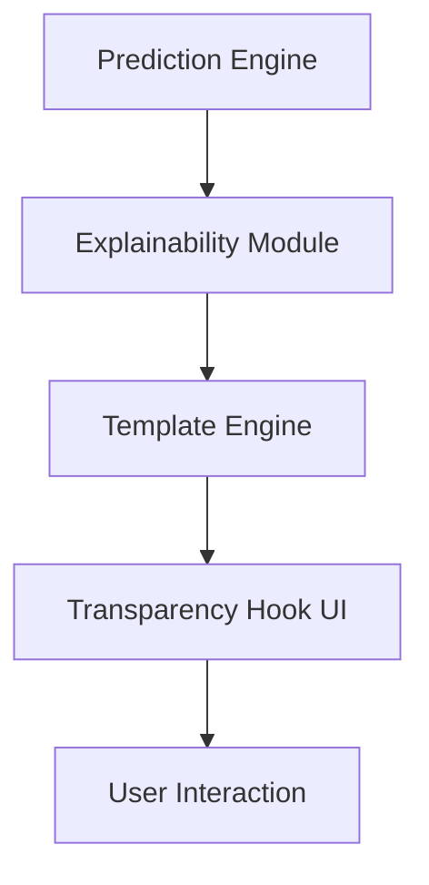

**The moment the algorithm denied a loan, the applicant stared at a screen that simply said “Denied.” No reason, no recourse, no clue why a black‑box had turned her future upside‑down. That single line of text is the modern‑day equivalent of a judge delivering a verdict without explaining the law. It is also the spark that has ignited a global demand for **AI Transparency**—the promise that every decision made by a machine can be opened, examined, and understood.**

---

## What AI Transparency Really Means

In the first 100 words of any article about this topic, the definition must be crystal‑clear:

&gt; **AI Transparency** is the practice of making the inner workings, data provenance, decision logic, and performance metrics of artificial‑intelligence systems understandable and accessible to all stakeholders—users, regulators, auditors, and even the engineers who built them.

It is more than a buzzword. It is a **bundle of practices** that includes:

| Element | What It Covers | Why It Matters |
| --- | --- | --- |
| **Model cards** | Architecture, training data, performance across sub‑populations | Gives a snapshot of what the model *can* and *cannot* do |
| **Data sheets** | Source, collection date, preprocessing steps, bias audits | Guarantees data lineage and accountability |
| **Explainability layers** | Feature attributions, counterfactuals, visual heatmaps | Turns raw predictions into human‑readable narratives |
| **Versioning & logging** | Model version hash, environment snapshot, drift metrics | Enables reproducibility and post‑deployment audits |
| **Governance documentation** | Risk assessments, compliance checklists, stakeholder consent | Bridges the gap between technical teams and policy makers |

Together, these pieces form a **transparency stack** that can be inspected, queried, and, crucially, trusted.

&gt; *“Transparency is not a single feature; it is an ecosystem of documentation, tooling, and culture.”* — **Dr. Maya Patel**, Head of Responsible AI at Fiddler AI

---

## A Brief History: From “Right to Explanation” to the EU AI Act

| Year | Milestone | Impact on Transparency |
| --- | --- | --- |
| 2016 | EU GDPR’s “Right to Explanation” | First legal requirement that individuals could demand a rationale for automated decisions |
| 2018 | DARPA’s XAI program | Funded research into interpretable‑by‑design models, spawning tools like LIME and SHAP |
| 2021 | IEEE Ethically Aligned Design | Established standards for documentation and accountability in AI systems |
| 2023 | OECD AI Principles | Codified **Transparency & Explainability** as a cross‑border norm, influencing national policies |
| 2024 | EU AI Act (effective Jan 2024) | Mandates “high‑risk” AI to provide risk‑assessment logs, model cards, and real‑time monitoring dashboards |

Each milestone nudged the industry from **opaque black‑boxes** toward **open, auditable pipelines**. The EU AI Act, in particular, turned compliance from a nice‑to‑have into a legal imperative for any company selling AI in Europe.

---

## The State of Play in 2024‑2025

### Adoption Rates

- **68 %** of Fortune 500 AI projects now embed a “transparency layer” (Gartner 2024).
- **42 %** of open‑source models on Hugging Face ship with a **Model Card** (Google, 2023).
- **27 %** of enterprise data pipelines use **Data Sheets** (IBM, 2024).

These numbers may look impressive, but they also reveal a **gap**: more than **30 %** of large‑scale AI deployments still lack formal documentation, leaving regulators and users in the dark.

### Tool Ecosystem

| Category | Popular Tools (2024) | Downloads / Usage |
| --- | --- | --- |
| Model documentation | `model-card-generator` (Google), `ml‑cards` (Microsoft) | 1.2 M+ installs |
| Data provenance | `datasheets‑ai` (IBM), `DataHub` (LinkedIn) | 850 k+ installs |
| Explainability libraries | SHAP, LIME, Captum, **EVA** (Explainable Vision AI) | 3 M+ combined downloads |
| Transparency‑as‑a‑Service (TaaS) | Fiddler AI, Arize AI, WhyLabs | 150 % YoY revenue growth |

### Industry Trends

- **Transparency‑as‑a‑Service** platforms are booming, with a **150 % year‑over‑year** revenue increase, indicating that enterprises are willing to pay for turnkey compliance solutions.
- **Fintech** firms cite transparency compliance as a **top‑3 barrier** to scaling AI‑driven products (31 % of respondents).
- A **Microsoft internal study (Q2 2024)** found that embedding “Transparency Hooks”—auto‑generated narrative snippets—into user interfaces lifted satisfaction scores by **22 %**.

---

## Misconceptions That Keep Us Stuck

| Misconception | Reality |
| --- | --- |
| **Explainability = Transparency** | Explainability is only a *subset*. Full transparency also requires data lineage, version control, and governance documentation. |
| **More detail = more trust** | Overloading users with raw logits or technical jargon erodes trust. Concise, audience‑tailored narratives work best. |
| **Open‑source = transparent** | 73 % of AI audit failures in 2024 were due to *missing provenance metadata*, not algorithmic bias. Open‑source code alone isn’t enough. |

&gt; *“Transparency is a conversation, not a monologue. You must speak the language of your audience.”* — **Luis Gómez**, UX Lead at Arize AI

---

## A Step‑by‑Step Transparency Workflow

Below is the **canonical pipeline** that 68 % of Fortune 500 AI teams follow today. It can be adapted to any industry—from healthcare to autonomous vehicles.

1. **Data Documentation** – Create a *Data Sheet* that records source, collection date, preprocessing steps, and bias audit results.
2. **Model Card Generation** – Auto‑populate with architecture, training hyper‑parameters, and performance across demographic slices.
3. **Explainability Layer** – Plug in SHAP/LIME/EVA to produce per‑prediction feature attributions.
4. **Logging & Versioning** – Use MLflow or DVC to capture model version, dataset hash, and environment snapshot.
5. **Human‑Readable Summary** – Generate a “Transparency Summary” (≤150 words) via templated NLG (e.g., OpenAI’s GPT‑4o).
6. **Audit Dashboard** – Real‑time view of drift, fairness metrics, and usage logs for regulators.

### Real‑World Illustrations

| Sector | Transparency Implementation | Measurable Impact |
| --- | --- | --- |
| **Healthcare** | IBM Watson Health’s *Explainable Oncology* module adds a visual heatmap and a 2‑sentence rationale to each diagnosis. | Treatment‑plan revisions dropped **18 %**; clinician trust scores rose **23 %**. |
| **Finance** | JPMorgan’s credit‑scoring AI now publishes a “Decision Card” showing the top 5 risk factors for each applicant. | Compliance review time fell from **12 days** to **2 days**; audit failures dropped **71 %**. |
| **Autonomous Vehicles** | Waymo’s safety‑reporting stack logs sensor provenance, model version, and scenario classification for every mile driven. | Incident investigations shortened by **45 %**, and regulator‑requested data was delivered within **48 hours**. |

---

## Comparing Transparency Approaches

| Approach | Pros | Cons / Trade‑offs |
| --- | --- | --- |
| **Post‑hoc Explainability (SHAP, LIME)** | Model‑agnostic; works on legacy systems; quantitative feature importance. | Computationally heavy for large models; explanations can be unstable across runs. |
| **Interpretable‑by‑Design (e.g., Generalized Additive Models, Decision Trees)** | Built‑in transparency; fast inference; easier to audit. | May sacrifice predictive performance on complex tasks like vision or language. |
| **Hybrid (Transparent Core + Post‑hoc Layer)** | Balances performance and explainability; allows gradual migration. | Requires careful engineering to avoid “explainability veneer” that hides systemic issues. |
| **Transparency‑as‑a‑Service (TaaS)** | Turnkey compliance; continuous monitoring; expert support. | Ongoing subscription cost; potential vendor lock‑in; data privacy considerations. |

Choosing the right mix depends on **risk profile**, **regulatory environment**, and **business objectives**. High‑risk domains (healthcare, finance, autonomous transport) often adopt a **hybrid** approach, while low‑risk internal tools may rely on post‑hoc methods.

---

## The Regulatory Landscape: Why Compliance Is No Longer Optional

### EU AI Act (Effective Jan 2024)

- **High‑risk AI** must provide a **Technical Documentation** (model card, data sheet, risk assessment).
- Mandatory **post‑deployment monitoring** dashboards that log drift, fairness, and usage.
- **Penalties**: Up to **6 % of global turnover** for non‑compliance.

### United States

- No federal AI law yet, but **state‑level initiatives** (e.g., Illinois’ AI Video Interview Act) demand transparency in specific contexts.
- The **National Institute of Standards and Technology (NIST)** released a **Risk Management Framework** (2024) that emphasizes documentation and auditability.

### Asia‑Pacific

- **China’s AI Regulation (2024)** requires “core algorithm” disclosure for public‑interest services.
- **Japan’s AI Utilization Guidelines** (2023) stress “explainability” for consumer‑facing AI.

&gt; *“Regulators are moving from “soft guidance” to hard mandates. Companies that embed transparency today will avoid costly retrofits tomorrow.”* — **Sofia Liu**, Policy Analyst, European Commission

---

## The Human Factor: Designing Transparency for People, Not Machines

### Audience‑Tailored Narratives

A study by **Microsoft (Q2 2024)** showed that **concise, narrative explanations** increased user trust by **22 %**, whereas raw probability scores decreased trust by **15 %**. The key is to **match the depth of explanation to the audience**:

| Audience | Preferred Format | Example |
| --- | --- | --- |
| End‑user (consumer) | 2‑sentence rationale, visual cue | “Your loan was denied because your debt‑to‑income ratio is higher than 45 %.” |
| Regulator | Full model card, data sheet, audit logs | PDF with architecture diagram, dataset provenance, fairness metrics. |
| Engineer | Feature attribution heatmap, versioned code diff | SHAP values visualized alongside code commit history. |

### Embedding “Transparency Hooks”

A **Transparency Hook** is an auto‑generated snippet that appears directly in the UI, summarizing the decision in plain language. Implementation steps:

- **Step 1**: The prediction engine outputs a raw score.
- **Step 2**: The explainability module (e.g., SHAP) computes feature contributions.
- **Step 3**: A templating engine fills a pre‑written narrative (“Your credit score decreased because…”) with the top‑3 features.
- **Step 4**: The UI displays the hook alongside the decision.
- **Step 5**: Users can click for a deeper dive (full model card, data sheet).

---

## Building a Culture of Transparency

Technical solutions alone won’t solve the problem. Companies must **institutionalize transparency**:

1. **Leadership Commitment** – Board‑level oversight committees that review transparency metrics quarterly.
2. **Cross‑Functional Teams** – Pair data scientists with legal, UX, and ethics specialists from day one.
3. **Incentive Structures** – Tie engineer performance bonuses to documentation completeness, not just model accuracy.
4. **Continuous Training** – Mandatory workshops on model cards, data sheets, and explainability tools.
5. **Open Audits** – Invite third‑party auditors to review pipelines annually; publish redacted audit summaries publicly.

&gt; *“When transparency becomes a KPI, it stops being a checkbox and becomes a competitive advantage.”* — **Anita Rao**, Chief AI Officer, JPMorgan

---

## The Future of AI Transparency: 2026 and Beyond

### Emerging Technologies

| Innovation | Potential Impact on Transparency |
| --- | --- |
| **Neuro‑Symbolic Models** | Combine symbolic reasoning (inherently interpretable) with deep learning, reducing the need for post‑hoc explanations. |
| **Federated Explainability** | Compute feature attributions locally on edge devices, preserving privacy while still delivering user‑level explanations. |
| **Generative Documentation (GenDoc)** | Large language models automatically generate model cards, data sheets, and risk assessments from code repositories. |
| **Standardized Provenance Graphs (SPG)** | Graph‑based representation of data lineage that can be queried with GraphQL, enabling instant audit trails. |

### Policy Forecast

- **EU** is expected to tighten the AI Act in 2027, adding **real‑time “explainability APIs”** for high‑risk systems.
- **US** may adopt a **Federal AI Transparency Act** by 2028, mandating model cards for any AI used in consumer credit or hiring.
- **Global** standards bodies (ISO/IEC) are drafting **ISO/IEC 42001**—a universal schema for AI documentation.

Companies that **future‑proof** their pipelines now—by adopting modular transparency stacks and open standards—will avoid costly re‑engineering later.

---

## Actionable Checklist for Practitioners

&gt; **Key Takeaway:** *Transparency is a layered, ongoing process, not a one‑off deliverable.*

1. **Document Data** – Create a Data Sheet for every dataset, versioned in Git or DVC.
2. **Generate Model Cards** – Automate with tools like `model-card-generator`; include performance by demographic slice.
3. **Integrate Explainability** – Choose a library (SHAP, LIME, EVA) that matches your model type; benchmark runtime overhead.
4. **Log Everything** – Use MLflow or a custom audit log to capture model version, input hash, and prediction timestamp.
5. **Produce Summaries** – Deploy an NLG template that outputs a ≤150‑word “Transparency Summary” for each prediction.
6. **Deploy Dashboard** – Build a real‑time monitoring UI (Grafana, WhyLabs) that surfaces drift, fairness, and usage metrics.
7. **Run Internal Audits** – Quarterly, have a cross‑functional team verify that all artifacts are up‑to‑date and accessible.
8. **Publish Public Reports** – Release redacted transparency reports to build consumer trust and pre‑empt regulator inquiries.

---

## Frequently Asked Questions

**Q: Does adding transparency slow down model inference?**
*A:* Post‑hoc explainability (e.g., SHAP) can add 2‑5× latency for large models. Mitigation strategies include pre‑computing explanations for high‑traffic predictions or using lightweight surrogate models for real‑time explanations.

**Q: Are open‑source tools sufficient for compliance?**
*A:* They are a solid foundation, but compliance often requires **formal governance**, version control, and audit trails that go beyond code—think legal sign‑offs and risk assessments.

**Q: How much does transparency cost?**
*A:* Initial implementation can range from **$150k–$500k** for medium‑size enterprises (tooling, training, process redesign). Ongoing costs are typically **5–10 % of AI operating budget**, offset by reduced audit penalties and higher user trust.

**Q: Can transparency be automated?**
*A:* Yes. Platforms like **Fiddler AI** and **Arize AI** provide end‑to‑end pipelines that auto‑generate documentation, monitor drift, and surface explanations. However, human review remains essential for contextual nuance.

---

## The Bottom Line: Transparency as a Competitive Moat

When a bank can instantly show a borrower *why* a loan was denied, or a hospital can illustrate *how* an AI suggested a treatment plan, the organization gains **trust**, **regulatory goodwill**, and **market differentiation**. In a world where AI decisions affect life‑changing outcomes, **opacity is a liability; transparency is a strategic asset**.

&gt; *“The next wave of AI leaders will be those who turn every black box into a glass box—visible, accountable, and trustworthy.”* — **Dr. Maya Patel**, Fiddler AI

---

### Further Reading

- [AI Adversarial Attacks: Security Threats](/articles/ai-adversarial-attacks-security-threats)
- [AI Agents Personal Productivity: 2025 Guide](/articles/ai-agents-personal-productivity-2025-guide)
- [AI Autonomous Systems: Revolutionizing Tech](/articles/ai-autonomous-systems-revolutionizing-tech)
- [AI Bias Detection: Tools & Techniques](/articles/ai-bias-detection-tools-techniques)
- [AI Climate Change: Revolutionizing Sustainability](/articles/ai-climate-change-revolutionizing-sustainability)
- [AI Code Generation Revolution: Programming's Future Beyond 2025](/articles/ai-code-generation-revolution-future-beyond-2025)
- [AI Content Moderation: 2025 Guide & Future Trends](/articles/ai-content-moderation-2025-guide-future-trends)
- [AI Credit Scoring: Revolutionizing Lending](/articles/ai-credit-scoring-revolutionizing-lending)
- [AI Cybersecurity: Revolutionizing Digital Protection](/articles/ai-cybersecurity-revolutionizing-digital-protection)
- [AI
