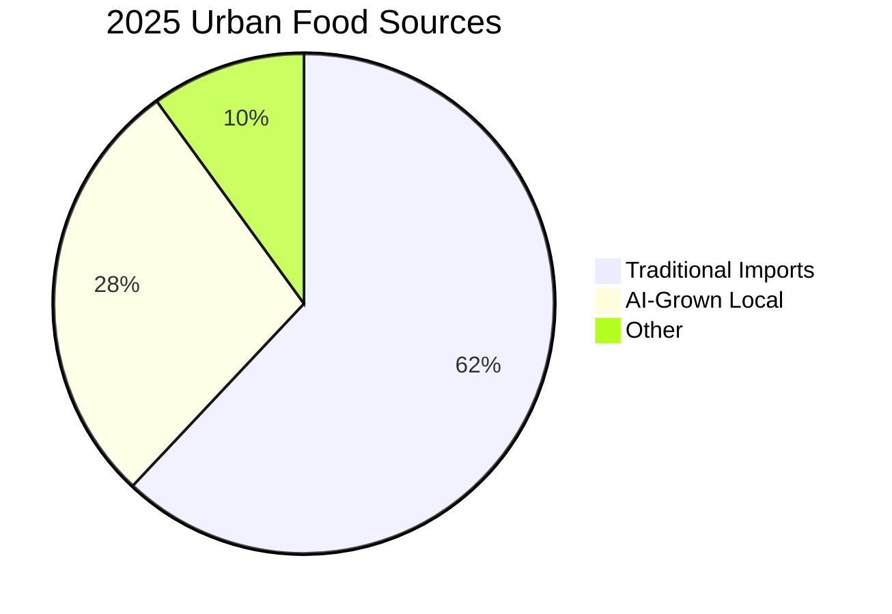

**"The average NYC salad travels 1,500 miles — AI-powered towers now grow it 3 blocks away."**

This startling statistic encapsulates a quiet revolution reshaping how cities feed themselves. As climate change disrupts supply chains and urban populations swell, a new breed of AI-driven urban farms is turning office basements, grocery store walls, and abandoned warehouses into hyper-efficient food production centers. These aren't your grandmother's community gardens — they're climate-controlled, algorithm-optimized ecosystems where crops grow faster, denser, and with near-zero waste.

---

## The AI Farming Revolution Explained

At its core, AI urban farming merges three transformative technologies:

1. **Vertical farming architecture** (stacking crops 10-30 layers high)
2. **Precision agriculture sensors** (tracking 15+ environmental variables)
3. **Machine learning models** that continuously optimize growing conditions

The results defy conventional agriculture:
- **210% higher basil yields** than field farming (MIT Media Lab 2024)
- **98% water reduction** using closed-loop hydroponics
- **365-day growing seasons** unaffected by external weather

### From Sci-Fi to Supermarket: The Evolution Timeline

This technological maturation explains why the sector grew **400%** from 2020-2024. Today's most advanced systems, like Bowery Farming's New Jersey facility, use **147 sensors per growing rack** feeding data to AI models that adjust nutrients hourly.

---

## Busting 5 Persistent Myths About AI Farming

### Myth 1: "It's Only for Tech Hubs"
Detroit's **Planted Detroit** proves otherwise. Their 30,000 sq ft farm in a former auto plant supplies 12% of the city's leafy greens using refurbished industrial equipment and open-source AI tools.

### Myth 2: "The Energy Costs Are Prohibitive"
2025's LED arrays consume **37% less power** than 2020 models (HortiTech report). Berlin's **Infarm** now connects directly to municipal solar grids, achieving **net-zero energy** operations.

### Myth 3: "Robots Will Replace Farmers"
In reality, AI augments human expertise. At Singapore's **Sustenir Agriculture**, growers use AI dashboards to:
- Predict pest outbreaks **14 days in advance** (U Tokyo model)
- Customize light recipes for each crop variety
- Identify nutrient deficiencies 5x faster than the human eye

### Myth 4: "Limited to Leafy Greens"
Pioneers are now growing:
- Strawberries with **45% higher brix levels** (sweetness)
- Root vegetables like carrots using aeroponic misting
- Biofortified kale with **2x the vitamin C** (Bayer-IBM project)

### Myth 5: "It Can't Feed Real Communities"
Plenty Unlimited's Compton farm produces **2 million lbs annually** — enough for 50,000 people — on just 2 acres (vs. 720 acres traditionally needed).

---

## Blueprint for Implementing AI Urban Farming

### Step 1: Site Selection Matrix

| Factor | Ideal Range | Tools Needed |
| --- | --- | --- |
| Ceiling height | 12-30 feet | Laser distance measurer |
| Power access | 400-600 amps | Electrician assessment |
| Water access | 1-2 GPM supply | Flow rate tester |
| Ambient temperature | 60-75°F year-round | Thermal imaging camera |

### Step 2: Core Technology Stack

1. **Sensing Layer**
   - Multispectral cameras ($1,200-$4,000/unit)
   - CO2/Humidity/PPM sensors ($200-$600 each)

2. **AI/ML Layer**
   - Pre-trained crop models (Python/TensorFlow)
   - Reinforcement learning dosing system

3. **Actuation Layer**
   - Robotic harvesters (20-30% ROI boost)
   - Automated nutrient injectors

### Step 3: ROI Calculation Framework

Sample 5,000 sq ft facility:
- **Setup cost**: $1.2M (fully automated)
- **Annual yield**: 80,000 lbs greens
- **Revenue**: $640,000 (@ $8/lb wholesale)
- **Payback period**: 22 months (AgFunder 2025 data)

---

## Traditional vs AI Farming: The Ultimate Showdown

### Space Efficiency

| Metric | Traditional | AI Urban | Advantage |
| --- | --- | --- | --- |
| Output per sq ft/yr | 1 lb | 100 lbs | 100x |
| Harvest cycles/yr | 1-3 | 15-30 | 10x |

### Climate Resilience

When Dubai faced **127°F heatwaves** in 2024, vertical farms maintained **72°F optimal temperatures** while conventional crops failed. AI systems automatically:
- Adjusted cooling loads
- Increased antioxidant nutrients
- Balanced light spectra to reduce heat stress

### Nutritional Quality

Lettuces grown in **Bowery's system** show:
- **24% more vitamin K**
- **17% higher polyphenols**
- **Near-zero pesticide residues** (vs. 4.2ppm in field samples)

---

## The 2025-2030 Roadmap: What's Next?

### Policy Changes Needed
1. **Zoning reforms** to allow farming in commercial districts
2. **Tax incentives** for retrofitting old buildings
3. **Grid integration** programs linking farms to renewable energy

### Consumer Adoption Curve
Early adopters (2020-2024) were specialty grocers. By 2026, **Walmart predicts** 30% of produce will come from local vertical farms.

### Next-Gen Crop Targets
- **AI-designed varieties**: Drought-proof wheat (Bayer)
- **Building-integrated systems**: Skanska's "FarmScraper" pilot
- **Mycelium networks**: Using fungi to transport nutrients 30% faster

---

## The Future Is Growing Locally

As climate volatility increases, cities that adopt AI farming will gain:
- **Food security** against supply chain shocks
- **Economic resilience** through local jobs
- **Environmental benefits** from reduced transport emissions

The math is clear: the average American meal travels **1,500 miles**, emitting **4.5 lbs CO2**. An AI-grown salad from across town? Just **0.3 lbs** — with crunchier lettuce to boot.

**Ready to dig deeper?**
📥 [Download our AI Farming Implementation Kit](/articles/ai-urban-farming-toolkit)
📩 [Join the Urban Farming Revolution Newsletter](/subscribe)

By 2030, that pie chart will look radically different — and your city's dinner plate will too.
