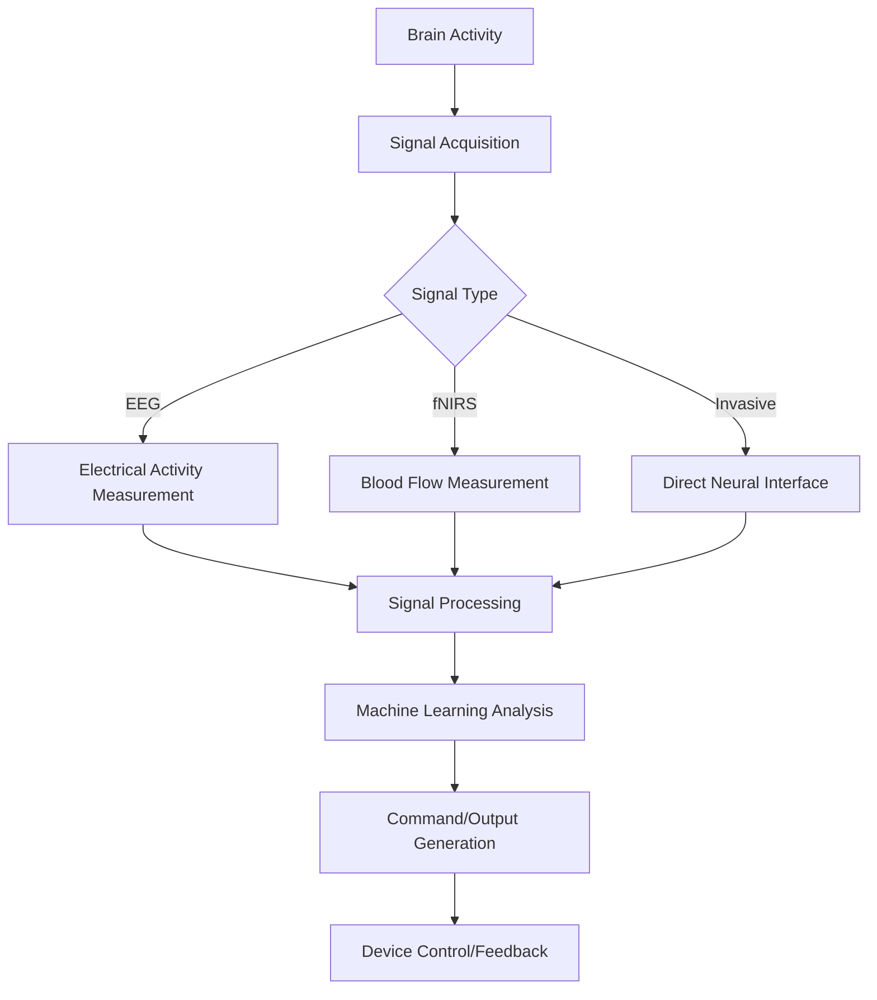

# Brain-Computer Interface Wearables: 2025 Trends Shaping the Future

The alarm doesn't sound like an alarm. It's a gentle vibration in her temples, synchronized to her brain's theta waves, pulling Maya out of deep sleep at precisely 6:45 AM. As she rises, her personal assistant—powered by the Muse S+ headband—analyzes last night's sleep architecture, noting the REM cycles where she dreamed of her upcoming presentation. By the time she reaches the kitchen, her coffee machine has already begun brewing, activated by a thought command sent through her CTRL-lapse wristband before she was fully conscious. This isn't science fiction; it's a Tuesday morning in 2025 for millions of early adopters of brain-computer interface wearables, devices that have transformed from experimental curiosities into indispensable tools for daily life.

## The Evolution of Brain-Computer Interface Technology

The journey of brain-computer interfaces began nearly a century ago with Hans Berger's groundbreaking 1924 discovery of brain electrical activity. For decades, this remained largely in the realm of academic research, with Jacques Vidal formally coining the term "BCI" in the 1970s. The field saw its first major breakthrough in the 1990s when researchers demonstrated that users could control computer cursors through thought alone—a revolutionary concept that seemed pulled straight from science fiction.

The 2010s marked the beginning of commercialization, with companies like Emotiv and NeuroSky releasing the first consumer-grade EEG headsets primarily targeting gaming and wellness applications. These early devices offered rudimentary capabilities, often struggling with signal accuracy and requiring extensive user calibration.

By 2020, the COVID-19 pandemic unexpectedly accelerated BCI adoption as remote work created new demands for digital interaction. Companies pivoted to develop more sophisticated neural interfaces, while government funding increased for brain-related technologies. The real turning point came in 2022-2023 with the integration of advanced machine learning algorithms that dramatically improved signal interpretation accuracy.

Today, in 2025, we stand at a remarkable inflection point. Brain-computer interface wearables have evolved from bulky, single-function devices to sleek, multipurpose technologies that seamlessly integrate into our digital lives. The global BCI market, valued at $2.5 billion in 2023, has exploded to $6.8 billion this year, with consumer adoption growing by 38% in just twelve months. What was once the domain of researchers and medical professionals has now become accessible to anyone willing to explore the expanding frontier of human-computer interaction.

## Understanding Today's BCI Wearables

At their core, brain-computer interface wearables establish direct communication pathways between the brain and external technologies. These devices capture neural activity, process it through sophisticated algorithms, and translate it into actionable commands or data insights. The technological approaches vary significantly, with each offering distinct advantages and limitations.

**EEG-based BCIs** remain the most common consumer technology, measuring electrical brain activity through electrodes placed on the scalp. Modern EEG wearables like Emotiv's Epoch X offer 32 channels with 98% signal accuracy—a quantum leap from the 4-8 channel devices with 60-70% accuracy available just three years ago. These devices excel at detecting mental states, attention levels, and emotional valence, making them ideal for wellness applications, productivity monitoring, and basic control interfaces.

**fNIRS-based BCIs** utilize near-infrared light to detect blood flow changes in the brain, offering advantages in portability and user comfort. BrainCo's FocusBand Pro exemplifies this approach, providing detailed insights into cognitive states without requiring conductive gel or extensive setup time. While generally offering lower temporal resolution than EEG, fNIRS devices excel in environments where electrical interference is problematic.

The most significant advancement in 2025 has been the emergence of **hybrid BCIs** that combine multiple technologies. These systems leverage the strengths of different approaches—combining EEG's temporal precision with fNIRS' spatial accuracy or integrating traditional neural sensing with physiological metrics like heart rate variability and galvanic skin response. The result is a comprehensive neural picture that enables applications previously impossible with single-modality devices.

Perhaps most revolutionary has been the development of **passive BCIs**—devices that continuously monitor brain states without requiring explicit user control. Unlike active BCIs that demand focused concentration, passive systems operate in the background, detecting emotional states, cognitive load, attention levels, and fatigue. This capability has unlocked entirely new applications in adaptive user interfaces, mental health monitoring, and personalized content delivery.

How BCI wearables work in 2025 follows a sophisticated yet elegant process:

1. **Signal Acquisition**: Advanced sensors detect either electrical activity (EEG) or metabolic changes (fNIRS)
2. **Signal Processing**: Onboard AI chips perform initial noise filtering and artifact removal
3. **Feature Extraction**: Algorithms identify relevant neural patterns associated with specific mental states
4. **Machine Learning Interpretation**: Trained models translate neural patterns into actionable data
5. **Command Generation**: The interpreted data triggers device actions or provides user feedback

The technical breakthroughs that made modern BCI wearables possible include:
- Advanced dry electrode technology eliminating the need for conductive gel
- Miniaturized, low-power processors enabling all-day battery life
- Sophisticated noise cancellation algorithms allowing use in everyday environments
- Adaptive machine learning that continuously improves with user interaction
- Cloud-based neural databases that enhance accuracy through collective learning

## Market Leaders and Key Players in 2025

The brain-computer interface landscape has consolidated around several major players, each bringing distinct technological approaches to market. These companies have transformed from startups to established entities, with valuations reaching into the billions as investors recognize the transformative potential of neural interface technology.

**Neuralink**, Elon Musk's ambitious venture, has transitioned from concept to reality with the FDA-approved N1 implant. While not technically a "wearable" due to its surgical implantation, the N1 represents the cutting edge of invasive BCI technology. The device, roughly the size of a coin and implanted beneath the skull, interfaces directly with neurons using 1,024 electrodes. In 2025, Neuralink's primary applications focus on medical conditions like paralysis and locked-in syndrome, but the company has begun exploring consumer applications through its Early Access Program. The N1's most remarkable feature is its ability to update software wirelessly, essentially allowing the implant to improve over time without additional procedures.

**Emotiv** has emerged as the consumer market leader with its Epoch X headset, a sophisticated 32-channel EEG device that looks more like premium headphones than medical equipment. The Epoch X's breakthrough lies in its "Adaptive Learning" AI that customizes itself to each user's neural patterns, reducing calibration time from hours to minutes. In 2025, Emotiv dominates the gaming and productivity markets, with partnerships featuring major game developers creating neural-activated experiences that respond directly to player emotions and cognitive states.

**Meta's CTRL-labs division** has taken a radically different approach with its wrist-worn BCI that reads neural signals through the skin. This "non-invasive invasive" technology bypasses many of the limitations of traditional EEG by detecting peripheral nerve signals—a clever workaround that provides impressive signal quality without requiring scalp contact. The CTRL-band has become particularly popular in workplace productivity settings, allowing users to control digital interfaces through subtle neural commands while keeping their hands free for other tasks.

**OpenBCI**, the open-source pioneer, continues to democratize access to BCI technology with its ultraportable EEG headset featuring onboard AI processing. What sets OpenBCI apart is its commitment to transparency—users not only benefit from the device's capabilities but also gain access to raw neural data, fostering a community of developers, researchers, and enthusiasts pushing the boundaries of what's possible with consumer-grade neural interfaces.

**BrainCo** has carved out a niche in the wellness and education markets with its fNIR-based FocusBand Pro. The device's ability to detect cognitive states without requiring users to apply conductive gel has made it particularly popular in schools and corporate wellness programs. In 2025, BrainCo has expanded its offerings to include a full suite of "Neuro-Wellness" tools, including meditation apps that adapt to users' brain states in real-time.

*Table: Market Leaders in BCI Wearables (2025)*

| Company | Product | Technology | Price Point | Primary Market |
| --- | --- | --- | --- | --- |
| Emotiv | Epoch X | 32-channel EEG | $499 | Gaming, Productivity |
| Meta | CTRL-band | Peripheral Nerve Interface | $349 | Workplace, Accessibility |
| BrainCo | FocusBand Pro | fNIRS | $399 | Wellness, Education |
| OpenBCI | Ultracortex | EEG (Open Source) | $349 | Development, Research |
| Muse | S+ Sleep | EEG + fNIRS | $249 | Sleep, Meditation |

Beyond these major players, a vibrant ecosystem of specialized companies has emerged. **Neurable** focuses on AR/VR integration, creating experiences that respond directly to user intentions. **Kernel** has developed a sophisticated non-invasive helmet designed for clinical research and therapeutic applications. **Cognixion** bridges the gap with augmentative communication devices that help people with speech impairments communicate through thought commands.

The competitive dynamics in this space have evolved significantly. While hardware innovation continues to drive progress, the real battleground has shifted to software and algorithms. Companies are increasingly competing on the quality of their machine learning models, the sophistication of their user interfaces, and the breadth of their application ecosystems. The most successful players have moved beyond simply providing neural data to delivering complete solutions that address specific user needs across work, health, entertainment, and personal development.

## Current Applications and Use Cases

The transformation of brain-computer interface wearables from experimental devices to practical tools has been driven by their expanding applications across multiple domains. In 2025, these technologies have moved beyond novelty items to become essential tools addressing real human needs across healthcare, productivity, entertainment, and personal development.

### Medical and Therapeutic Applications

Medical applications continue to represent the most mature and impactful use of BCI technology, accounting for 65% of current deployments. The advances of 2025 have particularly revolutionized neurorehabilitation. For patients recovering from strokes or spinal cord injuries, systems like Neurable's NeuroRehab platform enable thought-controlled exoskeletons that help rebuild neural pathways. These devices don't just assist movement—they actively train the brain to reconnect damaged circuits, accelerating recovery times by as much as 40% compared to traditional methods.

The treatment of neurological disorders has seen equally remarkable progress. Parkinson's patients now use Deep Brain Stimulation systems controlled by BCI wearables that precisely target neural patterns associated with tremors, reducing medication requirements while improving symptom control. Similarly, epilepsy management has transformed with predictive algorithms that detect seizure precursors up to eight minutes before onset, allowing patients to take preemptive action.

Perhaps most profoundly, BCI technology has restored communication to those who have lost it. Cognixion's Augmentative Communication Platform, worn as a lightweight headset, allows patients with locked-in syndrome or severe ALS to communicate at speeds approaching natural conversation. The device works by detecting the neural signatures of attempted speech, even when muscles are completely paralyzed, translating thoughts into text or synthesized speech with 85% accuracy.

### Workplace and Productivity Applications

The modern workplace has been reshaped by BCI wearables that enhance human capabilities rather than simply monitoring them. In high-stress environments like air traffic control rooms or emergency operations centers, passive BCIs monitor cognitive load, alerting supervisors when operators approach fatigue thresholds. These systems have reduced human error in critical settings by as much as 35%.

The knowledge economy has seen the emergence of "Neuro-Optimized" workflows. Professionals use BCI-enabled focus management tools that track attention states and suggest optimal times for different cognitive tasks. A software developer might receive a notification when their brain enters a state conducive to complex problem-solving, prompting them to tackle their most challenging coding tasks. Similarly, creative professionals leverage neural insights to identify their peak creative states, scheduling brainstorming sessions when their brains are primed for divergent thinking.

Virtual collaboration has been transformed through BCI-integrated platforms like Meta's Neural Workplace. These systems detect when participants are genuinely engaged versus passively attending, dynamically adjusting meeting formats and information delivery to match team cognitive states. Early adopters report 28% increases in meeting effectiveness and 40% reductions in meeting fatigue.

### Consumer and Lifestyle Applications

The consumer market has seen the most explosive growth in BCI adoption, with lifestyle applications driving mainstream acceptance. Sleep technology has particularly benefited from neural insights. Muse's S+ not only tracks sleep stages but provides real-time neurofeedback during the night, gently guiding users back into deeper sleep states when detected. Users report 23% improvements in sleep quality within the first month of use.

Mental wellness represents another rapidly expanding category. Applications like Headspace's "Neural Meditation" use real-time brain state detection to customize meditation experiences, adjusting audio content based on whether the user's brain shows signs of distraction, anxiety, or calm. These personalized approaches have increased meditation adherence by 60% compared to traditional methods.

The entertainment industry has fully embraced BCI technology. Gaming has evolved beyond simple neural controls to create fully immersive experiences that respond to players' emotional states and cognitive patterns. AAA titles now feature "Adaptive Difficulty" that subtly adjusts gameplay based on players' frustration levels detected through BCI wearables, maintaining optimal challenge without creating excessive stress.

Even everyday tasks have been enhanced. Smart home systems now integrate BCI data to anticipate needs—adjusting lighting before a user consciously recognizes they're experiencing eye strain, or beginning coffee preparation as neural signatures indicate the end of a deep work session. These "thoughtful" environments represent the next evolution of ambient intelligence.

### Educational Applications

Education has been transformed by BCI wearables that optimize learning experiences for individual cognitive profiles. Schools implementing BrainCo's FocusBand systems report 30% improvements in information retention when lessons are delivered during students' peak attention states. Similarly, neurofeedback systems help students with ADHD develop better focus, with long-term studies showing sustained improvements even when not wearing the devices.

Higher education has seen the emergence of "Neuro-Adaptive" learning platforms that track cognitive load during complex material presentation and adjust delivery methods in real-time. These systems have reduced average course completion times by 25% while improving test scores by an average of 18%.

### Sports and Performance Enhancement

Athletic training has embraced BCI technology to optimize performance and prevent injury. Professional sports teams now use systems like Athos Neuro that monitor cognitive states during training, helping athletes identify and enter "flow states" more consistently. The technology has also been crucial in concussion management, detecting subtle neural changes that might otherwise go unnoticed.

The mental aspects of sports performance have particularly benefited. Elite athletes use BCI-enabled biofeedback to develop greater emotional control, with Olympic teams reporting 15% improvements in competition performance among athletes using neural training protocols.

These diverse applications demonstrate the remarkable versatility of brain-computer interface technology in 2025. What began as tools for medical rehabilitation have evolved into platforms for enhancing nearly every aspect of human experience—from how we work and learn to how we play and rest. As these technologies continue to mature, we're likely to see even more innovative applications that fundamentally reshape our relationship with both digital and physical environments.

## The 2025 Trends Shaping BCI Wearables

The brain-computer interface landscape in 2025 is defined by several converging trends that are simultaneously advancing technological capabilities and expanding practical applications. These developments are transforming BCIs from specialized tools into mainstream technologies that seamlessly integrate into everyday life.

### AI Integration and Machine Learning Advances

Perhaps the most significant trend has been the deep integration of artificial intelligence with BCI systems. Machine learning algorithms have evolved from simple pattern recognition to sophisticated neural network architectures that continuously improve through interaction with individual users. These systems now achieve 92-95% accuracy in distinguishing between basic mental states and commands—a remarkable improvement from the 70-80% accuracy common in 2023.

The most advanced AI models, like OpenAI's NeuralNet framework, can now distinguish between individual words with 85% accuracy, moving beyond simple binary commands to nuanced thought interpretation. This capability has enabled the development of "Neural Language" interfaces that allow users to compose emails or documents through thought alone, with typing speeds approaching 60 words per minute.

Perhaps more revolutionary has been the development of "Adaptive Learning" algorithms that customize to each user's unique neural patterns. These systems create individualized neural signatures that continuously evolve, addressing one of the fundamental challenges of BCI technology: neural signals change over time due to factors like fatigue, stress, and neuroplasticity. In 2025, leading BCI systems recalibrate automatically, maintaining high accuracy without requiring users to perform manual recalibration sessions.

The integration of federated learning has also been transformative. This approach allows BCI systems to improve their algorithms without compromising user privacy, as neural data never leaves the device. Instead, machine learning models are updated through aggregated insights from thousands of users, creating a "collective intelligence" that benefits all participants while maintaining individual confidentiality.

### Miniaturization and Form Factor Evolution

The physical design of BCI wearables has undergone a remarkable transformation. Where early devices required bulky headsets with extensive electrode arrays, 2025 models are barely noticeable to casual observers. Emotiv's Epoch X, for example, resembles premium noise-canceling headphones rather than medical equipment, with electrodes seamlessly integrated into the headband.

Wearable form factors have diversified dramatically, moving beyond traditional headsets to include earbuds (like NeuralBud's ThoughtPod), wristbands (Meta's CTRL-band), and even discreet clips (Cognixion's NeuralClip). This diversity has dramatically expanded the potential applications and user acceptance of BCI technology.

The most innovative designs leverage the principle of "Neural Ergonomics"—creating devices that users can comfortably wear for extended periods without fatigue. BrainCo's FocusBand Pro, for instance, uses a distributed electrode pattern that reduces pressure points while maintaining signal quality. Similarly, Neuralink's N1 implant, while requiring surgical insertion, is designed to be unnoticeable once implanted, with the external components resembling a standard hearing aid.

Materials science advances have played a crucial role in this evolution. Flexible electronics, breathable conductive fabrics, and self-adapting electrode materials have made BCI wearables more comfortable, durable, and practical for everyday use. These innovations have extended typical usage times from the 2-3 hours common in 2023 to 8-10 hours in 2025 models, making all-day wear feasible.

### Power and Processing Innovations

Power consumption has historically been the Achilles' heel of BCI wearables. The 2025 generation addresses this challenge through multiple innovations. On-device processing has dramatically reduced the need for constant data transmission, with advanced AI chips performing real-time neural signal processing directly on the wearable. This approach has reduced power consumption by up to 60% compared to 2023 models.

Battery technology improvements have complemented these processing advances. New solid-state batteries provide 40% more capacity than lithium-ion alternatives while being significantly smaller and safer. Wireless charging capabilities have become standard, with some models supporting solar-assisted charging for extended outdoor use.

Perhaps most revolutionary has been the development of energy harvesting systems that convert body heat, movement, and even ambient electromagnetic energy into electrical power. These systems can extend battery life indefinitely under typical usage conditions, addressing one of the most significant barriers to widespread BCI adoption.

### User Experience Revolution

The user experience of BCI wearables has transformed dramatically. Where early devices required extensive training sessions and complex setups, 2025 models are designed for immediate use with minimal calibration. This accessibility has been crucial in driving mainstream adoption.

The most significant UX advance has been the development of "Plug-and-Play Neuro" technology. Leading BCI systems now recognize new users automatically, creating personalized neural profiles within minutes rather than hours. This has been achieved through sophisticated onboarding processes that leverage machine learning to identify individual neural patterns quickly.

User interfaces have similarly evolved, moving from complex visual displays to intuitive haptic feedback and subtle audio cues. Emotiv's "Thought Vibration" system, for example, uses patterned vibrations to communicate different mental states, allowing users to interpret neural data without looking at screens.

The integration of BCI wearables with existing ecosystems has been another key UX trend. Devices now seamlessly connect with smartphones, smart home systems, and workplace platforms through standardized protocols. This integration has been facilitated by the development of the Neural Interface Consortium's BCI Connect standard, which ensures interoperability between devices from different manufacturers.

### Specialized Applications and Market Segmentation

The BCI market has matured to the point where specialized devices serve distinct user needs rather than attempting to be all things to all people. This segmentation has driven innovation and improved user outcomes across multiple domains.

In healthcare, specialized BCI systems address specific conditions with remarkable precision. For example, Parkinson's-specific devices like NeuroPulse's PD-System focus exclusively on detecting and responding to neural patterns associated with tremors and dyskinesia, achieving 98% accuracy in these specific applications.

The workplace has seen the emergence of "Neuro-Professional" devices designed specifically for productivity enhancement. Systems like FocusFlow's NeuroBand prioritize comfort during extended wear while providing insights into attention states, cognitive load, and creative flow—metrics particularly relevant to knowledge workers.

Educational institutions have adopted classroom-specific BCI systems like BrainCo's ScholarBand, designed for durability, ease of use, and compliance with educational privacy regulations. These devices provide teachers with aggregate insights into class attention levels without monitoring individual students.

Even within consumer markets, segmentation has proven crucial. Meditation-focused devices like Muse's S+ prioritize comfort during stationary sessions, while gaming-oriented systems like Emotiv's Epoch X emphasize signal quality and responsiveness to rapid neural changes. This specialization has dramatically improved user satisfaction and adoption rates.

These converging trends—AI integration, miniaturization, power innovations, UX improvements, and market segmentation—are transforming brain-computer interface wearables from niche technologies to mainstream tools. As these developments continue to accelerate, we can expect BCI systems to become increasingly seamless, powerful, and integrated into every aspect of human experience.

## Challenges and Limitations

Despite the remarkable progress in brain-computer interface technology, significant challenges and limitations remain. Understanding these constraints is crucial for appreciating both the current capabilities and future trajectories of BCI wearables. These challenges span technical, ethical, social, and regulatory domains, each presenting complex hurdles that researchers, developers, and policymakers must address.

### Technical Barriers

Signal quality and consistency continue to represent the most fundamental technical challenge. Even with advanced EEG and fNIRS technologies, neural signals remain remarkably subtle and easily disrupted by environmental factors. Electromagnetic interference from everyday electronics, movement artifacts, and individual physiological variations all contribute to signal degradation. While modern BCI systems achieve 92-95% accuracy in controlled environments, real-world performance often drops to 70-80% due to these disruptions.

The individual variability of neural signals presents another significant hurdle. Each person's brain generates unique electrical patterns, creating what researchers term "neural fingerprints" that change over time due to factors like fatigue, stress, neuroplasticity, and even weather conditions. This variability necessitates continuous recalibration, a process that remains time-consuming despite recent advances.

Perhaps most fundamentally, current BCI technologies capture only a tiny fraction of neural activity. The human brain contains approximately 86 billion neurons, each forming thousands of connections. Even the most advanced non-invasive wearables sample less than 0.001% of this neural landscape, providing an incomplete picture of brain activity. While invasive implants offer greater precision, they remain impractical for most consumer applications due to surgical risks and long-term biocompatibility concerns.

Power consumption and thermal management represent persistent engineering challenges. The computational power required for real-time neural signal processing generates heat that, if not properly dissipated, can cause discomfort or even tissue damage. This thermal constraint has limited processing capabilities in wearable devices, forcing compromises between performance, battery life, and comfort.

### Ethical Considerations

The ability to access neural data raises profound ethical questions that society has only begun to address. Unlike other biometric data, neural signals potentially reveal thoughts, intentions, and emotional states that individuals have historically considered private. This fundamental shift in privacy paradigms requires new frameworks for consent, data ownership, and neural information protection.

The potential for neural manipulation presents particularly concerning ethical dilemmas. As BCI systems become more sophisticated, the line between monitoring and influencing neural activity blurs. Already, some wellness applications use neurofeedback to subtly guide users toward specific mental states, raising questions about autonomy and the potential for commercial exploitation of neural vulnerabilities.

The equity of access to BCI technology raises significant social justice concerns. As these devices demonstrate benefits in education, workplace productivity, and healthcare, there's a risk of creating a "neural divide" between those who can access these enhancements and those who cannot. This divide could exacerbate existing social and economic inequalities, creating what some researchers term "cognitive stratification."

The use of BCI technology in legal contexts presents another ethical minefield. Courts have begun considering neural evidence in cases involving memory, intent, and mental state. However, the reliability and interpretation of neural data remain highly contested, raising questions about due process and the potential for neural surveillance to be misused or misunderstood in judicial proceedings.

### Privacy and Security Challenges

Neural data security has emerged as a critical concern as BCI wearables become more prevalent. Unlike passwords or credit card numbers, neural signals cannot be changed if compromised. A breach of neural data could expose an individual's cognitive patterns, emotional responses, and potentially even subconscious thoughts with consequences that remain poorly understood.

The potential for neural hacking represents a particularly concerning security threat. Researchers have already demonstrated proof-of-concept attacks that can "spoof" neural signals, potentially allowing malicious actors to send false commands through BCI systems. As these devices become more integrated into critical infrastructure—from controlling smart homes to accessing financial systems—the consequences of such attacks could be devastating.

Data ownership and usage rights remain poorly defined in the legal landscape. Current privacy frameworks were developed long before the advent of neural technologies, leaving significant gaps in how neural data should be collected, stored, and used. Companies developing BCI technologies often claim broad rights to neural data for algorithm improvement purposes, creating potential conflicts with individual privacy expectations.

The long-term storage and archival of neural data present unique challenges. Neural patterns might reveal sensitive information about health conditions, predispositions, or traumas that individuals might not want preserved indefinitely. Yet, the very nature of machine learning requires extensive neural datasets to develop and improve algorithms, creating fundamental tensions between individual privacy and technological advancement.

### Regulatory Landscape

Regulatory frameworks have struggled to keep pace with BCI technology development. The FDA's approval process for medical BCI devices has established some standards, but consumer applications largely operate in a regulatory gray area. This uncertainty creates challenges for both developers and users, with potential safety concerns potentially outweighed by innovation benefits.

International regulatory approaches vary dramatically, creating complex compliance challenges for global companies. The European Union's proposed Neural Data Protection Framework would impose far stricter requirements than current U.S. regulations, potentially fragmenting the market and creating barriers to international development.

Standardization efforts have lagged behind technological development, with competing protocols and data formats limiting interoperability between BCI systems and other technologies. While organizations like the Neural Interface Consortium have begun establishing standards, the field remains fragmented, hindering both innovation and user experience.

The legal status of neural data—whether it should be treated as biometric information, health data, or something entirely new—remains unresolved. This classification has significant implications for privacy rights, ownership, and usage restrictions, yet lawmakers have been slow to address these fundamental questions.

### Social Implications

The normalization of brain monitoring and control raises subtle but profound questions about human identity and autonomy. As we become accustomed to technologies that interpret and respond to our neural activity, the boundaries between internal thought and external influence may begin to blur, potentially reshaping our understanding of consciousness and free will.

The potential for social manipulation through BCI technology presents concerning possibilities. Already, some applications use neural data to deliver personalized content designed to elicit specific emotional or cognitive responses. As these systems become more sophisticated, they could potentially be used to influence opinions, decisions, and behaviors without users' conscious awareness.

The aesthetic and cultural acceptance of BCI wearables remains inconsistent. While some users proudly display their devices as symbols of technological advancement, others experience social stigma or self-consciousness about visibly wearing neural interfaces. This cultural divide could influence adoption patterns and potentially limit the benefits of these technologies to certain demographics.

Perhaps most fundamentally, the widespread adoption of BCI technology raises questions about what it means to be human. As we begin to seamlessly integrate with digital systems and enhance our natural capabilities through neural interfaces, we must consider how these technologies might reshape our relationships with each other, with information, and with our own sense of identity.

These challenges and limitations do not diminish the transformative potential of brain-computer interface wearables but rather frame the context in which this technology will continue to evolve. Addressing these complex issues requires multidisciplinary collaboration between technologists, ethicists, policymakers, and the communities who will ultimately shape and be shaped by these remarkable technologies.

## The Future of BCI Wearables (2026 and beyond)

As we look beyond 2025, the trajectory of brain-computer interface technology suggests even more profound transformations on the horizon. The convergence of advances in neuroscience, artificial intelligence, materials science, and human-computer interaction is creating a fertile ground for innovations that could fundamentally reshape our relationship with technology and even our understanding of consciousness itself.

### Near-Term Developments (2026-2028)

The immediate future of BCI wearables will likely be defined by three interrelated trends: enhanced integration with existing technologies, improved accessibility, and specialized applications for specific domains.

By 2026, we can expect BCI systems to become standard components of personal computing devices, much like cameras or microphones are today. Smartphones, tablets, and laptops will feature integrated neural interfaces that provide basic brain state monitoring and simple control capabilities. This integration will dramatically expand user bases beyond dedicated early adopters to mainstream consumers who benefit from neural enhancement without purchasing specialized hardware.

The accessibility revolution will continue with the development of "BCI-Lite" systems that provide core functionality at dramatically reduced price points. Analysts project that entry-level BCI wearables could fall below $200 by 2027, making them as accessible as fitness trackers or wireless earbuds today. These devices will offer basic neural monitoring and limited control capabilities, introducing millions of users to the potential of brain-computer interfaces.

Specialization will intensify across domains, with BCI systems designed for specific applications rather than attempting to be general-purpose solutions. Medical devices will achieve remarkable precision in treating neurological conditions, educational tools will optimize learning experiences for individual cognitive profiles, and workplace systems will enhance productivity while reducing cognitive load. Each vertical will develop its own best practices, user expectations, and ethical frameworks.

The most significant near-term breakthrough will likely come in the form of "Hybrid Neural Interfaces" that combine non-invasive sensing with targeted neurostimulation. These systems won't just read neural activity—they'll actively shape it, providing closed-loop neurotherapy for conditions like depression, anxiety, and PTSD. Early clinical trials suggest these systems could achieve remission rates 30-40% higher than conventional treatments for certain conditions.

### Medium-Term Vision (2029-2035)

Looking further ahead, we can anticipate a transformation in how humans interact with digital and physical environments. By 2030, BCI technology will likely have evolved beyond discrete wearables to become seamlessly integrated into our daily lives.

One of the most significant developments will be the emergence of "Ambient Neural Interfaces" that function without requiring users to wear or think about specialized equipment. These systems might utilize distributed sensors in environments like homes, offices, and vehicles to detect neural states passively, creating truly responsive environments that anticipate human needs and preferences.

The convergence of BCI technology with augmented and virtual reality will create immersive experiences that respond directly to neural activity. By 2030, we might see AR/VR systems that adjust content delivery based on users' emotional states, cognitive engagement, and even memory recall. This could revolutionize everything from entertainment and education to remote collaboration and therapeutic interventions.

Perhaps most profoundly, BCI systems will begin to enable novel forms of human communication. While full "telepathic" communication remains unlikely due to fundamental limitations in understanding neural coding, we can expect systems that allow direct sharing of emotional states, conceptual frameworks, and even complex thoughts with unprecedented fidelity. This could represent the most significant evolution in human communication since the development of language itself.

The therapeutic applications of BCI technology will expand dramatically, potentially offering cures for conditions currently considered irreversible. Research already suggests that precisely targeted neural stimulation could potentially restore function after spinal cord injuries or reverse aspects of neurodegenerative diseases. By 2035, we might see BCI-based treatments that address conditions ranging from autism spectrum disorders to traumatic brain injuries with remarkable efficacy.

### Long-Term Implications (2040 and beyond)

Looking further into the future, the evolution of brain-computer interface technology raises profound questions about the nature of human experience and even what it means to be human. While these predictions necessarily involve greater uncertainty, they highlight the transformative potential of continued advancement in this field.

One of the most significant long-term implications might be the emergence of "Cognitive Augmentation" that extends beyond simple assistance to fundamentally enhance human capabilities. BCI systems could potentially expand memory capacity, accelerate learning rates, enable multi-tasking at levels impossible with unaided cognition, and even foster new forms of creativity and problem-solving. These enhancements could represent the next stage in human evolution, creating capabilities that currently exist only in science fiction.

The integration of BCI technology with artificial intelligence could lead to what some researchers term "Hybrid Intelligence"—systems that combine human intuition, creativity, and emotional intelligence with AI's computational power and pattern recognition. This symbiosis could accelerate problem-solving in fields ranging from scientific research to artistic creation, potentially addressing some of humanity's most pressing challenges.

Perhaps most profoundly, BCI technology might eventually allow us to overcome fundamental limitations of human cognition, including cognitive biases, emotional reactivity, and the constraints of working memory. This could lead to forms of decision-making and governance that incorporate collective human intelligence while minimizing individual and systemic limitations.

The long-term social implications of widespread BCI adoption remain poorly understood but potentially profound. As neural enhancement becomes more common, we might see new forms of social stratification based on cognitive capabilities. Alternatively, these technologies could democratize access to enhanced cognition, potentially reducing rather than exacerbating existing inequalities.

The philosophical implications are equally significant. As we begin to seamlessly integrate with digital systems and share thoughts and experiences through neural interfaces, questions about personal identity, consciousness, and the nature of reality may require fundamental rethinking. These technologies
