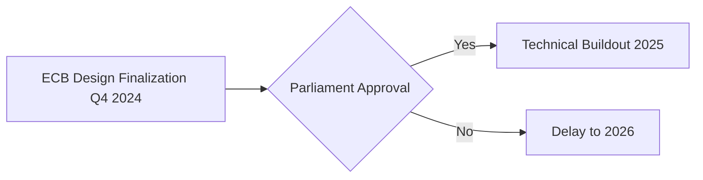

## CBDC Rollout 2025: Which Nations Go Live First?

Imagine your wallet going fully digital by 2025—while central banks gain power to freeze funds or automate taxes. This isn’t sci-fi; it’s the CBDC revolution racing toward us. **CBDC rollout 2025** represents a tectonic shift in global finance, with 134 countries pursuing Central Bank Digital Currencies (CBDCs)—digital sovereign cash that could replace physical money. Unlike volatile cryptocurrencies, CBDCs offer state-backed stability but introduce unprecedented surveillance capabilities. With the Bank for International Settlements confirming 60% of central banks target implementation within 1-6 years, 2025 emerges as the tipping point. Here’s what our exhaustive analysis reveals about which nations will deploy first—and how their choices will reshape your financial freedom.

### What Is a CBDC? Breaking Down the 2025 Game Changer
**CBDC (Central Bank Digital Currency)** is sovereign digital money issued by central banks, equivalent to physical cash but programmable and trackable. Unlike decentralized cryptocurrencies, CBDCs operate on permissioned ledgers where transactions are visible to monetary authorities. Three architectural pillars define them:

**1. Two-Tier Distribution Model**
Central banks issue to commercial banks (like JPMorgan or ICBC), which distribute to consumers—a firewall against bank runs. China’s e-CNY prototype exemplifies this, limiting direct central bank exposure.

**2. Identity Frameworks**
```markdown
- **Account-Based CBDCs**: Tied to verified identities (e.g., ECB's proposal requiring KYC).  
- **Token-Based CBDCs**: Mimic cash anonymity (e.g., Bahamas' Sand Dollar—but even here, >$500 transactions trigger ID checks).  
```

**3. Programmability Engine**
CBDCs embed smart contract-like functions:
```python
# Example: Automated tax collection in Brazil's DREX prototype  
def process_payment(amount, recipient):  
    tax = amount * 0.15  # 15% automatic withholding  
    net_amount = amount - tax  
    central_bank.transfer(tax, "TAX_AUTHORITY")  
    central_bank.transfer(net_amount, recipient)  
```

&gt; 💡 **Key Takeaway**: CBDCs combine cash’s legal status with digital surveillance—a trade-off between convenience and privacy that’ll define financial systems by 2025.

### Global CBDC Status: Where We Stand Before 2025
As of Q2 2024, five nations have live retail CBDCs, while giants like China and the EU race toward 2025 deadlines. Critical developments include:

| **Country** | **Project** | **Adoption Level** | **2024 Milestone** |
| --- | --- | --- | --- |
| China | e-CNY | National Pilot | 260M wallets, $250B transacted |
| ECB | Digital Euro | Preparation Phase | Design finalization Q4 2024 |
| India | e-Rupee | Integration Pilot | Linked to UPI payment rails |
| Nigeria | eNaira | Live | $1.2M daily transactions |
| USA | (No Retail CBDC) | Research Phase | FedNow (non-CBDC) live since 2023 |

**Non-Negotiable Roadblocks:**
- **Privacy Backlash**: Germany’s Bundesbank warns public resistance could delay the digital Euro unless anonymity guarantees improve.
- **Bank Disintermediation**: Jamaica capped JAM-DEX holdings at $1,500 to prevent funds fleeing commercial banks—a model others may copy.
- **Infrastructure Gaps**: Nigeria’s eNaira struggles with offline transactions, critical for regions with patchy internet (less than 35% penetration in rural areas).

&gt; ⚠️ **Expert Warning**: The IMF’s January 2024 report cautions that fragmented CBDC systems could “balkanize global payments,” urging interoperability standards like BIS’s Project mBridge.

### The 2025 Rollout Map: Country-by-Country Forecasts

#### 🇨🇳 China: The Uncontested Leader
**Prediction**: Full national rollout by Q3 2025
China’s e-CNY already handles 0.2% of M0 money supply—seemingly small but scaling exponentially. The PBoC’s “controllable anonymity” model allows:
- Anonymous sub-$220 transactions
- Full tracing for larger payments
Critical 2025 catalysts:
1. Integration with Alipay/WeChat Pay (covering 90% of mobile payments)
2. Belt & Road trade settlements bypassing SWIFT

#### 🇪🇺 Eurozone: Regulatory Hurdles Ahead
**Prediction**: Limited pilot by December 2025
The ECB’s “preparation phase” faces political landmines:

Privacy remains the dealbreaker. France demands transaction anonymity under €100; Germany insists on zero “programmable” restrictions. Without compromise, a 2025 launch looks improbable.

#### 🌏 Emerging Economies: The Silent Disruptors
**High-Probability 2025 Launches**:
1. **India’s e-Rupee**: Integrated with UPI (4B+ monthly transactions). Expect nationwide rollout by March 2025.
2. **Brazil’s DREX**: Targeting programmable welfare payments using Ethereum-based smart contracts.
3. **Thailand’s Project Inthanon**: Cross-border mBridge participant—likely pilot in 2025.

**Delayed Rollouts**:
- **USA**: Political gridlock makes 2025 retail CBDC impossible. FedNow will dominate instead.
- **UK**: “Britcoin” stalled by leadership changes; 2027 more realistic.

### Hidden Risks: What Could Derail CBDC Rollout 2025?
**Technical Debt**: Nigeria’s eNaira suffered a 3-day outage in 2023—highlighting scalability risks. As seen in [Bagaimana Discord Mengatasi Skalabilitas Tinggi dengan ScyllaDB](/articles/bagaimana-discord-mengatasi-skalabilitas-tinggi-dengan-scylladb), distributed systems require robust architecture.

**Geopolitical Tensions**: Russia’s digital ruble rollout froze post-sanctions, while the US-China tech war could fragment CBDC standards.

**Public Backlash**: 62% of Europeans distrust CBDC privacy in ECB surveys. Without “cash-like” anonymity features, adoption could falter.

### Beyond Payments: The Transformative Impact of CBDCs Post-2025
**Monetary Policy Revolution**:
- **Negative Interest Rates**: Directly applied to CBDC holdings to stimulate spending (e.g., ECB’s proposed €3,000 holding limit).
- **Targeted Stimulus**: Programmable expiry dates on disaster relief funds (tested in Jamaica’s JAM-DEX).

**Corporate Implications**:
- Supply chains: Automated VAT payments via CBDC smart contracts
- Payroll: Instant salary settlements cutting bank processing fees

&gt; 🔮 **2030 Vision**: CBDCs could integrate with AI financial agents, automating investments using tools from [How to Build AI Agents: A Complete Guide for 2025](/articles/how-to-build-ai-agents-a-complete-guide-for-2025).

### How Businesses and Citizens Should Prepare for CBDC Rollout 2025
**For Consumers**:
1. Diversify holdings: Keep ≤10% in CBDCs to mitigate freezing risks
2. Demand transparency: Support legislation limiting transaction surveillance

**For Enterprises**:
1. Audit systems for CBDC compatibility (e.g., NFC payment terminals)
2. Explore programmable treasury functions:
   ```python  
   # Automated corporate tax payment  
   if revenue > CBDC_threshold:  
        auto_transfer(tax_rate * revenue, tax_authority)  
   ```

**Governments**: Prioritize offline access and tiered privacy—without them, the 2025 CBDC rollout risks becoming a dystopian tool of control rather than innovation.

---

**Final Verdict**: China and India will dominate the 2025 CBDC landscape, while Western democracies grapple with privacy trade-offs. One certainty remains: CBDCs aren't just digital cash—they’re programmable levers of economic control. Prepare accordingly.
