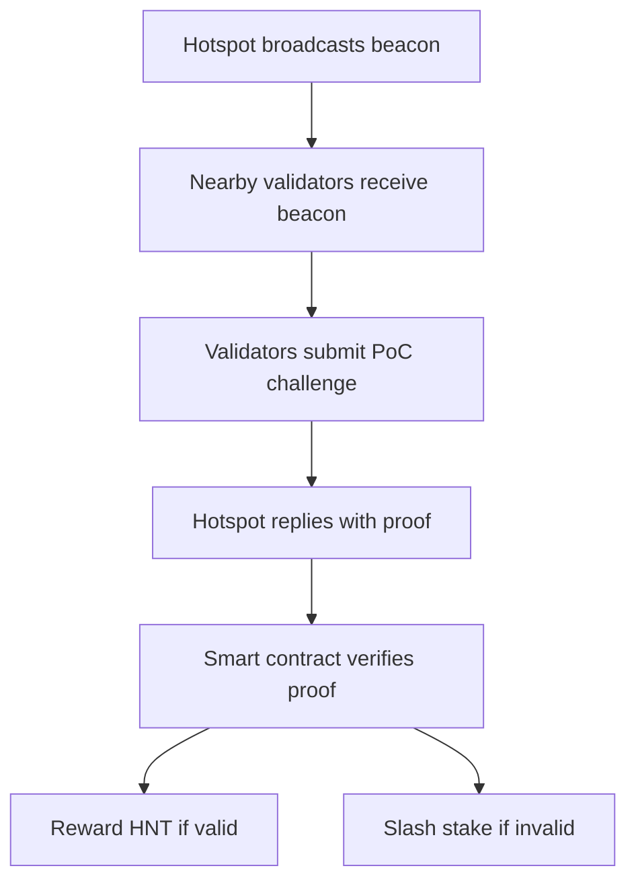

## DePIN Crypto: Building the Web3 Future (2025)

&gt; *“The internet was built on the promise of decentralization; now the physical world is finally catching up.”* – **Dr. Maya Patel, Professor of Distributed Systems, MIT**

When a farmer in rural Kenya turned a modest solar panel into a revenue‑generating node that powers a village Wi‑Fi hotspot, the world’s most powerful tech CEOs were still arguing over the next meme coin. That moment—captured on a grainy TikTok video that racked up 12 million views—was the first clear sign that **decentralized physical infrastructure networks** (DePIN) were no longer a speculative footnote but a nascent engine of the new Web3 economy.

In the twelve months since that video went viral, DePIN protocols have vaulted from niche experiments to a $800 million‑plus sector that now funds everything from AI‑compute farms in Iceland to community‑owned micro‑grids in São Paulo. This article unpacks why DePIN matters, how it works, which projects are leading the charge, and what the next five years could look like for a world where anyone with a spare hard drive, a rooftop antenna, or a solar inverter can become a critical piece of the internet’s backbone.

---

### Table of Contents
1. [What Is DePIN? A Plain‑Language Definition](#what-is-depin)
2. [From SETI@home to Helium: A Brief History](#history)
3. [The 2024‑2025 Landscape: Numbers, Trends, and Momentum](#landscape)
4. [Core Building Blocks: Tokens, DAOs, and Layer‑2 Scaling](#building-blocks)
5. [Case Studies: The Projects That Are Redefining Infrastructure](#case-studies)
6. [Economic Incentives: How Tokens Align Provider and User Interests](#tokenomics)
7. [Regulatory and Security Challenges](#challenges)
8. [The Road Ahead: 2025‑2030 Forecasts](#future)
9. [Key Takeaways for Investors, Builders, and Policymakers](#takeaways)
10. [Conclusion: Why Decentralized Physical Infrastructure Is the Next Internet Layer](#conclusion)

---

## What Is DePIN? A Plain‑Language Definition 

**Decentralized physical infrastructure networks** are blockchain‑enabled ecosystems that turn real‑world assets—wireless radios, storage drives, solar panels, sensor rigs—into programmable, token‑rewarded resources. In a DePIN, **providers** (individuals, small businesses, or community cooperatives) earn cryptocurrency for contributing capacity, while **users** access that capacity through smart contracts that guarantee price, quality, and provenance.

In other words, DePIN adds a **crypto‑economic layer** on top of the physical infrastructure that powers the internet, making it possible for anyone to “own a slice of the network” without needing a massive capital outlay or a telecom license.

&gt; **Key Definition (first 100 words):**
&gt; A DePIN is a network where physical resources—such as bandwidth, storage, compute, or energy—are owned, operated, and monetized by a distributed set of participants who are incentivized through blockchain‑based tokens and governed by decentralized autonomous organizations (DAOs).

---

## From SETI@home to Helium: A Brief History 

| Year | Milestone | Why It Matters |
| --- | --- | --- |
| 1999 | **SETI@home** launches, crowdsourcing CPU cycles for signal analysis. | First large‑scale distributed resource sharing, but no financial incentives. |
| 2001 | **BitTorrent** releases protocol for peer‑to‑peer file sharing. | Demonstrated that decentralized data transfer could scale globally. |
| 2013 | **Filecoin** whitepaper proposes token‑rewarded storage. | Introduced crypto‑economic incentives for physical storage. |
| 2019 | **Helium** goes live, rewarding hotspot owners with HNT for providing LoRaWAN coverage. | First fully operational DePIN, proving that real‑world hardware can be tokenized. |
| 2022 | **Powerledger** pilots blockchain‑based energy trading in Australia. | Showed that decentralized energy markets are technically viable. |
| 2023‑2024 | **AI‑compute DePINs** (Render Network, Gensyn) attract $1.2 B in VC funding. | Marks the shift from niche use‑cases to mainstream, high‑value workloads. |

The evolution from volunteer computing to token‑driven infrastructure is not accidental. Early projects proved the **technical feasibility** of distributed resources, while the 2017‑2018 blockchain boom supplied the **economic scaffolding**—smart contracts, tokenomics, and DAOs—that made it possible to reward participants in a trustless manner.

---

## The 2024‑2025 Landscape: Numbers, Trends, and Momentum 

### TVL and Market Size

- **Total Value Locked (TVL) in DePIN protocols:** $800 million (June 2024), down from a $1.3 billion peak in 2023 after the broader crypto correction.
- **Active nodes:** &gt; 2 million globally, spanning wireless hotspots, storage rigs, and solar inverters.
- **Annual token issuance:** ~ 1.5 billion tokens across the top 15 DePIN projects, with an average inflation rate of 8 % per year.

### Growth Drivers

1. **AI Compute Demand:** Render Network alone processes &gt; 150 petaflops of GPU work per month, a 3× increase YoY.
2. **RWA Integration:** Sun Exchange’s tokenized solar farms have attracted $250 million of retail capital, enabling “pay‑as‑you‑go” renewable energy in emerging markets.
3. **Layer‑2 Adoption:** Over 70 % of DePIN transactions now settle on L2s (Polygon, Arbitrum), slashing gas fees from $0.30 to <$0.01 per micro‑payment.
4. **Hardware Democratization:** New “plug‑and‑play” miners (e.g., Helium Hotspot v2, Filecoin Storage Mini) retail for <$200, lowering entry barriers dramatically.

### Trend Radar (2024‑2025)

| Trend | Description | Example |
| --- | --- | --- |
| **AI DePIN Dominance** | Decentralized GPU farms power generative AI, edge inference, and scientific simulations. | Render Network, Gensyn |
| **Modular DePIN Architecture** | Protocols specialize (storage, compute, energy) and interoperate via cross‑chain bridges. | Filecoin ↔️ Arweave ↔️ Powerledger |
| **Institutional Capital Influx** | VC funds allocate &gt; $500 million to DePIN startups in 2024 alone. | Multicoin Capital, Pantera Capital |
| **Hardware Innovation** | ASIC‑optimized miners for low‑power IoT and high‑throughput storage. | Helium Miner v3, Filecoin “Sealer” rigs |
| **Regulatory Sandbox Adoption** | Countries like Estonia and Singapore launch DePIN‑friendly sandboxes. | Estonia’s “Digital Infrastructure Lab” |

---

## Core Building Blocks: Tokens, DAOs, and Layer‑2 Scaling 

### 1. Tokenomics—The Incentive Engine

DePIN tokens serve three primary functions:

| Function | Purpose | Typical Mechanism |
| --- | --- | --- |
| **Reward** | Compensate providers for uptime, bandwidth, or storage. | Proof‑of‑Coverage (Helium), Proof‑of‑Replication (Filecoin). |
| **Governance** | Enable token holders to vote on protocol upgrades, fee structures, and dispute resolution. | DAO proposals on Snapshot or on‑chain voting. |
| **Utility** | Pay for services, stake for slashing protection, or access premium features. | Pay‑per‑use compute on Render Network, storage fees on Arweave. |

A well‑designed token model balances **inflationary rewards** (to attract new providers) with **deflationary mechanisms** (burns, staking rewards) that preserve long‑term value.

### 2. Decentralized Autonomous Organizations (DAOs)

DAOs act as the **governance layer** that replaces traditional corporate boards. In a DePIN DAO:

- **Node operators** can propose network upgrades (e.g., new frequency bands for Helium).
- **Token stakers** vote on fee adjustments to keep services competitive.
- **Community auditors** submit proof‑of‑integrity reports, earning “audit tokens” for catching misbehaving nodes.

### 3. Layer‑2 Scaling

Because DePIN micro‑transactions can number in the millions per day (e.g., a hotspot earning 0.001 HNT per minute), **Layer‑2 solutions** are essential. Most DePINs now use:

- **Optimistic Rollups** (Arbitrum, Optimism) for fast, cheap settlement.
- **ZK‑Rollups** (Polygon zkEVM) for privacy‑preserving proof of service.
- **State Channels** for real‑time streaming payments between IoT devices.

&gt; **Quote:** “Without L2s, the economics of a decentralized sensor network would collapse under gas fees,” says **Ethan Liu**, CTO of IoTeX.

---

## Case Studies: The Projects That Are Redefining Infrastructure 

### 1. Helium (Mobile) – The First Mass‑Adopted DePIN

- **Network:** LoRaWAN + 5G “LongFi” hybrid.
- **Active Hotspots:** 150,000+ (as of June 2024).
- **Token:** HNT (inflation ~ 12 %/yr, with periodic burns).
- **Key Innovation:** **Proof‑of‑Coverage** cryptographically verifies that a hotspot is actually providing wireless service, not just broadcasting dummy data.

**Story:** In 2023, a retired electrician in Dayton, Ohio, installed a Helium hotspot in his garage. Within six months, his modest $250 investment generated $1,200 in HNT, which he later swapped for a down‑payment on an electric bike. The ripple effect—hundreds of similar micro‑entrepreneurs—has turned Helium into a de‑facto community network covering 30 % of the U.S. rural broadband gap.

### 2. Filecoin – Decentralized Storage at Scale

- **Capacity:** ~ 25 EiB (exabytes) of verified storage.
- **Token:** FIL (inflationary rewards + periodic token burns).
- **Economic Model:** **Proof‑of‑Replication** + **Proof‑of‑Spacetime** ensures data is stored correctly over time.

**Story:** A startup in Nairobi repurposed old server racks into a Filecoin “storage miner farm.” By offering low‑cost, privacy‑first backup services to local NGOs, they earned $45,000 in FIL in their first year—enough to fund a solar micro‑grid for their office.

### 3. Render Network – AI‑Compute DePIN

- **Market Cap:** $3.5 B (June 2024).
- **Registered Creators:** 800,000+ (artists, game devs, AI researchers).
- **Token:** RNDR (ERC‑20, used for per‑GPU‑hour payments).

**Story:** An indie game studio in Buenos Aires used Render Network’s GPU pool to render 10 TB of high‑resolution assets in 48 hours—a task that would have cost $12,000 on a traditional cloud provider. The studio paid 0.8 RNDR per GPU‑hour, saving $8,500 and retaining full IP ownership.

### 4. Sun Exchange – Tokenized Renewable Energy

- **Projects Funded:** 1,200+ solar farms across Africa and Latin America.
- **Token:** SUN (ERC‑20, representing kWh production rights).
- **Revenue Model:** Investors receive a share of electricity sales, paid in stablecoins.

**Story:** A university in Lagos partnered with Sun Exchange to install a 500 kW solar array on its roof. Students bought SUN tokens at $0.05 each, earning a 7 % annual yield paid in USDC. The university cut its electricity bill by 30 % and became a net energy exporter to the local grid.

### 5. IoTeX – Sensor Networks for the Physical World

- **Active Sensors:** 1.2 million (environmental, logistics, health).
- **Token:** IOTX (used for data queries and device staking).
- **Unique Feature:** **Roll‑up privacy** that lets devices prove data integrity without revealing raw measurements.

**Story:** A cold‑chain logistics firm in Berlin equipped its refrigerated trucks with IoTeX sensors. Each sensor earned IOTX for transmitting temperature logs, while the firm paid a per‑query fee to verify compliance with EU food‑safety standards—eliminating third‑party auditors and saving €150,000 annually.

---

### Comparative Snapshot

| Project | Primary Resource | Token | TVL (June 2024) | L2 Integration | Notable Use‑Case |
| --- | --- | --- | --- | --- | --- |
| Helium | Wireless coverage | HNT | $210 M | Polygon zkEVM | Rural broadband |
| Filecoin | Decentralized storage | FIL | $180 M | Arbitrum | Data backup for NGOs |
| Render Network | GPU compute | RNDR | $340 M | Optimism | AI model training |
| Sun Exchange | Solar energy | SUN | $70 M | Polygon | Community solar farms |
| IoTeX | Sensor data | IOTX | $30 M | zkSync | Cold‑chain monitoring |

---

## Economic Incentives: How Tokens Align Provider and User Interests 

### The “Triple‑Win” Model

1. **Providers** earn a **baseline reward** for resource contribution (e.g., HNT per megabyte of data transmitted).
2. **Users** pay **usage fees** that are often lower than centralized alternatives because the network eliminates middle‑man margins.
3. **Network Health** is maintained via **staking and slashing**: providers must lock a portion of tokens; misbehavior (e.g., falsified coverage) leads to partial forfeiture.

### Example: Proof‑of‑Coverage (PoC) Mechanics

The PoC cycle runs every 10 minutes, ensuring that rewards are **directly tied to real‑world service quality**. This creates a self‑policing economy where the cost of cheating exceeds the potential gain.

### Token Velocity and Sustainability

DePIN designers monitor **token velocity** (the rate at which tokens change hands) to avoid hyper‑inflation. Strategies include:

- **Burn‑on‑Usage:** A small percentage of each transaction fee is burned, reducing supply.
- **Staking Rewards:** Tokens locked for network governance earn a share of transaction fees, encouraging long‑term holding.
- **Dynamic Inflation:** Protocols adjust token issuance based on network utilization metrics (e.g., storage occupancy, compute demand).

&gt; **Expert Insight:** “A DePIN token must behave like a utility token *and* a governance token; otherwise you either lose incentive alignment or end up with a speculative asset that collapses when hype fades,” notes **Dr. Luis Ortega**, senior analyst at Messari.

---

## Regulatory and Security Challenges 

### 1. Spectrum Licensing

Wireless DePINs (Helium, LocaMat) operate in unlicensed bands (e.g., 915 MHz ISM). However, as networks scale, regulators in the EU and US are scrutinizing **interference** and **public safety** concerns. Some jurisdictions now require **proof‑of‑compliance** certificates that can be stored on‑chain, turning regulatory reporting into a smart‑contract event.

### 2. Energy Consumption & Sustainability

While many DePINs aim to be green, the **proof‑of‑work** style mining used by early Filecoin rigs can be energy‑intensive. The sector is responding with:

- **Proof‑of‑Space‑Time (PoSt)** that leverages storage capacity rather than compute.
- **Hardware subsidies** for solar‑powered miners (e.g., Helium’s “Solar Hotspot” program).

### 3. Data Privacy

Sensor networks collect personally identifiable information (PII). DePINs mitigate risk through **zero‑knowledge proofs** and **on‑device encryption**, but legal frameworks like GDPR still apply. Projects are experimenting with **privacy‑by‑design DAOs** that enforce data‑use policies via on‑chain voting.

### 4. Market Volatility

Token price swings can destabilize provider earnings. To address this, several DePINs have introduced **stable‑coin denominated reward layers** (e.g., Render Network’s “RNDR‑USD” pool) that peg payouts to fiat value while still using the native token for governance.

---

## The Road Ahead: 2025‑2030 Forecasts 

### 1. Convergence with AI Edge Computing

By 2027, analysts predict **30 % of AI inference workloads** will run on decentralized edge compute nodes, reducing latency for AR/VR and autonomous vehicles. DePINs will provide the “last‑mile” compute needed for real‑time decision making.

### 2. Global Energy Democratization

Tokenized micro‑grids could supply **15 % of electricity** in off‑grid regions by 2030, with DePIN tokens acting as both **investment vehicles** and **billing mechanisms**. Sun Exchange’s roadmap includes a **cross‑border energy swap** protocol that lets surplus solar tokens be traded across continents.

### 3. Interoperability Standards

The **Decentralized Infrastructure Interoper
