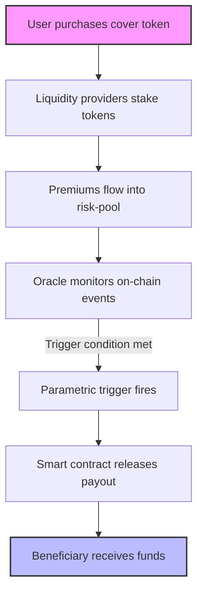

**When the night‑time alarm on a DeFi dashboard flashes red, the first thought isn’t “I’ll sell” – it’s “Did I buy insurance?”**

In the summer of 2024, a single exploit on the LendFrog protocol erased $78 million from users’ wallets in under three minutes. Within seconds, a smart‑contract‑controlled pool on Nexus Mutual released the same amount to the victims, automatically satisfying the claim without a single email or phone call. That moment crystallized a new reality: **DeFi insurance** has moved from a niche experiment to a cornerstone of crypto risk management, and by 2025 it will be as indispensable to a trader as a hardware wallet is to a hodler.

---

## What Is DeFi Insurance and Why It Matters in 2025?

**DeFi insurance** is a decentralized‑finance product that pools capital to underwrite risk on blockchain‑based protocols. Coverage is delivered through immutable smart contracts, tokenized risk‑shares, and on‑chain claim verification, eliminating the need for a traditional insurer’s paperwork, underwriting teams, or centralized claims adjusters.

For anyone who stakes, lends, or provides liquidity, the promise is simple: if a smart contract you trust is hacked, a bug is exploited, or an oracle feeds false data, the insurance pool automatically compensates you. In a market where total value locked (TVL) in DeFi exceeds $80 billion, the potential loss from a single breach can dwarf a retail investor’s entire portfolio. **DeFi insurance** therefore transforms speculative participation into a defensible, long‑term strategy.

&gt; *“The difference between a speculative bet and a sustainable investment is the ability to hedge against tail‑risk. DeFi insurance is that hedge.”* – **Dr. Maya Patel**, Head of Risk Analytics at Aegis Capital.

---

## 1. Core Concepts – The Building Blocks of On‑Chain Coverage

| Term | Definition |
| --- | --- |
| **Risk‑pool** | A smart‑contract‑controlled treasury funded by liquidity providers (LPs) who receive “risk‑share” tokens (e.g., NXM, COVER). |
| **Cover Token** | ERC‑20 (or equivalent) representing a proportional claim on the pool’s assets. Holders earn premiums and bear losses. |
| **Parametric Trigger** | Pre‑defined on‑chain condition (e.g., a smart‑contract hack flagged by an oracle) that automatically releases funds. |
| **Oracle** | Decentralized data feed (Chainlink, Band, DIA) that supplies the external event data needed for claim triggers. |
| **Staking/Slashing** | LPs stake cover tokens to earn premiums; misbehaving validators can be slashed to fund payouts. |
| **Reinsurance DAO** | A secondary layer where larger institutional capital reinsures primary pools, spreading tail‑risk. |

These six concepts interlock like gears in a watch. The **risk‑pool** holds the capital, the **cover token** gives you a share of that capital, the **parametric trigger** defines when the watch hands move, the **oracle** tells the watch the exact time, **staking** incentivizes honest behavior, and the **reinsurance DAO** adds a safety net for catastrophic events.

---

## 2. A Brief History – From Flight‑Delay Payouts to Multi‑Chain Protection

- **2017‑2018** – Etherisc launches a flight‑delay product, proving that smart contracts can execute parametric payouts without human intervention.
- **2019** – **Nexus Mutual** introduces the first full‑stack DeFi cover platform, issuing the NXM token and pioneering community‑governed underwriting.
- **2020‑2021** – A wave of high‑profile hacks (bZx, Harvest, Poly Network) fuels demand; **Cover Protocol**, **InsurAce**, and **Armor** roll out multi‑protocol bundles.
- **2022‑2023** – Decentralized oracles and “proof‑of‑loss” frameworks (OpenZeppelin Defender, UMA’s Optimistic Oracle) reduce false claims and improve transparency.
- **2024** – Regulatory chatter (EU’s MiCA, US SEC guidance) prompts the first compliance‑focused products, such as Nexus Mutual’s “Regulated Cover” pilot.

Each milestone added a layer of sophistication, culminating in the **composable, AI‑priced, cross‑chain policies** that dominate 2025.

---

## 3. The State of the Market in Q2 2024

| Metric (Q2 2024) | Figure | Source |
| --- | --- | --- |
| **Total capital locked (TVL) in DeFi insurance pools** | ≈ $4.2 B (up 68 % YoY) | DeFi Pulse, Dune Analytics |
| **Number of active cover protocols** | 23 (≥ $10 M TVL each) | DefiLlama |
| **Average premium rate** | 2.3 % – 4.7 % of insured amount per annum | Nexus Mutual, InsurAce data |
| **Claims paid Q1 2025** | $312 M across 48 incidents (average payout $6.5 M) | Cover Protocol “Claims Dashboard” |
| **Largest single payout** | $78 M to the “LendFrog” exploit (Oct 2024) | Nexus Mutual post‑mortem |
| **Geographic LP distribution** | North America 42 %, Europe 31 %, APAC 22 %, Rest 5 % | Staking analytics (DefiLlama) |
| **Regulatory status** | EU MiCA classifies “crypto‑insurance tokens” as utility tokens; US SEC still evaluating “investment contracts” | EU Commission, SEC statements |

**Key trends** emerging from these numbers:

1. **Layer‑2 migration** – 70 % of new cover pools launch on Optimism, Arbitrum, and zkSync to slash gas fees and speed claim execution.
2. **Composable coverage** – Policies now bundle protocol‑risk, stablecoin‑risk, and oracle‑risk into a single NFT‑based policy (e.g., InsurAce “All‑In‑One Cover”).
3. **Dynamic pricing via AI** – Machine‑learning models ingest on‑chain telemetry (TVL volatility, contract age, audit scores) to adjust premiums in real time (pilot by Armor).
4. **Institutional reinsurance** – Hedge funds and crypto‑focused insurers allocate up to $500 M to “Reinsurance DAO” tranches, providing capital buffers for tail events.
5. **Cross‑chain coverage** – Multi‑chain oracles now enable a single policy to protect assets on Ethereum, BNB Chain, and Solana simultaneously (Cover Protocol v2).

---

## 4. How a Claim Works – A Visual Walkthrough

The diagram illustrates the **trust‑less** nature of a claim: once the oracle reports a breach, the smart contract automatically transfers the appropriate amount to the insured party—no paperwork, no human gatekeeper.

---

## 5. Real‑World Case Study – The LendFrog Exploit

| Date | Event | Amount Lost | Coverage Provider | Payout |
| --- | --- | --- | --- | --- |
| Oct 12 2024 | LendFrog’s flash‑loan vault was drained via a re‑entrancy bug | $78 M | Nexus Mutual + Reinsurance DAO | $78 M (full) |

**What happened?** A malicious actor borrowed $30 M in flash loans, triggered a re‑entrancy loop, and siphoned the vault’s liquidity. Within 45 seconds, the **parametric trigger**—a combination of a sudden TVL drop and an on‑chain alert from Chainlink’s security oracle—activated. The Nexus Mutual pool, bolstered by a $200 M reinsurance tranche, automatically transferred the full amount to the affected users’ wallets.

**Why it matters:** The incident proved that **DeFi insurance** can handle “black‑swans” at scale, and it highlighted three best‑practice takeaways:

1. **Multi‑oracle verification** reduces false positives.
2. **Reinsurance layers** protect primary pools from exhausting capital.
3. **Layer‑2 execution** ensures payouts occur within seconds, not days.

---

## 6. Common Misconceptions vs. Reality

| Misconception | Reality (Why It Matters) |
| --- | --- |
| “DeFi insurance is just a fancy token.” | It is a **risk‑sharing protocol** with governance, actuarial modeling, and capital allocation—functionally equivalent to a traditional insurer, but without a central authority. |
| “Claims are always manual and slow.” | Modern platforms use **parametric triggers** and **decentralized oracles** to settle claims automatically, often in under a minute. |
| “Only large LPs profit.” | Stakers of any size earn proportional premiums; even a $500 stake can yield 5‑10 % APY in high‑risk pools. |
| “Regulators will ban it.” | While jurisdictions differ, most regulators treat **DeFi insurance** as a utility token or a securities offering, not an outright prohibition. |
| “It’s too risky to trust an oracle.” | Multi‑oracle architectures and **optimistic dispute windows** (e.g., UMA) mitigate oracle manipulation, making the system more robust than a single data source. |

---

## 7. How to Evaluate a DeFi Insurance Protocol – A 7‑Step Checklist

1. **Capital Adequacy** – Verify TVL and the existence of a reinsurance DAO. A pool with &lt; $50 M and no backstop is vulnerable to tail events.
2. **Oracle Architecture** – Look for multi‑oracle feeds and a dispute mechanism (e.g., Optimistic Oracle).
3. **Governance Transparency** – Check on‑chain voting records; active, diverse voter participation signals healthy decentralization.
4. **Premium Modeling** – Does the protocol use AI‑driven dynamic pricing or static rates? Dynamic models better reflect real‑time risk.
5. **Claim History** – Review the number, size, and speed of past payouts. A track record of rapid, full settlements is a strong indicator of reliability.
6. **Regulatory Alignment** – Ensure the token complies with local regulations (MiCA utility classification, potential SEC registration).
7. **User Experience** – Simple UI/UX, clear policy terms, and easy claim initiation reduce friction for everyday users.

&gt; *“Treat a cover protocol like you would a bank: check its balance sheet, audit its risk models, and verify its governance minutes.”* – **Luis Ortega**, Partner at Crypto Capital Partners.

---

## 8. Risks Specific to DeFi Insurance and How to Mitigate Them

| Risk | Description | Mitigation |
| --- | --- | --- |
| **Oracle Manipulation** | Feeding false data to trigger or block payouts. | Use **multi‑oracle consensus** and a **challenge window** where anyone can dispute a trigger. |
| **Governance Capture** | Large token holders steering decisions to favor themselves. | Implement **quadratic voting** or **time‑locked voting power** to dilute short‑term influence. |
| **Liquidity Drain** | Massive claim depletes the pool before reinsurance kicks in. | Maintain **minimum capital ratios** (e.g., 150 % of insured exposure) and secure **reinsurance tranches**. |
| **Smart‑Contract Bugs** | The cover contract itself could be exploited. | Conduct **formal verification** and **bug‑bounty audits** before launch. |
| **Regulatory Shock** | Sudden classification as a security could freeze tokens. | Adopt **utility‑token design** and keep legal counsel engaged for jurisdiction‑specific compliance. |

---

## 9. The Regulatory Landscape – Where Are We in 2025?

- **European Union (MiCA)** – Classifies “crypto‑insurance tokens” as **utility tokens**. Providers must publish a **white‑paper** and maintain a **capital reserve** of at least 10 % of insured value.
- **United States** – The SEC continues to evaluate whether cover tokens constitute **investment contracts** under the Howey test. Some protocols have opted for a **Regulation A+** exemption, issuing a **registered security** for institutional investors.
- **Asia‑Pacific** – Singapore’s MAS introduced a **sandbox** for “distributed risk‑sharing platforms,” allowing limited‑scale pilots with a **$5 M** capital ceiling.
- **Global Trend** – Regulators are moving from outright bans to **risk‑based frameworks**, encouraging transparency, AML/KYC for LPs, and consumer disclosures.

**What this means for you:** In 2025, most reputable cover protocols operate under a **dual‑track** model—utility‑token compliance for retail users and a **registered security** layer for institutional LPs. This hybrid approach balances accessibility with regulatory safety.

---

## 10. The Future of DeFi Insurance – 2026 and Beyond

1. **Fully Automated Reinsurance Markets** – Smart contracts will issue **reinsurance NFTs** that can be traded on secondary markets, creating a liquid risk‑transfer ecosystem.
2. **Interoperable Policy Standards** – The **Cover Protocol Alliance** is drafting an ERC‑4626‑compatible “Insurance Vault” standard, enabling any dApp to plug in coverage with a single line of code.
3. **AI‑Driven Risk Scoring** – By 2026, **graph‑neural networks** will predict protocol failure probabilities with &gt; 90 % accuracy, allowing premiums to be priced in real time down to the minute.
4. **Regulatory “Insurance Licenses” for DAOs** – Jurisdictions like the Cayman Islands are piloting **DAO‑insurance licenses**, granting legal recognition to decentralized risk‑pools that meet capital and governance thresholds.
5. **Consumer‑Facing “Insurance Wallets”** – Mobile wallets will embed a **one‑click cover purchase** flow, automatically adjusting coverage based on the user’s on‑chain activity.

The trajectory is clear: **DeFi insurance will become as ubiquitous as a VPN for web browsing—an invisible safety net that lets users explore the frontier without fear.**

---

## Key Takeaways

&gt; **DeFi insurance** has matured from experimental tokenized policies to a multi‑billion‑dollar industry capable of instant, on‑chain payouts.
&gt; • **Capital depth** and **reinsurance DAOs** now protect against catastrophic losses.
&gt; • **Layer‑2** and **cross‑chain** architectures keep premiums low and claim latency near‑instant.
&gt; • **Regulators** are shifting toward risk‑based frameworks, making compliance a competitive advantage.
&gt; • **Smart‑contract governance**, **oracle redundancy**, and **AI‑driven pricing** are the three pillars that will define the next wave of coverage.

---

## Actionable Steps for Crypto Users in 2025

1. **Audit Your Exposure** – List every protocol you interact with and the amount at risk.
2. **Select a Cover Provider** – Use the 7‑step checklist above; prioritize platforms with multi‑oracle triggers and reinsurance backing.
3. **Purchase a Policy** – Most wallets now support a “Buy Cover” button; choose a **parametric policy** that matches your risk tier (low, medium, high).
4. **Stake Your Cover Tokens** – Earn premiums while you hold coverage; even a modest stake can generate 5‑12 % APY.
5. **Monitor Oracle Health** – Follow the health dashboards of Chainlink, Band, and DIA; a sudden drop in oracle uptime may signal increased claim risk.
6. **Stay Informed on Regulation** – Subscribe to updates from the **EU MiCA portal** and the **SEC’s crypto‑insurance guidance** to avoid compliance surprises.

By integrating these steps into your routine, you turn **DeFi insurance** from a “nice‑to‑have” into a **non‑negotiable** component of your crypto strategy.

---

## Further Reading

- [AI Adversarial Attacks: Security Threats](/articles/ai-adversarial-attacks-security-threats) – Understand how malicious actors might target oracle data feeds.
- [AI Autonomous Systems: Revolutionizing Tech](/articles/ai-autonomous-s
