## DeFi Insurance: Crypto’s Safety Net in 2025

**In March 2024, a single misplaced semicolon in a smart contract vaporized $135 million in 37 seconds—yet across the globe, investors who’d paid just $300 for DeFi insurance slept soundly that night.** This stark dichotomy captures crypto’s new reality: as blockchain technology evolves, so do its predators and protectors. Welcome to DeFi insurance in 2025—a $680 billion fortress against chaos, where algorithms battle hackers and democratized pools replace corporate giants.

### Why 2025 is Crypto’s "Insurance Moment"
The crypto winter of 2022-2023 wasn’t merely a market crash—it was an extinction event that incinerated $2 trillion in value. But from those ashes rose DeFi insurance, morphing from niche experiment to essential infrastructure. Three seismic shifts converged:
1. **Hackflation**—Cyberattacks grew 210% year-over-year in 2024 (Chainalysis), with decentralized protocols absorbing 68% of losses.
2. **Institutional demand**—BlackRock’s tokenized fund launch forced pension funds to seek coverage meeting regulatory thresholds under the EU’s MiCA framework.
3. **Parametric breakthroughs**—AI-driven triggers now automate payouts in minutes versus traditional insurance’s 90-day claim labyrinths.

&gt; Key Takeaway: DeFi insurance isn’t optional anymore—it’s the oxygen mask for surviving crypto’s turbulence. The 40% year-over-year growth in Total Value Locked (TVL) proves it’s no longer gamblers hedging bets, but pragmatists building bunkers.

### How DeFi Insurance Actually Works (No Jargon)
Forget paperwork and adjusters—this is protection rebuilt for the algorithmic age. At its heart lies a simple peer-to-pool model: thousands of users lock crypto in shared vaults, creating collective shields against disasters. When Ethereum developer Mikhail lost $220K in the 2024 Curve Finance hack, his recovery looked like this:

```mermaid  
graph LR  
A[Policy Purchase] --> B[ETH deposited to Nexus Mutual pool]  
C[Parametric Trigger] -->|“If Curve TVL drops >20% in 1hr”| D[Automatic Payout]  
E[Claim Validation] ---> F[DAO members vote via governance token]  
```

**Three revolutionary mechanisms power this:**
- **Parametric Triggers**: Like a vending machine for justice—pre-coded conditions (e.g., "Pay if BTC drops below $50K") slash human intervention. Over 65% of 2025 policies use them.
- **Mutualized Risk Pools**: Your premiums join a communal pot—Nexus Mutual’s $320M TVL shows the power of collective defense.
- **Decentralized Oracles**: Chainlink’s `Proof-of-Reserve` feeds validate claims, while DAO members (staking their own crypto as collateral) adjudicate disputes.

But the magic lies in what’s excluded. *"People confuse this with wallet insurance,"* warns InsurAce founder Oliver Xie. *"We cover smart contract failures—not your dog eating the USB drive with your private keys."*

### The 2025 Landscape: Who’s Insuring Your Crypto?
The arena has three gladiators battling for dominance:

| **Protocol** | **TVL (Q1 2025)** | **Specialization** | **Unique Edge** |
| --- | --- | --- | --- |
| **Nexus Mutual** | $320M | Smart contract exploits | Pioneer DAO governance model |
| **Sherlock** | $145M | Stablecoin depegs | Pre-funded claims vaults |
| **InsurAce** | $98M | Cross-chain bridge hacks | Risk-tranching for yield farms |

**Three trends defining 2025:**
1. **Real-World Asset (RWA) Infusion**: 30% of capital now comes from tokenized bonds and real estate, easing liquidity crunches during mass claims events.
2. **TradFi Hybrids**: Lloyds of London’s blockchain syndicate `KryptoShield` offers "legacy backing" for institutions wary of pure-DeFi models.
3. **Adverse Selection Arms Race**: High-yield farmers—70% of claimants—routinely target undercollateralized pools. Etherisc’s solution? AI-driven policy pricing that adjusts hourly based on protocol risk scores.

The stakes are visceral: During January’s Aave V4 exploit, parametric policies paid out $8.2 million before hackers finished transferring stolen funds.

### Debunking Myths and Hidden Realities
**Myth 1: "DeFi insurance is a safety blanket for all crypto risks."**
Reality: Coverage gaps are strategic. Policies exclude:
- Market volatility (use derivatives instead)
- Custodial exchange failures (Coinbase partners with traditional insurers)
- User errors like phishing or lost keys (as [AI cybersecurity tools](/articles/ai-cybersecurity-revolutionizing-digital-protection) evolve to address these)

**Myth 2: "Payouts are instant."**
Reality: While parametric triggers enable sub-hour transfers, DAO-voted claims take 7-30 days. Nexus Mutual’s Q4 2024 data shows 22% of claims contested by stakeholders protecting the pool.

**Non-Obvious Insight: The 'Tranching Revolution’**
Etherisc slices policies like a layered cake:
- **Senior Tranche**: Low-risk protocols (e.g., Uniswap) at 1.2% premiums
- **Mezzanine**: Medium-risk yield farms like PancakeSwap at 3.7%
- **Equity Tranche**: Experimental algorithms at 15%+ premiums

This allows pension funds to buy "blue-chip" coverage while degens gamble on frontier tech—all within the same pool.

### Buying Your First Policy: A Step-by-Step Guide
**Phase 1: Risk Assessment**
Audit your exposure using:
1. `CertiK Skynet` for real-time protocol safety scores
2. DEX liquidity depth checks via [AI autonomous systems](/articles/ai-autonomous-systems-revolutionizing-tech)
3. Bridge vulnerability scans with Chainalysis coverage maps

**Phase 2: Policy Purchase**
1. **Choose provider** (Nexus for Ethereum Dapps, Unslashed for Solana)
2. **Select coverage type**: Parametric for speed, discretionary for complex claims
3. **Lock funds**: Deposit ETH/USDC; receive policy as verifiable NFT
4. **Set duration**: 30-365 days (average premium: 2.5% annually)

**Phase 3: Claims & Beyond**
- For automated triggers: No action—watch your wallet
- For DAO claims: Submit transaction hashes + exploit analysis
- Post-payout: Reinvest premiums into [AI credit scoring](/articles/ai-credit-scoring-revolutionizing-lending)-optimized yield strategies

**Pro Tip**: Cover only 15-30% of holdings—over-insurance crushes ROI. After the 2024 Fantom hack, users hedging 50%+ saw net losses despite payouts.

### DeFi vs. Traditional Insurance: The $680M Comparison

| **Model** | Pros | Cons | Ideal User |
| --- | --- | --- | --- |
| **DeFi Insurance** | Premiums 80% lower (avg 2.5% vs 15-20%) | No legal recourse for denied claims | Active traders, DAOs |
| **Traditional** | Covers theft/physical damage | Excludes "code as law" exploits | Institutional custodians |
| **Self-Custody** | Zero cost | 100% risk exposure | Long-term HODLers |

**The Trade-Off Equation**:
DeFi wins for protocols interacting with [AI adversarial attacks](/articles/ai-adversarial-attacks-security-threats) daily. Traditional coverage suits offline vaults. Hybrid models emerge—Coinbase’s "ReGenesis" plan blends both for exchanges.

### The Future: AI, Regulations, and Quantum Threats
**2026 Projections**:
- **AI Underwriting**: Etherisc adapts its flight-delay insurance model to crypto—algorithms predict hacks using social sentiment and code commits.
- **Cross-Chain Synergy**: Polkadot’s XCM v3 enables single policies covering Ethereum L2s, Cosmos, and Solana.
- **Regulatory Catalysts**: MiCA’s "custodian insurance mandate" could funnel $4B+ into DeFi pools by 2027.

**The Quantum Countdown**
By 2027, quantum computers may crack elliptic-curve encryption. Nexus Mutual’s testnet already offers "Q-Shield" policies triggering payouts if quantum-based theft occurs—a hedge against cryptographic obsolescence.

### Conclusion: The Unavoidable Evolution of Protection
De Ethics insurance symbolizes crypto’s maturation: no longer just rebellion against legacy systems, but construction of parallel institutions offering speed, transparency, and communal resilience. As Lloyds CEO John Neal admitted in 2024: *"Their parametric model is eating our premium base. We either adapt or become antiquarians."*

The path forward balances automation with human oversight—algorithmic triggers for speed, DAOs for nuanced judgment. For the retail investor, it means sleeping soundly amid storms. For crypto, it’s the final piece in building an ecosystem that doesn’t just dazzle with增幅, but endures through disaster.

**Final Key Takeaway**: Insure your crypto like you’d fortify a castle—layered defenses, vigilance against novel siege engines, and the wisdom to know which walls will crumble first. The hackers evolve. So must our shields.

&gt; **Checklist Before Buying**:
&gt; ☑️ Audit protocol risk via CertiK
&gt; ☑️ Choose parametric for predictable risks
&gt; ☑️ Allocate ≤30% of portfolio value
&gt; ☑️ Verify pool collateralization %
&gt; ☑️ Monitor [AI bias detection](/articles/ai-bias-detection-tools-techniques) feeds for governance fairness
