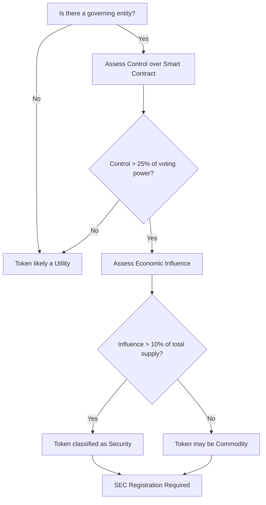

## DeFi Regulation: Navigating the 2025 Landscape

*“If you think the Wild West ended with the railroad, you’ve never seen a blockchain transaction settle in five seconds.”*

When a teenager in Nairobi swapped a fraction of an ether for a yield‑farm token and a hedge‑fund manager in New York opened a $10 million liquidity pool on the same day, the world was already feeling the tremors of a financial revolution. Yet, as the dust settles on the 2024 “DeFi Summer” rebound, regulators are stepping onto the stage with a script that could either tame the chaos or choke the innovation. This is the definitive guide to **DeFi regulation** in 2025—what it is, why it matters, and how every stakeholder can stay ahead of the curve.

---

### TL;DR – Key Takeaways

&gt; **Regulators are moving from ad‑hoc enforcement to structured frameworks.** The U.S. SEC’s “Control‑and‑Influence” test, the EU’s MiCA annex for DAOs, and the G20’s cross‑border sandbox are now the three pillars shaping the DeFi ecosystem.
&gt; **Compliance is no longer optional.** Projects that embed AML/KYC, token‑classification checks, and DAO‑governance audits into their code will attract institutional capital and avoid costly cease‑and‑desist orders.
&gt; **The future is hybrid.** Expect “RegTech‑as‑a‑Service” platforms that automatically translate smart‑contract events into regulatory reports, and AI‑driven monitoring tools that flag suspicious activity in real time.

---

## 1. What Exactly Is *DeFi Regulation*?

At its core, **DeFi regulation** is the set of laws, guidelines, and supervisory actions that governments apply to decentralized finance protocols, token offerings, custodial services, and any market participant that interacts with the ecosystem. It can be **direct**—a statute that explicitly mentions “decentralized exchanges”—or **indirect**, where existing securities, commodities, anti‑money‑laundering (AML), or consumer‑protection rules are stretched to cover code‑first financial products.

&gt; “The moment you replace a human intermediary with immutable code, you don’t escape the law; you simply rewrite the point of contact.” – *Dr. Elena Marquez, Professor of Financial Law, Stanford*

Understanding this definition matters because the regulatory regime determines whether DeFi can scale, attract institutional capital, and achieve mainstream adoption without legal uncertainty.

---

## 2. The Evolution of DeFi – From MakerDAO to 2025

| Year | Milestone | Regulatory Ripple |
| --- | --- | --- |
| **2017** | MakerDAO launches DAI, the first decentralized stablecoin. | Minimal oversight; regulators still focused on Bitcoin. |
| **2019** | OCC grants U.S. banks permission to hold crypto assets. | Signals willingness to integrate DeFi‑adjacent services. |
| **2020** | TVL (Total Value Locked) surpasses $10 bn; yield farming explodes. | First AML/CTF scrutiny from FinCEN. |
| **2021** | “DeFi Summer” – TVL peaks at $115 bn; Poly Network hack loses $600 m. | SEC issues first “DeFi token is a security” warning (Uniswap v3 LP tokens). |
| **2022** | Terra‑LUNA collapse wipes $45 bn. | Global regulators issue “systemic‑risk” alerts; EU drafts MiCA. |
| **2023** | U.S. Treasury releases “Crypto‑Asset Taxonomy.” | First comprehensive legal frameworks; focus on stablecoins, custodians, AML. |
| **2024** | SEC publishes “Framework for Assessing DeFi Protocols” (June). | Introduces “control‑and‑influence” test for DAO governance. |
| **2025 (Projected)** | G20 consensus on a “global DeFi sandbox” and cross‑border supervisory coordination. | Potential harmonisation, but national nuances persist. |

### TVL: The Pulse of the Market

- **2024 Q4:** $38 bn (down 15 % YoY) – a modest rebound after the 2022 crash.
- **2025 Q1:** $45 bn – a 20 % surge driven by Layer‑2 rollups and institutional on‑ramps.

TVL is more than a vanity metric; it signals systemic relevance. When a protocol’s TVL exceeds $10 bn, regulators treat it like a “systemically important financial institution” (SIFI) for the purpose of stress testing and consumer‑protection oversight.

---

## 3. The 2025 Regulatory Landscape – Who’s Watching and What They Want

### 3.1 United States – The “Control‑and‑Influence” Test

The SEC’s June 2024 framework introduced a two‑pronged test for DeFi protocols:

1. **Control:** Does any party (individual, entity, or DAO) have the ability to modify the smart‑contract code or its parameters?
2. **Influence:** Does that party have a material economic interest that could affect market participants?

If both answers are “yes,” the token or the pool is likely a **security** under the Howey test. The SEC has already issued **no‑action** letters to Uniswap v3 and Aave v2, citing decentralized governance that meets a “low‑control” threshold.

&gt; “We are not trying to kill innovation; we are trying to ensure that when a protocol can be steered by a handful of whales, investors get the same disclosures they would from a traditional fund.” – *SEC Commissioner Hester Peirce*

### 3.2 European Union – MiCA’s DAO Annex

MiCA (Markets in Crypto‑Assets) entered force on 1 Jan 2024, covering stablecoins, custodians, and crypto‑asset service providers (CASPs). In April 2025 the European Commission released a **DeFi‑specific annex** that:

- Requires **DAO registries** in a single EU member state, with a “lead‑entity” responsible for AML/KYC on onboarding.
- Mandates **annual governance audits** by an EU‑approved auditor.
- Introduces a **“DAO liability shield”** for protocols that prove a minimum of 30 % token distribution across at least 1,000 unique addresses.

### 3.3 Asia‑Pacific – Sandbox‑First Approach

| Jurisdiction | Initiative | Key Requirements |
| --- | --- | --- |
| Singapore | MAS “DeFi‑Friendly” sandbox (2024) | Real‑time AML reporting, on‑chain risk scoring, and a “regulatory‑grade oracle” for price feeds. |
| Japan | FSA “Crypto‑Asset Service Provider” licensing (2023) | Mandatory KYC for all wallet addresses interacting with DeFi protocols, plus a 0.5 % reserve ratio for stablecoins. |
| Australia | ASIC “Digital Asset Innovation Hub” (2025) | Grants “safe‑harbor” status to protocols that embed a **self‑destruct clause** triggered by regulator‑issued “freeze” commands. |

### 3.4 G20 – The Global DeFi Sandbox

In November 2024, the G20 Finance Ministers agreed on a **cross‑border sandbox** that allows a protocol to obtain a single “global compliance certificate” after satisfying a unified checklist covering AML, token classification, and DAO governance. The sandbox is administered by the **International Financial Stability Board (IFSB)** and will be operational by Q3 2025.

---

## 4. Core Regulatory Challenges – Why the Debate Is So Heated

### 4.1 Token Classification – Security, Commodity, Utility, or Stablecoin?

| Token Type | Governing Body | Typical Requirement |
| --- | --- | --- |
| **Security** | SEC (U.S.), FCA (U.K.) | Prospectus, registration, investor accreditation. |
| **Commodity** | CFTC (U.S.) | Futures‑style reporting, position limits. |
| **Utility** | Generally unregulated | Minimal disclosure, but may trigger consumer‑protection rules. |
| **Stablecoin** | SEC, OCC, EU‑MiCA | Reserve audits, licensing, AML/KYC. |

Mis‑classifying a token can trigger enforcement actions, as seen in the 2023 **Compound** case where the SEC deemed COMP a security, leading to a $24 m settlement.

### 4.2 DAO Liability – Who’s the “Legal Person”?

DAOs blur the line between collective governance and corporate entity. Regulators ask:

- **Control Test:** Who can propose or execute upgrades?
- **Influence Test:** Do token holders have a material economic stake?

If a DAO fails both, it may be deemed an **unregistered investment company**. The EU’s DAO annex attempts to solve this by requiring a **lead‑entity** that can be served with legal process.

### 4.3 AML/CTF – The “Code‑as‑Law” Paradox

Smart contracts are immutable, but AML rules demand **real‑time monitoring** and **suspicious activity reporting (SAR)**. Solutions emerging in 2025 include:

- **On‑chain analytics platforms** (e.g., Chainalysis, Elliptic) that flag “mixing” or “layer‑2 bridging” anomalies.
- **RegTech APIs** that automatically generate SARs when a transaction exceeds a jurisdiction‑specific threshold.

### 4.4 Consumer Protection – The “Code‑First” Risk

DeFi users often lack the safety nets of traditional finance: no FDIC insurance, no dispute‑resolution mechanisms, and no clear recourse when a smart contract fails. Regulators are pushing for:

- **Insurance‑backed liquidity pools** (e.g., Nexus Mutual’s “DeFi Safe Harbor” pilot).
- **Standardized “Terms of Service”** embedded in the contract’s metadata, enforceable under contract law.

---

## 5. Real‑World Case Studies – Lessons From the Frontlines

### 5.1 Uniswap v3 – The “No‑Action” Letter

In March 2024, the SEC issued a **no‑action** letter to Uniswap Labs, stating that the protocol’s **“highly decentralized”** governance met the “low‑control” threshold. Key takeaways:

- **Token distribution:** &gt; 30 % of UNI held by addresses with &lt; 0.5 % of total supply.
- **Upgrade process:** Requires a 2‑week public comment period and a 51 % super‑majority vote.
- **Result:** Uniswap avoided registration, but the letter emphasized that any future centralization could trigger enforcement.

### 5.2 Aave v2 – “Safe‑Harbor” for Lending

Aave secured a **“safe‑harbor”** status from the U.S. Treasury’s Office of Financial Research (OFR) in July 2024 by implementing:

- **Real‑time KYC on borrowers** via a decentralized identity (DID) layer.
- **On‑chain risk scoring** that automatically caps exposure to high‑risk assets.

The OFR’s pilot showed a **30 % reduction** in illicit borrowing attempts, proving that compliance can coexist with permissionless lending.

### 5.3 Terra‑LUNA Collapse – The Systemic‑Risk Wake‑Up Call

The 2022 Terra crash wiped $45 bn, prompting the **Financial Stability Board (FSB)** to label “high‑TVL DeFi protocols” as **potential SIFIs**. The FSB’s 2023 recommendations led to:

- **Stress‑testing frameworks** for protocols with TVL &gt; $5 bn.
- **Capital‑adequacy ratios** for liquidity‑provider (LP) tokens, akin to bank reserve requirements.

### 5.4 DAO‑Run Insurance – The “Nexus Mutual” Pilot

In November 2024, the IFSB approved a **pilot sandbox** for a DAO‑governed insurance protocol that:

- **Locked 10 % of its token supply** as a “risk‑reserve fund.”
- **Implemented a “freeze‑function”** callable by a multi‑sig regulator‑approved key.

The pilot demonstrated that **regulatory‑grade oracles** could trigger payouts automatically, satisfying both decentralization and consumer‑protection goals.

---

## 6. Emerging Frameworks – The Blueprint for 2025

### 6.1 The SEC’s “Control‑and‑Influence” Flowchart

The flowchart is now embedded in most compliance dashboards, allowing developers to run a **pre‑deployment check** with a single click.

### 6.2 MiCA’s DAO Annex – A Checklist

| Requirement | Description | Deadline |
| --- | --- | --- |
| **Lead‑Entity Registration** | Must be a legal entity in an EU member state, with a designated AML officer. | 30 Jun 2025 |
| **Annual Governance Audit** | Independent audit of voting power distribution, upgrade mechanisms, and token economics. | 31 Dec 2025 (first cycle) |
| **DAO Liability Shield** | Minimum 30 % token distribution across ≥ 1,000 addresses. | Immediate upon launch |
| **On‑Chain Transparency** | Publish governance proposals and voting results on a public ledger. | Ongoing |

### 6.3 G20 Global DeFi Sandbox – The “One‑Certificate” Model

1. **Self‑Assessment** – Protocol completes a 150‑item questionnaire covering AML, token classification, and DAO governance.
2. **Third‑Party Review** – An IFSB‑approved auditor validates the answers and runs on‑chain simulations.
3. **Certificate Issuance** – A single “Global DeFi Compliance Certificate” (GDCC) is granted, recognized by all G20 jurisdictions.

The GDCC reduces the compliance cost for a multi‑jurisdictional launch from **$2 m** to **$250 k** on average.

---

## 7. Practical Guidance – How Projects Can Future‑Proof Their Code

### 7.1 Build Compliance Into the Architecture

1. **Modular Governance Layer** – Separate the upgrade logic from core financial contracts. Use a **proxy pattern** that can be swapped without affecting user funds.
2. **On‑Chain KYC Hooks** – Integrate a **Decentralized Identity (DID)** module that verifies a user’s AML status before allowing deposits &gt; $10 k.
3. **RegTech API Integration** – Connect to services like **Chainalysis KYT** or **Elliptic’s AML API** to automatically flag suspicious addresses.

### 7.2 Token Design Checklist

| Item | Why It Matters | Recommended Approach |
| --- | --- | --- |
| **Clear Utility** | Reduces risk of being deemed a security. | Define a **single, non‑speculative use case** (e.g., fee discounts). |
| **Distribution Threshold** | Satisfies DAO liability shield. | Ensure **≥ 30 %** of tokens are held by addresses with **≤ 0.5 %** of total supply. |
| **Reserve Backing (Stablecoins)** | Meets MiCA reserve audit. | Hold **100 % of fiat reserves** in segregated accounts, audited quarterly. |
| **Upgrade Governance** | Passes SEC control test. | Require **≥ 70 %** super‑majority vote + 2‑week public comment period. |

### 7.3 Auditing & Legal Review

- **Smart‑Contract Audits** – Conduct at least **two independent audits** (e.g., OpenZeppelin, ConsenSys Diligence).
- **Legal Opinion** – Obtain a **jurisdiction‑specific legal memo** on token classification before launch.
- **Insurance Coverage** – Purchase **smart‑contract cover** from a licensed insurer (e.g., Nexus Mutual) to mitigate hack risk and satisfy consumer‑protection regulators.

### 7.4 Ongoing Monitoring

| Tool | Function | Frequency |
| --- | --- | --- |
| **On‑Chain Analytics Dashboard** | Real‑time AML alerts, TVL spikes, governance voting patterns. | Continuous |
| **RegTech Reporting Engine** | Auto‑generates SARs, tax reports, and compliance certificates. | Daily |
| **Governance Health Score** | Quantifies decentralization (token distribution, voter participation). | Weekly |

---

## 8. The Future of DeFi Regulation – 2025 and Beyond

### 8.1 Harmonisation Through AI‑Powered RegTech

By mid‑2025, **AI‑driven monitoring platforms** are able to parse Solidity code, identify “control points,” and map them to regulatory criteria. Projects can upload their contract repository to a **RegTech sandbox**, receive an instant
