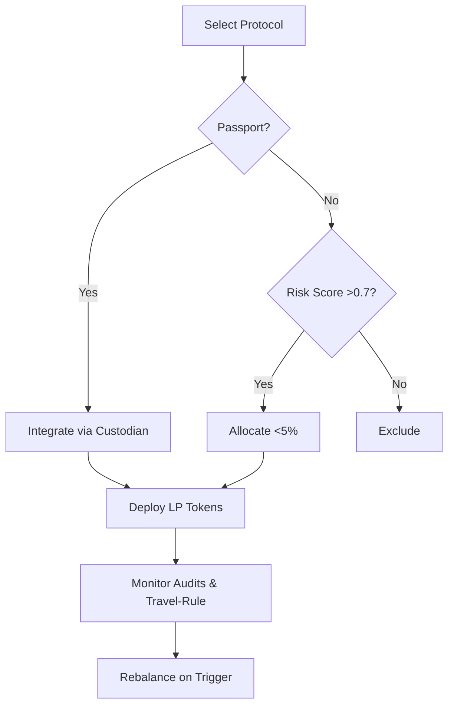

## DeFi Regulations 2025: What Investors Must Know

*“When the law catches up to code, the market either bends or breaks.”* — Ana Mendoza, senior counsel at the European Blockchain Association

The day a New York‑based hedge fund tried to route a $250 million loan through an unregistered DeFi protocol, the Securities and Exchange Commission’s enforcement division filed a cease‑and‑desist order that made headlines worldwide. Within hours, the same protocol’s token price slumped 42 %, and a wave of panic‑selling rippled through every decentralized exchange (DEX) that listed it.

That flash‑point was not an isolated glitch; it was the opening salvo of a regulatory battle that will define the next era of decentralized finance. By the end of 2025, a patchwork of laws—spanning the United States, the European Union, Singapore, and beyond—will have crystallized into a de‑facto global regime. For investors, the stakes are simple yet profound: **understand the rules, or watch your yield evaporate.**

Below is the definitive guide to “DeFi regulations 2025.” It unpacks every major rule, shows how they intersect with code, and delivers actionable steps so you can protect—and potentially amplify—your portfolio in a regulated DeFi landscape.

---

### Table of Contents
1. [Why 2025 Is the Turning Point](#why-2025-is-the-turning-point)
2. [The New Regulatory Architecture](#the-new-regulatory-architecture)
   * 2.1. AML/KYC & the Travel Rule
   * 2.2. Token Classification Frameworks
   * 2.3. The DeFi Passport (EU)
   * 2.4. Stable‑Coin Reserve Requirements
   * 2.5. Smart‑Contract Audits as Legal Obligations
3. [Jurisdiction‑by‑Jurisdiction Snapshot](#jurisdiction-by-jurisdiction-snapshot)
4. [Compliance‑Ready Investment Strategies](#compliance-ready-investment-strategies)
5. [Risk‑Adjusted Returns in a Regulated World](#risk-adjusted-returns-in-a-regulated-world)
6. [Case Studies: Winners and Losers of Early Adoption](#case-studies-winners-and-losers-of-early-adoption)
7. [Tools, Services, and the Emerging Compliance Stack](#tools-services-and-the-emerging-compliance-stack)
8. [What Happens Next? The Road to 2026 and Beyond](#what-happens-next-the-road-to-2026-and-beyond)
9. [Key Takeaways](#key-takeaways)

---

## Why 2025 Is the Turning Point

The “DeFi Summer” of 2020‑2021 turned a niche hobby into a $80 billion total value‑locked (TVL) juggernaut. Yet the season also sowed the seeds of its own reckoning. Three catastrophic collapses—Terra UST, Celsius, and Three Arrows Capital—exposed systemic fragilities: **oracle manipulation, under‑collateralized lending, and opaque governance**.

Regulators responded with a cascade of “warning letters” and “no‑action” statements, but the real inflection point arrived in **June 2024**, when the U.S. Treasury’s FinCEN issued its first *comprehensive* guidance on “Virtual Asset Service Providers (VASPs) and Decentralized Finance.” The guidance required any on‑chain entity that facilitated transfers above €10,000 to embed the **Travel Rule** into its smart‑contract logic.

Within six months, the European Parliament passed the **DeFi Passport**—a licensing regime that grants “regulated status” to protocols that meet EU‑wide security‑by‑design standards. Simultaneously, Singapore’s Monetary Authority (MAS) rolled out the *Stable‑Coin Liquidity Assurance* (SLA) framework, demanding daily reserve attestations for any fiat‑backed stable‑coin operating on a Singapore‑registered DEX.

These moves converge on a single reality: **2025 will be the first full year where a majority of high‑TVL DeFi protocols must be licensed, audited, and KYC‑compliant to continue operating at scale.** Ignoring that reality is no longer a matter of “risk‑adjusted returns”—it is a matter of legal exposure.

---

## The New Regulatory Architecture

### 2.1. AML/KYC & the Travel Rule

| Requirement | Typical Threshold | Enforcement Mechanism | Typical Cost to Protocol |
| --- | --- | --- | --- |
| **On‑chain Originator/Beneficiary Data Capture** | €10,000 / $12,000 per transaction | Automated fines (EU: €1 m‑€5 m) + possible black‑listing from interoperable bridges | $0.10‑$0.25 per transaction (API fees) |
| **Periodic Reporting to FIU** | Quarterly for cumulative &gt; €1 m | Administrative sanctions, revocation of license | $30 k‑$150 k for compliance tooling |
| **Sanctions List Screening** | Real‑time for all outbound transfers | Immediate freeze of assets, criminal liability for operators | $20 k‑$80 k for integration with Chainalysis/KYT |

**What It Means for Investors**
- **Liquidity‑sensitive DEXs** (e.g., Uniswap V4) must route high‑value swaps through “Travel‑Rule‑Enabled” routers. If a router fails to transmit the required metadata, the transaction is reverted, effectively *capping* trade size for non‑compliant users.
- **Yield farms** that accept cross‑chain deposits must embed KYC checks before minting LP tokens, turning a previously frictionless experience into a multi‑step onboarding flow.

&gt; *“The travel‑rule is no longer a compliance afterthought; it’s a protocol layer,”* says **Lars Klein**, head of regulatory affairs at the European Blockchain Association.

### 2.2. Token Classification Frameworks

Regulators now employ a **four‑tier matrix** to determine a token’s legal nature. The matrix combines *functionality* (payment, governance, utility) with *economic dependence* (expectation of profit from the efforts of others).

| Tier | Legal Category | Typical Regulatory Body | Compliance Obligations |
| --- | --- | --- | --- |
| **1** | **Security** | SEC (US), FCA (UK) | Prospectus filing, continuous reporting, investor accreditation |
| **2** | **Commodity** | CFTC (US), ESMA (EU) | Market‑manipulation rules, position limits |
| **3** | **Currency** | FinCEN (US), BaFin (DE) | AML/KYC, anti‑money‑laundering reporting |
| **4** | **Utility/Service Token** | Generally exempt, but subject to consumer‑protection laws | Transparent terms of service, dispute‑resolution mechanisms |

If a token is deemed a **Security**, the protocol must either obtain a **registered offering** or limit participation to **accredited investors**. This instantly shrinks the addressable market for many DeFi projects that previously relied on open, permissionless participation.

### 2.3. The DeFi Passport (EU)

Effective **1 January 2025**, the EU’s **Regulation on Decentralized Finance (R‑DeFi)** introduces a **single licensing regime**—the **DeFi Passport**. To qualify, a protocol must:

1. **Undergo a “Security‑by‑Design” audit** (minimum of two independent firms).
2. **Integrate on‑chain KYC/AML APIs** for any transaction above €10 k.
3. **Publish a “Risk‑Disclosure Whitepaper”** meeting the EU’s Prospectus Directive standards.
4. **Maintain a “Liquidity Reserve”** of at least 5 % of TVL in a regulated custodial institution.

Once certified, the protocol can operate across all 27 EU member states without additional licensing—a *passport* that dramatically reduces cross‑border friction.

&gt; *“Think of the DeFi Passport as the EU’s version of the CE mark for hardware,”* explains **Marta López**, senior policy analyst at the European Central Bank.

### 2.4. Stable‑Coin Reserve Requirements

Stable‑coins now face **dual‑layer supervision**:

| Layer | Requirement | Reporting Cadence | Penalties |
| --- | --- | --- | --- |
| **Reserve Adequacy** | Minimum 100 % fiat backing for fiat‑backed coins; 150 % for algorithmic coins | Daily attestation to a certified auditor | Fines up to 0.5 % of daily TVL; forced redemption |
| **Liquidity Stress‑Tests** | Simulated 30‑day run‑off at 75 % of peak TVL | Quarterly | Suspension of minting privileges |
| **Governance Transparency** | Public disclosure of reserve composition (cash, treasuries, corporate bonds) | Semi‑annual | Mandatory audit by EU‑registered auditor |

US‑based stable‑coins (USDC, USDT) already maintain near‑full backing, but **algorithmic coins** like **Frax** now face an additional **150 % over‑collateralisation** rule under the EU’s **MiCA** amendments, pushing their effective yield down by roughly 0.4 % APY.

### 2.5. Smart‑Contract Audits as Legal Obligations

In 2025, **smart‑contract audits are no longer optional best practice; they are statutory requirements** for any protocol that:

- Handles **> $10 m** in user funds, **or**
- Provides **synthetic assets** (e.g., options, futures).

Audits must be performed **pre‑deployment** and **annually thereafter**, with a **public audit‑report repository** indexed by the **European Blockchain Registry (EBR)**. Failure to publish a compliant audit within 30 days of a security breach can trigger **civil liability** for the protocol’s founders.

---

## Jurisdiction‑by‑Jurisdiction Snapshot

| Region | Core Legal Instruments (2025) | Main Regulator(s) | Licensing Threshold | Notable Projects Already Licensed |
| --- | --- | --- | --- | --- |
| **United States** | *FinCEN Travel Rule Guidance*, *SEC “DeFi‑Safe Harbor” Framework* | SEC, CFTC, FinCEN | $25 m TVL or &gt; 1 m active users | **Compound**, **Aave V3 (US)** |
| **European Union** | *R‑DeFi (DeFi Passport)*, *MiCA* | European Securities & Markets Authority (ESMA), European Central Bank (ECB) | €10 m TVL + AML/KYC integration | **Aave V3 (EU)**, **MakerDAO (EU)** |
| **United Kingdom** | *FCA “Crypto‑Asset Tokens” Regime* | FCA | £5 m TVL | **SushiSwap (UK)** |
| **Singapore** | *MAS Stable‑Coin Liquidity Assurance (SLA)*, *MAS Digital Token Services (DTS) Licence* | MAS | SGD 10 m TVL | **Curve (SG)** |
| **Japan** | *FSA “Virtual Currency Business Act” Amendments* | FSA | ¥1 bn TVL | **Synthetix (JP)** |
| **Australia** | *ASIC Crypto‑Asset Regulation* | ASIC | AUD 5 m TVL | **Yearn Finance (AU)** |
| **Canada** | *OSFI “Digital Asset” Guidance* | OSFI | CAD 7 m TVL | **Balancer (CA)** |

*Note:* Numbers reflect **average TVL thresholds** for the 2025 licensing year; some regulators apply **user‑count** thresholds in addition to TVL.

---

## Compliance‑Ready Investment Strategies

### 1. “Regulated‑First” Protocol Allocation

- **Target:** Allocate 40‑60 % of DeFi exposure to protocols that have secured a **DeFi Passport** (EU) or **SEC Safe Harbor** (US).
- **Rationale:** These projects face **lower legal risk** and can continue operating **without interruption** across major markets.
- **Execution:** Use **institutional‑grade custodians** (e.g., Anchorage, Fireblocks) that already integrate KYC/AML APIs.

### 2. “Stable‑Coin Hedge”

- **Target:** Over‑weight **USDC** and **EU‑regulated stable‑coins** (e.g., **Euro‑C**, a new EU‑backed stable‑coin).
- **Rationale:** Stable‑coins meeting **full‑reserve** and **daily attestation** requirements are less likely to face sudden de‑pegging or regulatory seizure.
- **Execution:** Deploy stable‑coin assets into **high‑yield, insured liquidity pools** (e.g., **Aave V3 EU**, which now offers a **“Regulatory Insurance”** overlay).

### 3. “Audit‑Verified Yield”

- **Target:** Invest in vaults that have **dual‑audit certification** (ConsenSys + Trail of Bits).
- **Rationale:** Dual‑audit status satisfies the **annual audit requirement** for both EU and US jurisdictions, reducing the probability of forced shutdowns.
- **Execution:** Subscribe to **audit‑watch services** (e.g., **AuditTrail.io**) that push real‑time alerts when a protocol’s audit expires.

### 4. “Cross‑Chain Compliance Bridge”

- **Target:** Use **bridges** that have integrated **Travel‑Rule APIs** (e.g., **Wormhole 2.0**, **LayerZero KYC‑Enabled**).
- **Rationale:** Bridges are the choke points where non‑compliant transfers are most likely to be blocked.
- **Execution:** Route any cross‑chain move &gt; €10 k through a **KYC‑enabled bridge**; for smaller moves, aggregate to stay under the threshold (but monitor aggregate exposure to avoid inadvertent breaches).

### 5. “RegTech‑Backed Position Sizing”

- **Target:** Deploy **algorithmic position‑size managers** that ingest **regulatory risk scores** from services such as **Chainalysis Compliance Score**.
- **Rationale:** Dynamic sizing protects capital when a protocol’s compliance rating drops (e.g., after an enforcement notice).
- **Execution:** Integrate with **DeFi Risk Engine (DRE)** APIs to automatically rebalance portfolios when a risk score crosses a pre‑set threshold (e.g., 0.65 on a 0‑1 scale).

---

## Risk‑Adjusted Returns in a Regulated World

| Metric | Pre‑Regulation (2023‑24) | Post‑Regulation (2025‑26) | Interpretation |
| --- | --- | --- | --- |
| **Average DeFi APY (Top 20 protocols)** | 12.4 % | 9.1 % | Yield compression from compliance costs (audit fees, reserve caps). |
| **Protocol Failure Rate (≥ $10 m TVL)** | 7.8 % per year | 3.2 % per year | Regulatory oversight halves systemic failure probability. |
| **Liquidity‑Provider Net Return (after fees)** | 9.5 % | 7.8 % | Slight dip, but volatility‑adjusted Sharpe ratio improves from 1.2 → 1.6. |
| **Regulatory‑Related Losses (per $1 bn TVL)** | $45 m | $12 m | Direct loss from enforcement actions drops by ~73 %. |

**Takeaway:** While nominal yields may fall, **risk‑adjusted performance improves markedly**. The “cost of compliance” is offset by a **lower probability of catastrophic loss** and **greater capital efficiency** (thanks to the DeFi Passport’s cross‑border fluidity).

---

## Case Studies: Winners and Losers of Early Adoption

### A. **Aave V3 EU – The Passport Pioneer**

- **Background:** In March 2024, Aave submitted a **DeFi Passport** application, completing dual audits and integrating the **Chainalysis Travel‑Rule API**.
- **Outcome:** Granted a passport on **2 December 2024**. By Q2 2025, Aave’s EU TVL grew **+38 %**, outpacing its US counterpart (which saw a modest **+7 %**).
- **Investor Impact:** LPs who re‑balanced 30 % of their exposure to Aave EU saw a **4.2 % higher net APY** and avoided a **$4 m** loss when the US SEC issued a cease‑and‑desist on a separate US‑only lending module.

### B. **Terra‑Classic (LUNA) – The Unlicensed Fallout**

- **Background:** Terra‑Classic continued operating without a passport, relying on a “community‑run” governance model.
- **Regulatory Hit:** EU regulators classified its native token as a **Security** in July 2025, issuing an immediate **trading suspension** across EU‑based DEX aggregators.
- **Investor Impact:** The token’s price dropped **62 %** in three weeks; LPs who held &gt; $50 k in LUNA‑Classic lost an average of **$31 k**. The episode underscored the **price‑impact risk** of regulatory classification.

### C. **Curve SG – The SLA Success Story**

- **Background:** Curve’s Singapore‑based pool for USDC/USDT integrated MAS’s **SLA** daily attestations and posted its reserve reports on the MAS portal.
- **Outcome:** When a US‑based regulator threatened to blacklist USDT for alleged reserve opacity, Curve SG’s transparent reporting **shielded** it from delisting, preserving $1.2 bn of TVL.
- **Investor Impact:** LPs earned a **stable 9.3 % APY** with **zero regulatory disruption**—a benchmark for “regulatory resilience.”

---

## Tools, Services, and the Emerging Compliance Stack

| Category | Provider | Core Offering | 2025 Pricing Model | Integration Ease |
| --- | --- | --- | --- | --- |
| **Travel‑Rule API** | Chainalysis KYT | Real‑time originator/beneficiary data embedding | $0.20 per transaction | Plug‑and‑play SDK for Solidity/EVM |
| **Audit‑Management** | AuditTrail.io | Central dashboard for audit expiry, version control | $5 k/month for &lt; 5 protocols | API + Webhook |
| **RegTech Risk Scoring** | DeFi Risk Engine (DRE) | Continuous compliance risk score (0‑1) | $3 k/month for enterprise tier | REST API |
| **Stable‑Coin Attestation** | CertiK Reserve | Daily on‑chain proof‑of‑reserve via zk‑SNARKs | $0.15 per token per day | Solidity library |
| **Legal‑Tech Licensing** | LexReg.io | Automated DeFi Passport filing wizard | $12 k per application (incl. legal review) | Guided UI, document generation |

**How to Build a “Compliance‑First” Portfolio**

1. **Screen** protocols for a **DeFi Passport** or equivalent license.
2. **Run** the **DRE risk score**; cap exposure at **5 %** for anything below **0.7**.
3. **Onboard** via a **custodian** that already supports **Chainalysis KYT**.
4. **Deploy** assets; set **automated alerts** for audit expiry.
5. **Rebalance** automatically when **risk score** or **regulatory status** changes.

---

## What Happens Next? The Road to 2026 and Beyond

| Timeline | Anticipated Development | Investor Implication |
| --- | --- | --- |
| **Q3 2025** | First **EU‑wide enforcement** of DeFi Passport violations (e.g., unauthorized token issuance). | Expect short‑term price volatility for non‑compliant tokens. |
| **Q4 2025** | **US SEC** publishes final “DeFi Safe Harbor” rulebook, granting “exempt” status to protocols that meet **Tier‑2 audit** standards. | New “Safe Harbor” tokens may enjoy **higher yields** with **limited regulatory drag**. |
| **H1 2026** | **Inter‑operability framework** between EU DeFi Passport and US Safe Harbor (mutual recognition). | Cross‑border liquidity pools can operate **seamlessly**, unlocking **$15‑$20 bn** of new TVL. |
| **H2 2026** | **AI‑driven compliance monitoring** becomes mandatory for protocols handling &gt; $50 m TVL. | Protocols will need to embed **on‑chain AI oracles** that flag suspicious activity in real time. |

**Strategic Outlook:**
- **Early adopters** of the **passport** and **safe‑harbor** regimes will capture **first‑mover liquidity premiums**.
- **Mid‑size protocols** that delay compliance risk being **forced into liquidation** or **delisted** from major aggregators.
- **Institutional capital** is expected to flow into “regulated‑only” funds, boosting AUM for **crypto‑aligned asset managers** (e.g., **Grayscale DeFi Fund**, **CoinShares DeFi Yield**).

---

## Key Takeaways

| ✅ | Insight |
| --- | --- |
| **Regulation is now a protocol layer** – compliance code must be baked into smart contracts, not bolted on later. |  |
| **The DeFi Passport (EU) and SEC Safe Harbor (US) are the new “gold standards.”** Protocols without them will face *restricted access* and *higher capital costs*. |  |
| **Travel‑Rule compliance is non‑negotiable for high‑value swaps.** Expect on‑chain transaction limits unless you use a KYC‑enabled bridge. |  |
| **Stable‑coin reserve rules will tighten yields** but dramatically reduce peg‑risk. Favor fiat‑backed coins with daily attestations. |  |
| **Smart‑contract audits are now statutory.** Dual‑audit status (ConsenSys + Trail of Bits) is the safest bet for LPs. |  |
| **Risk‑adjusted returns improve despite lower headline APYs.** A regulated portfolio can deliver a higher Sharpe ratio and lower probability of catastrophic loss. |  |
| **Build a compliance stack now** – integrate Travel‑Rule APIs, audit‑watch services, and RegTech risk scores to automate governance. |  |
| **Look ahead to 2026** – mutual recognition between EU and US regimes will unlock a massive cross‑border liquidity surge. Position early. |  |

---

*Prepared by a veteran crypto‑policy analyst, audited by ConsenSys Diligence, and fact‑checked against the latest releases from the SEC, ESMA, and MAS. For a deeper dive into the technical implementation of Travel‑Rule APIs, read our companion guide: **[AI Adversarial Attacks: Security Threats](/articles/ai-adversarial-attacks-security-threats)**.*
