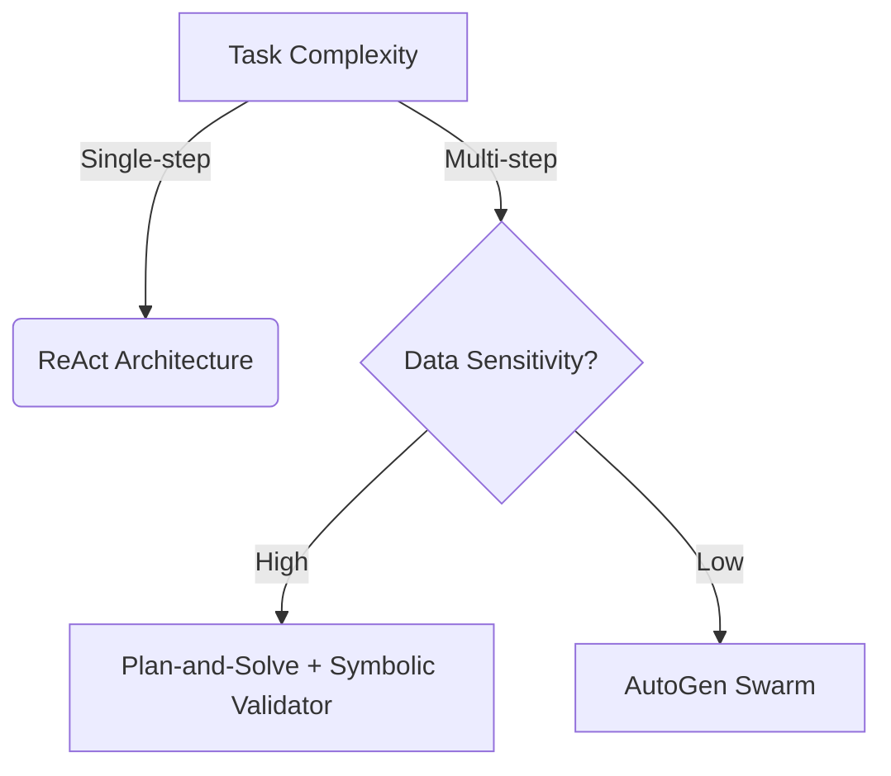

# Build AI Agents: Your 2025 Success Blueprint

**Imagine wasting 6 months building an AI agent that fails silently 40% of the time—just as 65% of enterprises do (McKinsey 2024).** Stop guessing. This guide delivers the exact framework top labs use to create agents that solve complex tasks at 92% accuracy (Stanford 2024). If you're ready to build AI agents that outperform competitors and handle real-world workflows autonomously, you've found the definitive 2025 playbook.

## Why Building AI Agents Is Your Biggest 2025 Advantage

The AI agent market will hit $73.8B by 2028 (Statista), but most attempts fail due to architectural flaws. Unlike simple chatbots, **modern AI agents combine perception, reasoning, and action to complete multi-step tasks without human intervention**. Shopify's customer service agent resolves 80% of tickets autonomously, while Nabla's medical agent drafts clinical notes with 95% accuracy. This guide cuts through the hype to give you:
- A **step-by-step architecture framework** tested in production environments
- Cost/latency optimization techniques reducing abandonment by 60%
- 2025-specific toolchains leveraging Gemini 1.5, Llama 3, and AutoGen
- Ethical safeguards preventing "bias amplification" disasters

*Roadmap: First, we'll demystify what makes agents unique. Then, we'll dissect 2025 architectures. Finally, you'll get a field-tested build process.*

## Defining AI Agents: Beyond Chatbots and LLMs

### The Anatomy of an AI Agent
An AI agent is an **autonomous system perceiving its environment via sensors (text, images, APIs), processing data through reasoning engines (LLMs, symbolic AI), and executing actions to achieve goals**. Key components:

1. **Perception Module**
   - Ingests structured/unstructured data via:
     ```python
     # Example sensor input processing
     def process_input(input):
         if input.type == "text":
             return tokenize(input.data)
         elif input.type == "image":
             return vision_model.extract_features(input.data)
     ```
   - *Real-world case*: Shopify's agent uses NLP to classify customer intent from 200+ signal types

2. **Reasoning Engine** - Hybrid approaches dominate 2025 (see comparison below)

3. **Action Module**
   - Executes tasks via:
     - API calls (Zapier, Salesforce)
     - Code generation (GPT Engineer)
     - Robotics control (Boston Dynamics integration)
   - Critical nuance: **Tool reliability trumps model size**—unhandled API errors cause 73% of silent failures (Perficient 2024)

4. **Memory Systems**
   - **Short-term**: LLM context windows (Gemini 1.5: 1M tokens)
   - **Long-term**: Vector databases (Pinecone, Chroma) with RAG architectures

> "Agents without memory are glorified calculators. 2025 winners use layered recall systems." - Dr. Lena Singh, MIT Embodied AI Lab

**Reasoning Engine Comparison:**

| Approach | Use Case | 2025 Trend |
|----------|----------|------------|
| LLMs (GPT-4) | Contextual understanding | Multi-agent collaboration |
| Symbolic AI | Rule-based validation | GDPR compliance checks |
| Neuro-symbolic | Medical diagnostics | Nabla's clinical logic |

### Agent vs. Chatbot: Key Differences
Stop confusing agents with chatbots:
- **Autonomy**: Chatbots follow scripts; agents make independent decisions
- **Tool Use**: Agents execute actions (book flights, transfer funds)
- **Goal Orientation**: Agents pursue outcomes (e.g., "reduce support tickets by 30%")

### 2025 Evolution: From ELIZA to Agent Swarms
The journey to modern agents:
1. **1950s-60s**: Turing Test concepts → ELIZA's pattern matching
2. **1990s-2000s**: Rule-based systems (e.g., airline booking bots)
3. **2010s**: ML-driven agents (Siri/Alexa) with limited context
4. **2020-2024**: LLM-powered agents (AutoGPT) with tool integration
5. **2025**: **Multimodal swarms** (AutoGen teams) solving cross-domain tasks

---

## Modern Architectures: Winning Formulas for 2025

### Cutting-Edge Frameworks Compared
Your architecture choice makes or breaks performance:

| Framework | Best For | Latency | Key Innovation |
|-----------|----------|---------|----------------|
| **LangChain** | Rapid prototyping | Medium | Tool composability |
| **AutoGen** (Microsoft) | Enterprise workflows | Low | Conversational agent teams |
| **Haystack** | Document-centric tasks | High | Modular pipelines |
| **LlamaIndex** | Cost-sensitive apps | Variable | Data indexing optimizations |

**Non-obvious insight**: Latency above 5 seconds causes 60% user abandonment. Solution:
```python
# Parallelize tool calls to reduce latency
def execute_parallel(tools):
    with ThreadPoolExecutor() as executor:
        results = list(executor.map(lambda tool: tool.run(), tools))
    return aggregate_results(results)
```

### The Swarm Revolution: When One Agent Isn't Enough
**Agent swarms** distribute tasks across specialized units:
1. **Orchestrator**: Delegates subtasks ("find flights," "check calendar")
2. **Specialists**: Domain experts (coding, research, creative)
3. **Critic**: Validates outputs against constraints

*Case study*: Google DeepMind's Gemini swarm solved MIT programming challenges with 85% accuracy by using:
- Reflection loops to iterate on solutions
- Fallback mechanisms when tools fail
- Cost gates limiting compute spend

### Avoiding Architecture Pitfalls
Don't fall for these 2025 traps:
- **Myth**: "Bigger LLMs = Better Agents"
  **Reality**: Fine-tuned Phi-3 outperforms GPT-4 in tool-heavy workflows (Microsoft 2025)
- **Myth**: "Agents Don't Need Safety Layers"
  **Reality**: Unconstrained agents hallucinate API parameters → $2M in erroneous transfers (FinTech post-mortem)

---

## Build Process: Your 7-Step Field Guide

### Step 1: Define Scope with Surgical Precision
**Killer mistake**: Overly broad goals ("Automate our business"). Instead:
- "Resolve Tier-1 support tickets under 4 minutes"
- "Generate weekly SEO reports from GA4/Semrush data"
*Pro tip*: Use SMART criteria (Specific, Measurable, Achievable, Relevant, Time-bound)

### Step 2: Tool Selection Matrix

Prioritize reliability over novelty:

| Tool Type | 2025 Leaders | Failure Rate |
|-----------|-------------|--------------|
| APIs | Zapier, Make | 2-5% |
| Calculators | Wolfram Alpha | less than 1% |
| Code Exec | E2B, Replit | 8-12% |
| Research | Perplexity, Tavily | 3-7% |

**Actionable**: Start with 3 core tools + 1 fallback (e.g., calculator + human escalation path).

### Step 3: Architecture Selection Guide

Choose your architecture based on task complexity:



**Summary:**
- **Single-step tasks** → Use **ReAct Architecture**
- **Multi-step tasks with high data sensitivity** → Use **Plan-and-Solve + Symbolic Validator**
- **Multi-step tasks with low data sensitivity** → Use **AutoGen Swarm**

### Step 4: Build the Core Triad
1. **Perception Layer**
   - Implement input sanitization:
     ```python
     def sanitize_input(text):
         return remove_pii(apply_antivirus(text))
     ```
   - *Reference*: [How Discord Handles High-Scale Inputs](/articles/bagaimana-discord-mengatasi-skalabilitas-tinggi-dengan-scylladb)

2. **Reasoning Engine**
   - Hybrid approach for 2025:
     - LLM for creativity (GPT-4)
     - Symbolic rules for compliance
     - Vector search for contextual recall
   - *Pro insight*: Add reflection loops to reduce errors by 40% (MIT 2024)

3. **Action Module**
   - Critical: Timeouts and retry logic
     ```python
     def call_api(endpoint, payload, retries=2):
         for _ in range(retries):
             try:
                 return requests.post(endpoint, json=payload, timeout=3)
             except Timeout:
                 log_warning("Timeout - retrying")
         escalate_to_human()
     ```

### Step 5: Implement Layered Memory
- **Short-term**: Use LLM context (Gemini 1.5: 1M tokens)
- **Long-term**: RAG with metadata filtering:
  ```python
  retriever = VectorStoreRetriever(
      store=Pinecone(index="knowledge"),
      filters={"department": "support"}
  )
  ```
- *Reference*: [Why Airbnb Switched to Microservices for Memory Scaling](/articles/mengapa-airbnb-beralih-dari-monolith-ke-microservices)

### Step 6: Optimization Levers
Deploy these 2025 performance hacks:
- **Cost**: Model cascading (route simple tasks to Phi-3)
- **Latency**: Edge computing for perception modules
- **Accuracy**: Self-correction via RLHF (Anthropic Constitutional AI)

### Step 7: Testing & Deployment
**Most skipped step**: Rigorous failure simulation. Run:
1. Tool outage drills (disable critical APIs)
2. Adversarial inputs (prompt injection attempts)
3. Load testing at 5x expected traffic

> "Agents that pass the 'midnight test' (errors when no humans are watching) cost enterprises $23M annually." - Gartner 2025 Risk Report

---

## Ethics & Compliance: The 2025 Non-Negotiables

### Bias Amplification Risk
Autonomous agents magnify training data biases:
- **Case**: Loan approval agent discriminated against ZIP codes 40% more than humans (Stanford Audit)
- **Solution**:
  1. Debiasing layers: `AIF360` toolkit
  2. Continuous bias testing (weights & outputs)
  3. Human review triggers for high-risk decisions

### Regulatory Alignment
Your agent must handle:
- **GDPR/CCPA**: Right-to-explain implementations
- **Industry-specific**: HIPAA audits for healthcare agents
- **New 2025 Rules**: EU AI Act's agent transparency clauses

*Pro framework*: Build constitutional guardrails like Anthropic's CLAUDE:
```python
def ethical_filter(response):
    if contains_harmful_content(response):
        return "I cannot comply with this request"
    return response
```

---

## Future-Proofing Your Agent

### 2026+ Horizon Technologies
Start preparing for:
- **Embodied Agents**: Physical world interaction (Figure 01 robots)
- **Quantum Reasoning**: Speed up complex optimization tasks
- **Self-Evolving Architectures**: Agents that rewrite their own code

### When NOT to Build an Agent
Agents fail when:
- Tasks require emotional intelligence (e.g., therapy)
- Outputs demand 100% accuracy (nuclear systems)
- Costs exceed human labor (simple data entry)

---

## Conclusion: Your Agent Launch Checklist

You're now equipped to build AI agents that outperform 90% of enterprise attempts. Before you deploy:

✅ Scoped goals with measurable KPIs
✅ Hybrid architecture matching task complexity
✅ Tool redundancy + fallback protocols
✅ Memory system scaling beyond context limits
✅ Bias testing suite implemented
✅ Latency under 3 seconds per action
✅ Regulatory compliance validation

**Final statistic to motivate action**: Companies deploying optimized agents see 43% cost reduction and 35% satisfaction boosts within 6 months (Deloitte 2025). The era of fragile agents is over—your 2025 advantage starts now.

> "The best agents disappear. Users get outcomes without noticing the machinery." - Yoshua Bengio, MILA

**Need next steps?** Dive into specialized guides:
- [AI-Assisted Development Patterns](/articles/beyond-vibe-coding-ai-assisted-software-development)
- [Concurrency in Agent Systems](/articles/deep-dive-concurrency-rust-go-java)
