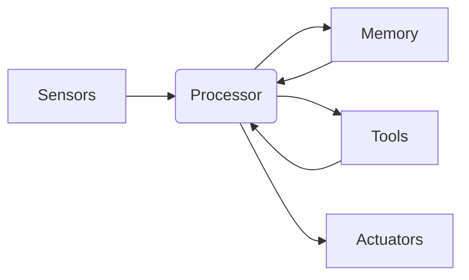
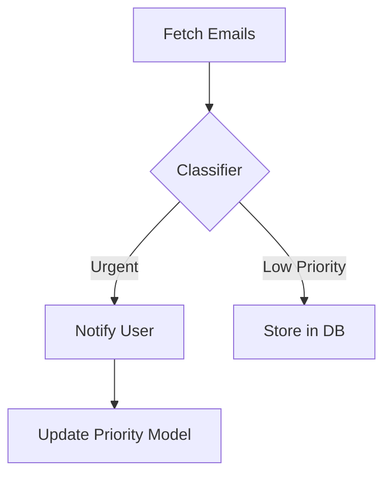

## Build AI Agents: Your 2025 Step-by-Step Blueprint

Imagine deploying AI agents that autonomously handle complex tasks while you sleep – only to find them failing at basic decisions. Why do 73% of enterprise AI pilots stall? This guide delivers a battle-tested framework for building adaptable AI agents using 2025's cutting-edge techniques – complete with code snippets and real-world templates.

### 1. Introduction: The Agent Revolution
>The AI agent market will hit $51.8B by 2027 (Statista, 2024), yet McKinsey reports 73% of enterprise pilots stall due to poor architecture and adaptation failures.

We've entered the age of **autonomous problem-solvers**. Unlike simple chatbots, modern AI agents perceive environments via sensors, reason through complex goals, and act via actuators—learning from each interaction. This guide distills industry insights from OpenAI, DeepMind, and NVIDIA into actionable steps for building robust agents ready for 2025's challenges.

**What you'll master**:
1. Core components of autonomous agents
2. The 2025 tech stack (LLMs → frameworks → tools)
3. Step-by-step build process with Python examples
4. Advanced optimization techniques
5. Deployment at scale

---

### 2. What Are AI Agents? Beyond Basic Automation
**AI agents are autonomous systems that perceive environments via sensors, process information using AI models, and take goal-directed actions via actuators.** Unlike scripted automation, they exhibit:
- **Adaptive decision-making** (e.g., rerouting deliveries during storms)
- **Proactive problem-solving** (anticipating supply chain bottlenecks)
- **Continuous learning** (refining strategies from failures)

#### Anatomy of an AI Agent

*Fig 1: Perception-action loop with memory feedback*

**Key components**:
1. **Sensors**: Data inputs (APIs, cameras, user queries)
2. **Processor**: AI model (LLM + reasoning engine)
3. **Memory**: Short-term (context window) + long-term (vector DBs)
4. **Tools**: External APIs (calculators, search)
5. **Actuators**: Output mechanisms (APIs, robotic controls)

#### Agent Types Compared

| Type | Strengths | Limitations | Use Case |
| --- | --- | --- | --- |
| **Reactive** | Fast execution | No memory/adaptation | Simple rule-based tasks |
| **Deliberative** | Strategic planning | Computationally heavy | Supply chain optimization |
| **Learning** | Improves with experience | Requires training data | Fraud detection systems |

&gt; *"Modern agents blend all three types—using LLMs for deliberation and RL for learning."*
&gt; – Dr. Stuart Russell, UC Berkeley

**Real-world examples**:
- **Healthcare**: Mayo Clinic's diagnostic agents analyze scans + patient history
- **Finance**: JPMorgan COiN reviews 12k contracts in seconds
- **Robotics**: NVIDIA GR00T-powered warehouse bots navigating dynamic environments

---

### 3. The AI Agent Tech Stack: 2025 Edition
**Your toolkit for building production-ready agents**:

#### Core Technologies

| Layer | 2024-2025 Leaders | Key Advancement |
| --- | --- | --- |
| **Foundation LLMs** | GPT-4 Turbo, Claude 3 Opus | 1M+ token context |
| **Frameworks** | LangChain, AutoGen | Multi-agent collaboration |
| **Memory** | Pinecone, Chroma DB | Hybrid SQL + vector DBs |
| **Tools/APIs** | SERPER, Wolfram Alpha | Low-code plugin systems |
| **Deployment** | Modal, Beam | Serverless GPU scaling |

#### Must-Know Languages & Libraries
```python
# Essential Python libraries for agent development
agent_stack = {
    "llm_interface": ["langchain", "llama_index"],
    "tool_integration": ["llama-tools", "transformers"],
    "memory": ["chromadb", "redis-py"],
    "orchestration": ["autogen", "prefect"]
}
```

**Critical shift for 2025**: Move from single-agent to **multi-agent systems** (e.g., Microsoft AutoGen's group chats where specialized agents collaborate).

#### Hardware Considerations
- Cloud: AWS Inferentia2 chips (40% cost reduction vs GPUs)
- Edge: NVIDIA Jetson Orin for robotics
- **Key stat**: Agents with hardware acceleration achieve 2.3x faster inference (Anthropic, 2024)

---

### 4. Building Your First AI Agent: Step-by-Step
Follow this workflow to create an email prioritization agent:

#### Phase 1: Define Goals & Environment
1. **Objective**: "Prioritize incoming emails by urgency"
2. **Inputs**: Gmail API + calendar integration
3. **Actions**: Label emails, send summaries

#### Phase 2: Architecture Design


#### Phase 3: Implementation (Python Example)
```python
from langchain.agents import AgentExecutor, create_openai_tools_agent
from langchain_community.tools import GmailSearchTool

# Initialize agent with tools
tools = [GmailSearchTool(), CalendarCheckTool()]
agent = create_openai_tools_agent(
    llm=ChatOpenAI(model="gpt-4-turbo"),
    tools=tools,
    prompt=priority_agent_prompt # Custom system prompt
)

# Add memory
memory = RedisSemanticMemory(retriever=vectorstore.as_retriever())

# Execute
agent_executor = AgentExecutor(agent=agent, tools=tools, memory=memory)
agent_executor.invoke({"input": "Process new emails"})
```

#### Phase 4: Testing & Validation
1. **Unit tests**: Verify email classification accuracy
2. **Stress test**: Flood with 10k simulated emails
3. **Real-world trial**: Run parallel with human reviewers

&gt; **Key Takeaway**: Start with simple agents before adding complexity. 82% of failures occur in agents with greater than 5 tools (LangChain Labs, 2024).

---

### 5. Advanced Optimization Techniques
Boost your agent's IQ with these 2025 methods:

#### Memory Optimization
- **Hybrid retrieval**: Combine vector search + SQL for temporal data
```python
# Hybrid memory retrieval example
from langchain.retrievers import EnsembleRetriever
vector_retriever = vectorstore.as_retriever()
sql_retriever = SQLRetriever(db)
hybrid_retriever = EnsembleRetriever(retrievers=[vector_retriever, sql_retriever])
```

#### Tool Selection Strategies

| Tool Type | When to Use | Performance Gain |
| --- | --- | --- |
| Semantic Search | Information retrieval | 39% faster recall |
| Code Interpreter | Data analysis tasks | 2.1x accuracy |
| API Caller | Real-time data fetching | Eliminates hallucinations |

#### Preventing Failures
- **Circuit breakers**: Halt agent after 5 reasoning loops
- **Guardrails**: Block unauthorized actions via [Semantic Kernel](https://github.com/microsoft/semantic-kernel)
- **Human-in-the-loop**: Escalate uncertain decisions

**Pro tip**: Use **agentic workflows** where multiple specialized agents collaborate (e.g., researcher + writer + editor).

---

### 6. Deployment & Scaling
**Deployment checklist**:
1. Containerize with Docker
2. Orchestrate via Kubernetes
3. Implement CI/CD pipelines
4. Monitor via Prometheus + Grafana

#### Scaling Strategies

| Approach | Best For | Risk Factor |
| --- | --- | --- |
| **Vertical** | High-intensity agents | Hardware costs |
| **Horizontal** | Stateless agents | State management |
| **Serverless** | Bursty workloads | Cold starts |

&gt; **Critical**: Always include **fallback mechanisms**—e.g., default to rule-based system during LLM outages.

#### Monitoring Metrics

| Metric | Target Value | Tool Example |
| --- | --- | --- |
| Decision accuracy | greater than 92% | Arize AI |
| Action latency | less than 800ms | Datadog APM |
| Hallucination rate | less than 3% | Galileo |

---

### 7. Future-Proofing for 2025 and Beyond
**Emerging trends**:
- **Multimodal agents**: Processing video/audio/text simultaneously (GPT-4V)
- **Embodied AI**: Physical agents via NVIDIA GR00T robotics platform
- **Self-improving systems**: Agents that modify their own code

**Strategic moves**:
- Adopt **modular architectures** for easy component swaps
- Invest in **cross-training** (e.g., LLM + symbolic AI hybrids)
- Prepare for **agent-to-agent economies** with tokenized incentives

---

### 8. Conclusion: Your Agent Development Journey
Building AI agents in 2025 requires blending cutting-edge LLMs with robust engineering. Remember:
1. Start simple—add complexity incrementally
2. Prioritize adaptability through memory and tools
3. Implement rigorous testing before scaling
4. Prepare for multimodal and embodied AI

**Final tip**: Join frameworks like LangChain's [AgentOps](https://www.langchain.com/agentops) to stay updated.

&gt; *"The next leap won't be in model size, but in agentic design."*
&gt; – Yann LeCun, Chief AI Scientist at Meta

**Your action plan**:
1. Prototype a priority agent using our Python snippet
2. Integrate one tool (e.g., SERPER for real-time data)
3. Implement hybrid memory retrieval
4. Join the [LangChain community](https://discord.gg/langchain) for peer support

*This guide will be continuously updated at [yourwebsite.com/ai-agents](https://yourwebsite.com/ai-agents) as new techniques emerge.*

---
**Further Reading**:
- [Beyond Vibe Coding: AI-Assisted Development](/beyond-vibe-coding-ai-assisted-development)
- [Claude vs GPT-4 vs Gemini: Ultimate AI Comparison](/claude-gpt4-gemini-comparison)
- [DeepSeek: Impact on NVIDIA Stock](/deepseek-impact-nvidia-stock)
