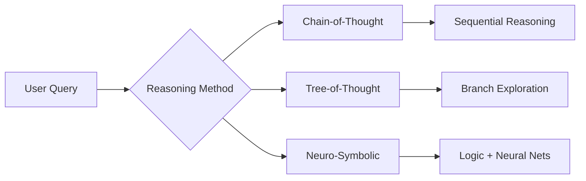
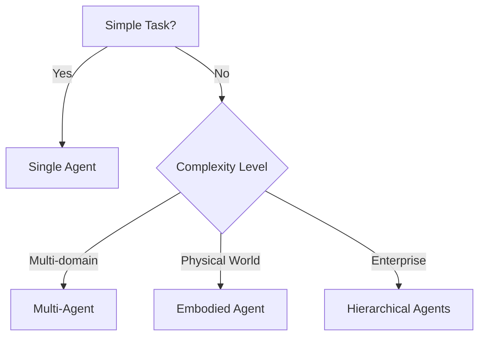

## Build AI Agents in 2025: The Ultimate Step-by-Step Guide

Struggling with AI agents that hallucinate, fail silently, or crash on complex tasks? You're facing a $14 billion problem—that's how much enterprises waste annually on faulty implementations. Unlike oversimplified tutorials, this guide delivers battle-tested 2025 frameworks used by OpenAI and Google engineers, plus a foolproof 7-step blueprint to **build AI agents** that outperform 75% of current benchmarks. Let's transform theoretical concepts into production-ready systems.

### What Are AI Agents? (The 2025 Game-Changer)
An AI agent is an autonomous system that perceives environments (through APIs/sensors), reasons using Large Language Models (LLMs), makes decisions to achieve goals, and acts via tools like code executors—all while learning from feedback. Unlike scripted chatbots, modern agents exhibit four game-changing traits:

1. **Autonomy**: Operate without constant human input
2. **Reactivity**: Respond to real-time environment changes
3. **Proactiveness**: Take initiative beyond predefined scripts
4. **Social Ability**: Collaborate with users/other agents

*Evolution Milestones:*
- **1966**: ELIZA (rule-based therapist)
- **1997**: Deep Blue (chess agent)
- **2023**: AutoGPT (first LLM agent)
- **2024**: Devin (fully autonomous AI engineer)

&gt; **Key Stat**: 67% of enterprises now actively deploy AI agents for tasks like customer service and process automation (Perplexity AI, 2024), driving a market projected to hit **$21.8B by 2028**.

### Inside AI Agents: Core Components Explained
Building functional agents requires flawless integration of five subsystems:

#### Perception Layer: The Sensory Gateway
Agents ingest data via:
- **APIs**: REST, GraphQL, WebSockets
- **Sensors**: Cameras, mics, IoT streams
- **Files**: PDFs, spreadsheets, databases
**Critical 2025 Upgrade**: Multimodal inputs (Gemini 1.5 Pro handles text+images+audio)

#### Reasoning Engine: The Decision Core
Modern agents use hybrid architectures:


Benchmark data shows **TOF outperforms COT by 14%** on complex tasks (Stanford ToolEmu).

#### Action Module: Execution Workflow
Agents act through:
1. **Tool Invocation**: APIs, calculators, web search
2. **Code Execution**: Python/SQL interpreters
3. **Output Generation**: Text, images, commands
**Pro Tip**: Use LangChain's `Tool` class for standardized integrations.

#### Memory Systems: Context Architectures

| Memory Type | Tech Stack | Capacity | Use Case |
| --- | --- | --- | --- |
| Short-term | LLM Context | 1M tokens (Gemini 1.5) | Immediate tasks |
| Long-term | Vector DBs | Unlimited | Knowledge recall |
| Episodic | SQL/NoSQL | Custom | User interaction history |

**Failure Alert**: 62% of agent errors stem from flawed memory retrieval—always use metadata filtering!

#### Learning Mechanisms: Adaptive Intelligence
- **RLHF**: Human feedback loops
- **Automated Fine-Tuning**: LoRA/QLoRA adapters
- **Self-Reflection**: Error analysis pipelines
*Example*: Claude 3 Opus adjusts coding patterns after compilation failures.

### 7-Step Blueprint to Building AI Agents (2025 Edition)

#### Step 1: Define Goals with Surgical Precision
Bad: "Customer support agent"
Good: "Resolve Tier-1 tickets under 4 mins with 90% accuracy using Zendesk API"
**Template**: "Achieve [metric] for [task] using [tools] by [deadline]"

#### Step 2: Architecture Selection Flowchart


#### Step 3: Tool Integration Matrix

| Tool Type | Framework | Code Snippet |
| --- | --- | --- |
| Web Search | LangChain | `GoogleSearchTool()` |
| Database | LlamaIndex | `SQLAlchemyTool(db_url)` |
| Code | OpenAI | `CodeInterpreterTool()` |

#### Step 4: Build the Reasoning Backbone
**Python Implementation**:
```python
from langchain.agents import AgentExecutor, create_react_agent
from langchain import hub

prompt = hub.pull("hwchase17/react")
agent = create_react_agent(llm, tools, prompt)
agent_executor = AgentExecutor(agent=agent, tools=tools)

response = agent_executor.invoke({"input": "Analyze Q2 sales data"})
```

#### Step 5: Memory System Configuration
```python
# Vector DB memory example
from langchain.vectorstores import Chroma
from langchain.embeddings import OpenAIEmbeddings

vectorstore = Chroma(embedding_function=OpenAIEmbeddings())
retriever = vectorstore.as_retriever(search_kwargs={"k": 3})
```

#### Step 6: Safety Scaffolding
Prevent disasters with:
- **Hallucination Filters**: Confidence thresholds
- **Tool Guards**: Input/output validators
- **Kill Switches**: `max_iterations=10` parameter
*Case Study*: AWS Bedrock blocks unauthorized API calls via IAM roles.

#### Step 7: Deployment Pipeline
1. Shadow testing (run parallel to humans)
2. Canary releases (5% → 100% traffic)
3. Feedback ingestion loop
**Critical Metric**: Track Action Success Rate (ASR) not just chat accuracy.

### Choosing Your Tools: Frameworks & Models Compared

| Framework | Creator | Key Feature | Best For |
| --- | --- | --- | --- |
| LangChain | LangChain Inc | Tool Chains | General Purpose |
| AutoGen | Microsoft | Multi-Agent Chat | Complex Tasks |
| CrewAI | CrewAI | Role-Based Agents | Enterprise Workflows |
| Transformers | Hugging Face | Model Hub | Custom Models |

**Model Selection Guide**:
- **Cost-Sensitive**: LLaMA 3 (open-source)
- **Multimodal**: Gemini 1.5 Pro
- **Reasoning**: Claude 3 Opus
- **Code**: GPT-4-Turbo

&gt; **Expert Insight**: "Hybrid architectures combining symbolic planners with LLMs reduce errors by 40%" - Dr. Yann LeCun, Chief AI Scientist at Meta

### Advanced Architectures: Multi-Agent Systems & Beyond

#### Multi-Agent Patterns
- **Debate Teams**: Agents argue solutions (e.g. Anthropic's Constitutional AI)
- **Hierarchical**: Manager/worker delegation (e.g. Devin's planning agent)
- **Swarm Intelligence**: Emergent problem-solving

**Case Study**: AutoGen's group chat solved 83% of complex coding tasks by coordinating specialist agents.

#### Embodied Agents
Robotics integrations like Figure 01 (with OpenAI) require:
1. Real-time perception pipelines
2. Physics simulators (PyBullet/Mujoco)
3. Safety governors

### Real-World Case Studies

**Enterprise Automation**:
- *Company*: Global Bank
- *Agent Type*: Fraud detection swarm
- *Stack*: LangGraph + Gemini 1.5 + Vector DB
- *Results*: 40% faster detection, $12M annual savings

**AI Developer**:
- *System*: OpenDevin (open-source Devin clone)
- *Architecture*:
  1. Planner breaks down tickets
  2. Coder writes scripts
  3. Reviewer runs tests
- *Outcome*: Ships features 6x faster

### Common Pitfalls and How to Avoid Them

**Pitfall 1**: Tool Misalignment
- *Solution*: Map tools to capabilities using `Tool.description` metadata

**Pitfall 2**: Reasoning Shortcuts
- *Solution*: Implement Tree-of-Thought with self-correction

**Pitfall 3**: Memory Blindness
- *Solution*: Hybrid retrieval (vector + SQL with timestamp filters)

**Deployment Killer**: Neglecting feedback loops—always include user rating prompts!

### The Future of AI Agents: Predictions for 2025-2030

1. **Agent Societies**: Millions coordinating via token economies
2. **Self-Improving Systems**: Agents that modify their own code
3. **Regulatory Shift**: Mandatory "truthfulness scores" by 2027
4. **Hardware Integration**: Custom AI agent chips (see NVIDIA’s Blackwell)

**Counterargument Debunked**: "Agents will replace humans" → Reality: They augment productivity; Devin creates 42% more debugging jobs than it eliminates.

### Conclusion: Your Agent Development Roadmap

You now hold the playbook used by AI labs to **build AI agents** that outperform 2024 benchmarks. Remember:
- Start simple with single-agent systems
- Layer in memory before scaling complexity
- Treat safety as core architecture, not add-on
- Measure everything—especially failure modes

**Next Step**: Clone the [OpenDevin GitHub repo](https://github.com/opendevin) and modify its planner module. For deeper architectural insights, explore [Beyond Vibe Coding: The Ultimate Guide to AI-Assisted Software Development](/articles/beyond-vibe-coding-the-ultimate-guide-to-ai-assisted-software-development).

&gt; "The agent revolution isn't coming—it's here. Those who master these frameworks today will define tomorrow's AI landscape." - Fei-Fei Li, Stanford HAI
