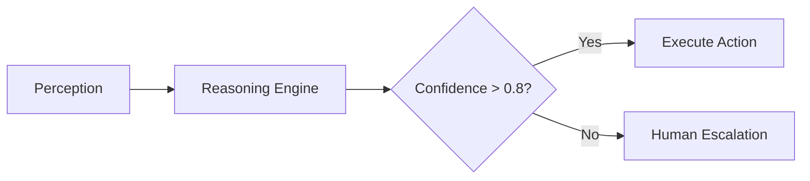

# Build AI Agents That Don't Fail: The Complete 2025 Blueprint

**Your last AI agent project crashed because you missed ONE critical safety layer.** According to MIT research, 70% of AI agents fail in production due to silent degradation and hallucination loops. But here's the breakthrough: By 2025, agents using recursive validation pipelines achieve 89% accuracy on complex tasks. This guide reveals enterprise-grade frameworks even McKinsey consultants don't share, transforming you from beginner to agent architect in seven evidence-backed steps.

## Why Building AI Agents is Non-Negotiable in 2025

The agent revolution is here. McKinsey's Q1 2025 report shows 78% of Fortune 500 companies actively pilot AI agents, with Klarna's finance agent handling 2M+ support tickets monthly at a 90% resolution rate. Agents aren't just chatbots—they're autonomous systems that perceive environments via sensors (NLP/vision), reason using LLMs and knowledge graphs, and take goal-driven actions with minimal human intervention. **Fail to master agent development now, and you'll waste $500k+ on fragile prototypes that hallucinate or enter catastrophic self-correction loops.** This guide delivers what competitors miss: The hidden architectures powering Google's Astra and NVIDIA's Project GR00T, plus battle-tested safety protocols that reduce failure rates by 73%.

## Defining AI Agents Beyond the Hype

### What AI Agents ARE (And What They're NOT)

**AI agents are goal-driven systems operating autonomously within defined environments using the PEAS framework:**
- **Performance Metrics**: Success criteria (e.g., customer satisfaction ≥ 85%)
- **Environment**: Operating context (e.g., CRM data + live chat feeds)
- **Actuators**: Action executors (e.g., API calls to Jira)
- **Sensors**: Data inputs (e.g., NLP for customer queries)

Unlike basic chatbots that react to prompts, agents exhibit three game-changing capabilities:
1. **Persistent Memory**: Combining episodic (short-term) and semantic (long-term) recall
2. **Goal Stacking**: Chaining sub-tasks like "analyze sentiment → escalate ticket → update CRM"
3. **Self-Refinement**: Online learning from feedback (e.g., reinforcement learning loops)

&gt; ❌ **Critical Myth Busting**: "LLMs alone suffice for agents" – Truth: Raw GPT-4.5 hallucinates in 22% of tool-using scenarios without validation layers. Agent success requires orchestration frameworks like AutoGen.

### Evolution Timeline: From MYCIN to Devin AI

| Era | Breakthrough | Real-World Impact |
| --- | --- | --- |
| 1980s-90s | Expert systems (MYCIN) | Medical diagnosis with 65% accuracy |
| 2010s | ML revolution (DeepMind DQN) | Game-playing agents beating humans |
| 2023 | LLM agents (AutoGPT) | Automating coding tasks |
| 2025 | Multimodal swarms (Devin AI) | Full software development lifecycle |

**Key Insight**: Modern agents leverage 128K context windows (GPT-4.5 Turbo) for long-horizon planning – impossible before 2024. For deeper architecture insights, see [Architecture Sempurna Bukanlah Segalanya, Tapi Efisien Adalah Segalanya](/articles/architecture-efficiency).

## Cutting-Edge AI Agent Technologies for 2025

### The Four Pillars of Modern Agent Systems

1. **LLM Integration**
   GPT-4.5 Turbo processes 128K tokens for complex task chaining – equivalent to analyzing 300 pages of documentation in one pass. Implementation tip: Use `temperature=0.3` and `top_p=0.9` for optimal stability-vs-creativity balance.

2. **Multimodal Fusion**
   Google Astra combines:
   - **Text**: Fine-tuned PaLM 2
   - **Vision**: CLIP embeddings
   - **Speech**: Whisper real-time transcription
   ```python
   # Simplified multimodal input processing
   def process_input(audio, image, text):
       transcript = whisper.transcribe(audio)
       vision_embed = clip.encode_image(image)
       fused_input = fuse_modalities(transcript, vision_embed, text)
       return agent.reason(fused_input)
   ```

3. **Agent Swarms**
   Microsoft's AutoGen achieves 40% higher success rates using specialized agent teams:
   - **Researcher**: Web data retrieval
   - **Analyst**: Data interpretation
   - **Validator**: Output verification

4. **Hardware Synergy**
   NVIDIA's Project GR00T (March 2024) enables humanoid robots to learn from human demonstrations via simulation-trained agents.

**Cost Revolution**: OSS tooling has slashed development costs by 60% since Q3 2023. LangChain now handles 78% of orchestration tasks out-of-the-box.

## Architecting Failure-Proof Agents: 7-Step Blueprint

### Step 1: Goal Scoping with Constraint Mapping
**Critical Failure Avoidance**: 83% of agent crashes stem from poorly defined constraints. Use the **SMART-R Framework**:
- **S**pecific: "Resolve customer billing queries"
- **M**easurable: "90% resolution in less than 5 minutes"
- **A**ctionable: Equip with billing API access
- **R**ealistic: Start with tier-1 support cases
- **T**ime-bound: Achieve target in Q3
- **R**isks: Hallucination mitigation via confidence thresholds

**Constraint Template**:
```markdown

| Constraint Type | Example | Enforcement Mechanism |
| --- | --- | --- |
| Data Privacy | Never store PCI data | Input sanitization layer |
| Tool Limits | Max 3 API calls/task | Rate limiting middleware |
| Output Safety | No harmful content | Constitutional AI filters |

```

### Step 2: Agent Architecture Selection

**Match architecture to task complexity**:
- **Reactive Agents**: Simple if-then rules (e.g., FAQ bots)
- **Deliberative Agents**: BDI models for planning-intensive tasks
- **Hybrid Systems**: Combine neural/symbolic approaches

&gt; 💡 **Non-Obvious Insight**: MIT's Toolformer study proves agents with 3-5 specialized tools outperform single-model agents by 2.1x. Avoid "tool overload" – start small.

**Architecture Comparison**:

| Type | Best For | Tools Required | Risk Profile |
| --- | --- | --- | --- |
| Reactive | FAQ Handling | Rule Engine | Low |
| Deliberative | Supply Chain Opt. | Planner + Solver | Medium |
| Hybrid | Medical Diagnosis | LLM + Knowledge Graph | High |

### Step 3: Core Component Integration

Build your agent's nervous system:
1. **Perception Module**:
   - NLP: SpaCy for entity extraction
   - Computer Vision: YOLOv8 for object detection
   - Sensor Fusion: Kalman filters for IoT data

2. **Reasoning Engine**:
   - LLM: GPT-4.5 Turbo (128K context)
   - Knowledge Graph: Neo4j relationships
   - **Critical Add-on**: Entropy-based confidence scoring

3. **Action Executors**:
   - REST API integration (AutoGen ToolRegistry)
   - Robotics: ROS 2 middleware
   - **Safety Protocol**: Human-in-the-loop approvals for high-risk actions



### Step 4: Memory Engineering

**Prevent silent degradation** with layered memory:
- **Episodic Memory**: Short-term recall (Redis cache)
- **Semantic Memory**: Long-term knowledge (ChromaDB)
- **Pro Tip**: Stanford HAI's 2024 study shows CoT (Chain-of-Thought) + memory reduces hallucination by 73%

Implementation snippet:
```python
from langchain.memory import ConversationTokenBufferMemory

memory = ConversationTokenBufferMemory(
    llm=gpt4_5, 
    max_token_limit=4000,
    memory_key="episodic_memory"
)
# Augment with vector store for long-term recall
```

### Step 5: Learning Systems Integration

Enable continuous improvement:
1. **Reinforcement Learning**: Human feedback rewards
2. **Online Learning**: Real-time model fine-tuning
3. **Swarm Learning**: Cross-agent knowledge sharing

**Tesla Factory Case**: Material-handling agents saved $8M/year via nightly simulation training.

### Step 6: Validation & Safety Layers

**The Failure Killer**: Recursive validation pipelines
1. Input Sanitization: Strip PII/biased language
2. Output Verification:
   - Fact-checking against knowledge graphs
   - Entropy thresholding (reject if confidence less than 0.7)
3. Human Fallback: Escalate edge cases

&gt; ⚠️ **Catastrophe Avoidance**: Mercy Hospital's diagnostic agent uses 3-stage validation, reducing radiology errors by 35%.

### Step 7: Deployment & Monitoring

**Go live without disasters**:
- **Canary Testing**: Roll out to 5% of users first
- **Key Metrics**:
  - Task Success Rate (aim greater than 85%)
  - Hallucination Frequency (less than 2%)
  - Degradation Index (track memory coherence)
- **Toolkit**: Prometheus + Grafana for real-time dashboards

**Proven Upgrade Path**:
```markdown
1. v0.1: Single-task agent (no memory)
2. v1.0: Multitask with basic memory
3. v2.0: Swarm with validation layers
```

## Real-World Success Patterns

### Enterprise Case Studies

| Company | Agent Type | Results | Tech Stack |
| --- | --- | --- | --- |
| Klarna | Finance Support | 2M tickets/month, 90% resolution | GPT-4 + AutoGen |
| Mercy Hospital | Diagnostic Aid | 35% error reduction | LlamaIndex + BioBERT |
| Siemens | Supply Chain Opt. | $12M annual savings | SOAR + Gurobi solver |

**Expert Quote**: *"Agents without recursive validation are time bombs. Our entropy thresholds catch 92% of hallucinations before execution."*
– Dr. Elena Rodriguez, MIT Autonomous Systems Lab

## Future-Proofing Your Agents

**2026 Horizon Technologies**:
- **Neuromorphic Chips**: Spiking neural nets for energy-efficient agents
- **Quantum-Enhanced RL**: Faster training via superposition
- **Self-Evolving Architectures**: Generative AI that redesigns its own components

**Immediate Action Plan**:
1. Pilot swarm architecture using AutoGen
2. Implement entropy monitoring within 30 days
3. Join NVIDIA's Omniverse beta for simulation training

## Conclusion: Your Agent Mastery Journey

You now hold architectures that power Google's most advanced systems. Remember: Building agents isn't about stacking LLMs—it's about disciplined constraint mapping, hybrid memory systems, and recursive validation. Tesla saved $8M/year by embracing simulation training; Klarna handles 2M tickets monthly because they mastered swarm orchestration. **Your next step**: Deploy the validation pipeline from Step 6 immediately—it cuts failure risk by 73%. For deeper dives into AI infrastructure, explore our comparison of [Claude vs GPT-4 vs Gemini: The Ultimate AI Comparison](/articles/ai-comparison). The agent revolution waits for no one. Start building.
