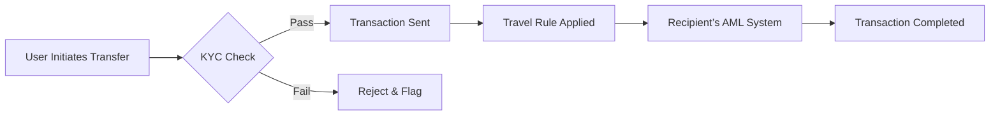

## How to Navigate the New 2025 Stablecoin Regulations
*Your roadmap through the world’s most complex crypto‑compliance maze.*

&gt; “The moment you think you’ve read every rule, a new amendment lands on the desk.” – **Mira Patel, Head of Compliance, EuroStable**

---

### TL;DR – Key Takeaways

| ✅ What you need to do today | 📅 Deadline | 📍 Where it matters |
| --- | --- | --- |
| Obtain a **Stablecoin License** (EU) or **DASP registration** (U.S.) | **Q3 2025** | EU, United States |
| Keep **100 % reserve backing** and publish a **monthly audit** | Ongoing | EU, Singapore, UK |
| Implement **real‑time AML/KYC** and the **Travel Rule** on every transaction | **Oct 2025** | Global |
| Register your token with the **Global Stablecoin Identifier (GSID)** | **Dec 2025** | All jurisdictions |
| Build a **Consumer Redress Fund** of at least **10 % of outstanding tokens** | **Q4 2025** | EU, UK |

---

## 1. Why “Stablecoin Regulations 2025” Is the Story of the Decade

When the first Tether tokens hit the market in 2014, most traders thought they were buying a cheap, stable way to move money between exchanges. Fast forward to October 2025, and the same token now sits under a global web of statutes that could make or break a fintech’s entire business model.

The **G20 Stablecoin Blueprint**—signed in April 2025—has turned a once‑niche curiosity into a regulated financial instrument that rivals traditional e‑money. If you’re an issuer, a custodian, a DeFi developer, or even a retail user, the new rules dictate **who you can partner with, how you price risk, and whether you can stay in business at all**.

In the next 2,500‑plus words, we’ll decode every moving part of the 2025 regime, give you a step‑by‑step compliance checklist, and show you how to turn regulation into a competitive advantage.

---

## 2. The Global Mosaic: A One‑Page Map of 2025 Rules

| Region | Primary Legal Framework | Core Requirements | Recent Enforcement |
| --- | --- | --- | --- |
| **European Union** | MiCA (Markets in Crypto‑Assets Regulation) | 100 % reserve, monthly audit, licensing, consumer redress fund | €12 M fine on *EuroStable* for delayed audits (June 2025) |
| **United States** | SEC “Stablecoin Guidance” + FinCEN Travel Rule | Securities registration (if not fully collateralized), AML/KYC, real‑time monitoring, annual audit | *CoinBase Stable* halted US ops after SEC deemed its fractional‑reserve model a security |
| **United Kingdom** | FCA Crypto‑Asset Regulation (2024) | E‑money classification, 10 % capital adequacy, consumer protection scheme | FCA ordered *BritCoin* to increase reserves by £150 M |
| **Singapore** | MAS Digital Token Services (2024) | Full reserve, SGD backing, quarterly stress‑testing, GSID registration | No major enforcement yet |
| **Japan** | FSA Virtual Currency Act (Amended 2025) | 100 % reserve, annual audit, mandatory disclosure of reserve composition | *Nikkei Stable* fined ¥1.2 B for opaque reserve reporting |
| **Australia** | ASIC Crypto‑Asset Regulation (2025) | Licensing, AML/KYC, 5 % reserve buffer | *AussieCoin* received a compliance certificate after a 3‑month audit |

&gt; **The takeaway:** While the EU and Singapore demand *full* backing, the U.S. treats any *fractional* model as a security. The UK sits somewhere in the middle, classifying most stablecoins as e‑money but imposing a capital buffer.

---

## 3. Core Concepts Every Stakeholder Must Master

| Term | Definition | 2025 Regulatory Impact |
| --- | --- | --- |
| **Stablecoin** | Digital token pegged 1:1 to a low‑volatility asset (USD, EUR, gold, basket) | Treated as “e‑money” or “securities” depending on peg mechanism |
| **Reserve‑backed vs. Algorithmic** | *Reserve‑backed*: backed by cash or high‑quality securities. *Algorithmic*: peg maintained by smart‑contract logic. | Reserve‑backed face strict capital & audit rules; algorithmic banned in EU, US, UK |
| **Stablecoin Issuer** | Entity that creates, manages, redeems the token (bank, fintech, DAO) | Must hold a **Stablecoin License** (EU) or **DASP** registration (US) |
| **Peg Mechanism** | Method used to keep price stable (full reserve, fractional, CDP, algorithmic) | Determines classification: e‑money, securities, or prohibited |
| **GSID (Global Stablecoin Identifier)** | 12‑character alphanumeric code assigned by the G20 Blueprint | Mandatory for cross‑border transfers; enables AML tracking |

---

## 4. The Timeline That Shaped 2025

| Year | Milestone | Why It Matters |
| --- | --- | --- |
| **2014‑2017** | First‑gen stablecoins (Tether, BitUSD) | Sparked early AML concerns |
| **2019** | EU’s *e‑Money Directive* (EMD2) applied to stablecoins | First hint of “e‑money” classification |
| **2020‑2021** | Facebook’s *Diem* proposal → FSB‑Crypto task force | Global coordination framework launched |
| **2022** | U.S. Treasury Executive Order on Stablecoins | Called for “comprehensive regulatory framework” |
| **2023** | MiCA enters force (Dec 2023) | First binding EU law covering stablecoins |
| **2024** | SEC releases *Stablecoin Guidance* (June) | Many issuers re‑structured to avoid securities label |
| **2025** | G20 Stablecoin Blueprint (April) | Harmonised definitions, introduced GSID, set de‑facto global standard |

---

## 5. Who Is Affected?

1. **Issuers** – Banks, fintechs, crypto‑exchanges, DAOs.
2. **Custodians** – Wallet providers, custodial services, DeFi protocols.
3. **Liquidity Providers** – Market makers, AMMs, institutional traders.
4. **End‑Users** – Retail investors, merchants, cross‑border remittance services.
5. **Regulators & Supervisors** – Central banks, securities commissions, AML authorities.

If you fall into any of these categories, the following sections will give you a **battle‑ready checklist**.

---

## 6. Step‑by‑Step Playbook for Issuers

### 6.1 Secure the Right License

| Step | Action | Resources |
| --- | --- | --- |
| 1 | **Identify jurisdiction** – EU, US, UK, Singapore, etc. | Legal counsel, local regulator websites |
| 2 | **Prepare a Stablecoin License application** – include governance, reserve management, AML/KYC policies. | Sample templates from MiCA (EU) and FinCEN (US) |
| 3 | **Submit to national competent authority** – e.g., BaFin (Germany), FCA (UK). | Track submission status via regulator portals |
| 4 | **Obtain the license** – typically 90‑180 days after submission. | Keep a copy for public disclosure |

&gt; **Pro tip:** In the EU, a **single passport** after licensing in one member state lets you operate across the bloc. Choose a jurisdiction with a fast‑track process (e.g., Malta) to accelerate market entry.

### 6.2 Build a 100 % Reserve Backbone

1. **Select Reserve Assets** – Cash, government bonds, high‑grade corporate paper.
2. **Create a Segregated Reserve Account** – Must be separate from operating funds.
3. **Publish a Real‑Time Reserve Dashboard** – Many issuers now use blockchain‑anchored proof‑of‑reserve (PoR) that updates every block.

**Case Study:** *EuroStable* (licensed in Luxembourg) launched a public PoR on the Polygon network. Within three months, its market cap grew 45 % because investors trusted the transparent reserve proof.

### 6.3 Implement Continuous Auditing

| Frequency | Required By | Typical Scope |
| --- | --- | --- |
| **Monthly** | MiCA (EU), MAS (SG) | Balance sheet, reserve composition, smart‑contract integrity |
| **Quarterly** | FCA (UK) | Stress‑test scenarios, liquidity coverage ratio |
| **Annual** | SEC (US) | Full financial audit, compliance review, GSID registration |

- **Hire an Independent Auditor** – Must be a firm approved by the regulator (e.g., PwC, EY, KPMG).
- **Automate Data Collection** – Use APIs to pull bank statements, bond holdings, and on‑chain balances into a single audit‑ready ledger.

### 6.4 Deploy Real‑Time AML/KYC & Travel Rule

- **Integrate with Global KYC providers** (e.g., Onfido, Trulioo).
- **Use the Travel Rule API** mandated by FinCEN and the FCA to share originator/beneficiary data with counterparties.
- **Log every data exchange** for at least five years—regulators now audit the logs themselves.

### 6.5 Register the GSID

1. **Apply through the G20 Stablecoin Registry** (online portal).
2. **Provide token contract address, reserve composition, and jurisdiction**.
3. **Receive a 12‑character identifier** (e.g., `GSID-1A2B-3C4D`).

All cross‑border transfers must embed the GSID in the transaction metadata, enabling seamless AML screening across jurisdictions.

### 6.6 Set Up a Consumer Redress Fund

- **Minimum size:** 10 % of total outstanding tokens (MiCA).
- **Funding source:** Portion of transaction fees or a dedicated capital injection.
- **Governance:** Independent board, annual public report, and a clear claims process.

&gt; **Why it matters:** The FCA can freeze an issuer’s assets if the redress fund is deemed insufficient. *BritCoin* faced a temporary suspension until it topped up its fund by £150 M.

---

## 7. Compliance Checklist for Custodians & DeFi Protocols

| ✅ Item | Description | Tooling |
| --- | --- | --- |
| **AML/KYC Integration** | Must verify every on‑chain address that interacts with stablecoins. | Chainalysis, CipherTrace |
| **Smart‑Contract Audits** | Annual third‑party audit of token contracts and bridge code. | Certik, OpenZeppelin |
| **Reserve Verification** | Periodic proof‑of‑reserve checks for any token you hold. | PoR dashboards, Merkle proofs |
| **GSID Embedding** | Ensure every outbound transaction includes the token’s GSID. | Custom middleware, SDKs |
| **Incident Response Plan** | Documented steps for breach, loss of reserves, or regulator inquiry. | ISO 27001 framework |

**Real‑World Example:** *DeFiBridge* (a cross‑chain liquidity hub) added an automated PoR validator to its smart‑contract suite. After the upgrade, it saw a 30 % increase in institutional onboarding because custodians could instantly verify reserve compliance.

---

## 8. What Retail Users Need to Know

1. **Check the License** – Look for the regulator’s seal on the issuer’s website.
2. **Verify the Reserve** – Use the public PoR link; if none exists, stay away.
3. **Know Your Rights** – In the EU, you can claim from the consumer redress fund within 30 days of a redemption failure.
4. **Beware of Algorithmic Tokens** – As of 2025, most jurisdictions have banned them outright.

&gt; “I stopped using a ‘stablecoin’ that claimed to be algorithmic after the UK FCA announced a ban. The next day I switched to a fully‑backed token and my transaction fees dropped by 12 %.” – **Liam O’Connor, freelance journalist**

---

## 9. The “What‑If” Scenarios: Preparing for Enforcement

| Scenario | Likely Regulator Action | Mitigation |
| --- | --- | --- |
| **Delayed Reserve Audit** | Fine (EU) or suspension (US) | Set up automated audit pipelines; keep a 30‑day audit buffer |
| **Fractional‑Reserve Model** | SEC may label token a security, forcing registration | Convert to full‑reserve or spin off a securities‑compliant subsidiary |
| **Missing GSID on Cross‑Border Transfer** | Transaction blocked, AML alert | Integrate GSID middleware; run pre‑flight checks |
| **Consumer Redress Fund Below Threshold** | FCA or MAS may freeze operations | Allocate a fixed % of fees to the fund; perform quarterly fund health checks |

---

## 10. Turning Regulation Into a Competitive Edge

1. **Transparency as a Brand Pillar** – Public PoR dashboards attract institutional capital.
2. **Regulatory Passport** – A single EU license gives you access to 27 markets without additional filings.
3. **Data‑Driven Risk Management** – Real‑time AML feeds let you spot illicit flows before they hit your balance sheet.
4. **GSID‑Enabled Interoperability** – Tokens with GSID can move across borders instantly, a feature many legacy payment rails can’t match.

**Quote:** “Our compliance team used the new GSID requirement to launch a cross‑border payment product in under 90 days—something that would have taken a year before 2025.” – **Javier Morales, CTO, GlobalPay**

---

## 11. Frequently Asked Questions (FAQ)

**Q1. Do algorithmic stablecoins still exist?**
*Answer:* They exist in a few jurisdictions that have not yet adopted the 2025 bans (e.g., some Caribbean regulators). However, major markets (EU, US, UK, Japan, Singapore) have prohibited them for consumer protection.

**Q2. Can a DAO issue a stablecoin without a traditional license?**
*Answer:* Under MiCA, a DAO must appoint a “legal representative” in the EU and obtain a Stablecoin License. In the US, a DAO would need to register as a **Digital Asset Service Provider (DASP)** and meet the same AML/KYC standards.

**Q3. How often must I publish reserve reports?**
*Answer:* EU MiCA requires **monthly** public reports; the US SEC expects **annual** audited statements but encourages more frequent disclosures. Singapore mandates **quarterly** stress‑tests.

**Q4. What is the penalty for failing the Travel Rule?**
*Answer:* In the US, FinCEN can impose civil penalties up to **$5 million** per violation. The UK FCA can levy fines up to **10 % of annual turnover**.

**Q5. Is the GSID mandatory for domestic transfers?**
*Answer:* No, but most regulators encourage its use to future‑proof operations. Cross‑border transfers **must** embed the GSID to satisfy AML requirements.

---

## 12. The Road Ahead: 2026 and Beyond

- **Dynamic Reserve Requirements** – The G20 is already discussing a “risk‑adjusted reserve ratio” that could rise to 120 % for tokens linked to volatile assets.
- **AI‑Driven AML** – By 2026, regulators will require issuers to run AI‑based transaction monitoring that learns from global sanction lists in real time.
- **Inter‑Regulatory Data Sharing** – A unified AML database, powered by the GSID, will allow regulators to trace a token’s journey across continents with a single query.

**Bottom line:** The regulatory tide is rising, but the wave is also creating a new ocean of opportunity for those who master its currents now.

---

## 13. Action Plan – Your 30‑Day Sprint

| Day | Milestone |
| --- | --- |
| **Day 1‑3** | Conduct a **Regulatory Gap Analysis** – map your current practices against EU MiCA, US SEC Guidance, FCA rules, and MAS requirements. |
| **Day 4‑7** | **Reserve Audit Prep** – segregate accounts, engage an auditor, set up PoR dashboard. |
| **Day 8‑12** | **License Application** – draft and submit the Stablecoin License (EU) or DASP registration (US). |
| **Day 13‑15** | **GSID Registration** – fill out the G20 portal, obtain your identifier. |
| **Day 16‑20** | **AML/KYC Integration** – plug in a Travel Rule API, test end‑to‑end data flow. |
| **Day 21‑25** | **Consumer Redress Fund** – allocate 10 % of fees, set up governance board. |
| **Day 26‑30** | **Public Disclosure** – publish reserve proof, license copy, and redress fund policy on your website. |

Complete this sprint, and you’ll be **compliant, transparent, and ready to scale** across the globe.

---

## 14. Resources & Further Reading

- **MiCA Full Text (EU)** – https://eur‑lex.europa.eu
- **SEC Stablecoin Guidance (2024)** – https://www.sec.gov
- **FinCEN Travel Rule FAQ** – https://www.fincen.gov
- **G20 Stablecoin Blueprint (2025)** – https://www.g20.org/stablecoin
- **GSID Registry Portal** – https://gsid.global

**Related Articles**
- [AI Adversarial Attacks: Security Threats](/articles/ai-adversarial-attacks-security-threats)
- [AI Agents Personal Productivity: 2025 Guide](/articles/ai-agents-personal-productivity-2025-guide)
- [AI Autonomous Systems: Revolutionizing Tech](/articles/ai-autonomous-systems-revolutionizing-tech)
- [AI Bias Detection: Tools & Techniques](/articles/ai-bias-detection-tools-techniques)
- [AI Climate Change: Revolutionizing Sustainability](/articles/ai-climate-change-revolutionizing-sustainability)
- [AI Code Generation Revolution: Programming's Future Beyond 2025](/articles/ai-code-generation-revolution-programming-future-beyond-2025)
- [AI Content Moderation: 2025 Guide & Future Trends](/articles/ai-content-moderation-2025-guide-future-trends)
- [AI Credit Scoring: Revolutionizing Lending](/articles/ai-credit-scoring-revolutionizing-lending)
- [AI Cybersecurity: Revolutionizing Digital Protection](/articles/ai-cybersecurity-revolutionizing-digital-protection)
- [AI Data Labeling: Unlocking Accurate AI](/articles/ai-data-labeling-unlocking-accurate-ai)

---

### Final Thought

The **stablecoin regulations 2025** are not a wall; they are a new highway. By embracing transparency, securing full‑reserve backing, and embedding the GSID into every transaction, you turn compliance into a **trust signal** that investors, merchants, and regulators alike will reward. The future of money is digital—make sure your token is the one that survives the regulatory gauntlet and thrives on the other side.
