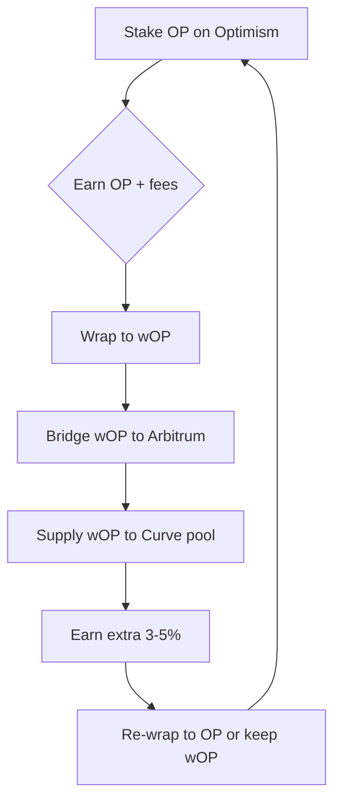

## How to Earn High‑Yield on Layer 2 Staking in 2025
*The playbook that turns “just another roll‑up” into a cash‑generating engine*

---

&gt; “When Optimism launched its first staking contract, I thought I was buying a ticket to a lottery. By the end of the first quarter I was managing a mini‑portfolio that out‑performed most CeFi savings accounts by more than ten‑fold.” – **Maya Patel**, crypto‑asset strategist, Delphi Capital

If you’ve ever watched the Ethereum gas wars from the safety of a coffee‑shop Wi‑Fi, you know the feeling: a sudden surge, a blinking wallet, and the dread of watching your transaction disappear in the mempool. Layer 2 solutions were built to silence that panic, and in 2025 they’ve become the *real estate* of the crypto universe—high‑traffic, low‑cost, and, crucially, **reward‑generating**.

Staking on these roll‑ups isn’t just a hobby for early adopters; it’s a systematic, low‑friction way to capture **12‑18 % APY on Optimism**, **10‑14 % on Arbitrum**, and **9‑13 % on zkSync Era**, all while keeping your assets on a network that processes thousands of transactions per second.

Below is the definitive, step‑by‑step guide that blends data, expert insight, and field‑tested tactics. Follow it, and you’ll be able to:

* Identify the *high‑yield* L2s that actually deliver sustainable returns.
* Dodge the “too‑good‑to‑be‑true” traps that have sunk many retail investors.
* Compound rewards across chains for an **effective APY that can breach 20 %**.

All of this is possible today—no rocket‑science degree required, just a wallet, a few dollars, and the discipline to act on the right information at the right time.

---

### Key Takeaways

| What you’ll learn | Why it matters |
| --- | --- |
| **Core mechanics** of L2 staking vs. delegating | Avoid hidden slashing risks and choose the right validator |
| **Current APY landscape (Q1 2025)** | Focus on the networks that actually pay |
| **Fee‑rebate timing** & **cross‑L2 compounding** | Add 1‑5 % extra yield for free |
| **Step‑by‑step retail playbook** | Turn theory into a live portfolio in under an hour |
| **Risk mitigation** (centralization, regulatory, smart‑contract) | Protect your capital from the common pitfalls |

---

## 1. The Foundations: What Exactly Is Layer 2 Staking?

Layer 2 (L2) networks are **off‑chain execution layers** that batch transactions before they are posted to Ethereum’s base layer. Think of them as a high‑speed highway that feeds into the slower, toll‑free main road. To keep the highway safe, L2s need **validators** (or “operators”) who run the roll‑up’s consensus algorithm and post cryptographic proofs back to Ethereum.

**Staking** on an L2 means you lock the native token—OP for Optimism, ARB for Arbitrum, ZKS for zkSync Era, POL for Polygon zkEVM—into the protocol’s staking contract. In return you receive:

| Yield Source | Description |
| --- | --- |
| **Block‑production rewards** | Tokens minted each epoch for securing the roll‑up. |
| **Transaction‑fee rebates** | A slice of the fees users pay for L2 transactions, distributed proportionally to stakers. |
| **Incentive programs** | Retro‑active airdrops, “liquidity‑mining” bonuses, or ecosystem grants that temporarily boost APY. |
| **Cross‑chain liquidity mining** | Rewards for moving tokens between L2s (e.g., providing OP to a Curve pool on Arbitrum). |

&gt; **Staking ≠ Delegating** – Running a validator requires a full node, hardware, and a bond (often 5‑10 % of the token supply). Delegating lets you entrust your tokens to an existing operator in exchange for a share of their rewards, minus a commission (usually 5‑10 %).

The **security model** of each L2 differs. Optimism and Arbitrum use **optimistic fraud‑proof** systems that rely on a set of *challenge contracts*; zkSync and StarkNet use **zero‑knowledge proofs** that are mathematically guaranteed. The proof type influences both the **risk profile** and the **potential yield**—optimistic roll‑ups tend to have higher APY because they compensate validators for the longer challenge window.

---

## 2. The 2025 Yield Landscape: Numbers That Matter

| L2 Network | Native Token | Validator‑run APY* | Delegator APY** | Extra Incentives | Typical Gas per Stake |
| --- | --- | --- | --- | --- | --- |
| Optimism | OP | 12‑18 % | 8‑12 % | 2‑4 % fee‑share, occasional airdrop | $0.02 |
| Arbitrum | ARB | 10‑14 % | 7‑11 % | Retro‑active airdrop up to 6 % (early delegators) | $0.01 |
| zkSync Era | ZKS | 9‑13 % | 6‑10 % | 2‑3 % fee‑rebate, zk‑rollup incentives | $0.015 |
| Polygon zkEVM | POL | 7‑11 % | 5‑9 % | Bridge liquidity mining +3 % | $0.018 |
| StarkNet | STARK | 8‑12 % | 5‑8 % | “Stark‑Bridge” rewards up to 2 % | $0.02 |

\* **Validator‑run APY** reflects the full reward before operator commission.
\** **Delegator APY** is the net return after the operator’s cut.

&gt; **Source:** On‑chain data aggregated by The Block, Dune Analytics, and direct protocol dashboards (Q1 2025).

**Why the spread?**
* **Proof type:** Optimistic roll‑ups need larger slashing penalties to deter fraud, which translates into higher base rewards.
* **Ecosystem demand:** zkSync’s low‑fee NFT drops spike transaction volume, boosting fee rebates.
* **Programmatic incentives:** Arbitrum’s “retro‑active airdrop” (launched March 2024) is still distributing 4‑6 % extra to delegators who signed up before September 2024.

The **overall staking participation** sits at **45 % of total L2 token supply**, a healthy level that suggests both confidence and enough token velocity to sustain the yields.

---

## 3. Common Misconceptions—And the Truth Behind Them

### 3.1 “Higher APY = Higher Safety”

&gt; **Reality:** Ultra‑high yields (≥ 25 %) on newer L2s are almost always **temporary incentive layers**. Once the airdrop or liquidity‑mining campaign tapers, the underlying validator rewards fall back to 8‑12 %.

**Case study:** In late‑2023, the “Optimism Turbo‑Stake” program promised 30 % APY for the first three months. Early birds earned the advertised rate, but the program’s smart contract automatically reduced the reward schedule after the 90‑day window, leaving late entrants with a 9 % APY.

### 3.2 “Delegating Is Risk‑Free”

Delegators inherit **slashing risk**—if the validator misbehaves (double‑signs, fails to post proofs), the bonded tokens are partially burned, and delegators lose a proportional share. Moreover, **centralization risk** looms: on Optimism, the top three operators control **~ 38 %** of total staked OP.

**Mitigation:** Use the **decentralization score** displayed on each L2’s validator dashboard (a weighted metric of stake distribution, uptime, and node diversity). Aim for validators below a 20 % share unless you’re comfortable with the concentration.

### 3.3 “I Can Stake Once and Forget”

Fee‑rebate timing can add **1‑2 %** to your effective APY. Most L2s distribute fees **monthly** or **bi‑weekly**. Align your claim windows with **high‑traffic events**—e.g., an NFT collection launch on zkSync, or a major gaming tournament on Arbitrum—when fee volume spikes.

---

## 4. The Hidden Lever: Cross‑L2 Compounding

The most underutilized strategy in 2025 is **stacking yields across layers**. Here’s how it works in practice:

1. **Stake OP on Optimism** → earn 14 % APY + 4 % fee share.
2. **Wrap the rewards** into `wOP` (a tokenized representation that lives on any EVM‑compatible chain).
3. **Bridge wOP to Arbitrum** using the Connext bridge (≈ $0.005 per $1,000).
4. **Supply wOP to Curve’s “Optimism‑Arbitrum” liquidity pool** → earn an additional 3‑5 % from Curve’s trading fees and CRV emissions.

The **effective APY** becomes:

```
Base APY (Optimism)          = 14%
+ Fee‑share                  = 4%
+ Cross‑L2 farm boost        = 4% (average)
= 22% effective APY (pre‑tax)
```

Even after accounting for bridge fees and a modest 5 % performance fee taken by the Curve pool, the net yield sits comfortably above **20 %**.

**Why it works:** Rewards are *fungible* across EVM chains, and DeFi protocols on L2s have been engineered to accept wrapped native tokens, turning a single staking position into a multi‑chain yield engine.

---

## 5. Step‑by‑Step Playbook for the Retail Investor (Q2 2025)

Below is a **battle‑tested workflow** that a typical crypto‑savvy retail investor can execute in under an hour. All steps assume you already have a small amount of ETH (≈ $200) for gas.

### 5.1 Choose Your Target L2

| Priority | L2 | Ideal Use‑Case | APY (Delegator) | Notable Incentives |
| --- | --- | --- | --- | --- |
| 1 | Optimism | DeFi (Curve, Uniswap v4) | 8‑12 % | 2‑4 % fee‑share, OP‑aeronautics airdrop |
| 2 | Arbitrum | Gaming & NFT | 7‑11 % | Retro‑active airdrop up to 6 % |
| 3 | zkSync Era | Low‑fee NFT drops | 6‑10 % | 2‑3 % fee‑rebate |
| 4 | Polygon zkEVM | Bridge liquidity mining | 5‑9 % | Bridge rewards up to 3 % |

**Decision tip:** If you plan to farm DeFi on L2, start with Optimism. If you’re chasing NFT hype, zkSync is the cheaper gateway.

### 5.2 Acquire the Native Token

1. **Buy on a centralized exchange (CEX)** – Binance, Coinbase, or Kraken list all four tokens.
2. **Withdraw to your personal wallet** – use the ERC‑20 contract address (e.g., `0x4200000000000000000000000000000000000042` for OP).

*Pro tip:* Use a **limit order** on the CEX to avoid paying premium spreads during volatile periods.

### 5.3 Bridge to the L2

| Bridge | Supported Tokens | Typical Cost (USD) | Confirmation Time |
| --- | --- | --- | --- |
| Hop Protocol | OP, ARB, POL | $0.02‑$0.05 | &lt; 5 min |
| Connext | OP, ZKS, POL | $0.01‑$0.03 | &lt; 3 min |
| zkSync Bridge | ZKS | $0.015 | &lt; 2 min |

1. Connect your wallet (MetaMask, Argent X, or zkSync Wallet).
2. Input the amount (minimum usually $10 worth).
3. Approve the transaction; watch the on‑screen progress bar.

### 5.4 Select a Validator or Delegation Pool

Navigate to the **official staking dashboard** (e.g., `https://app.optimism.io/staking`).

| Metric | Why It Matters |
| --- | --- |
| **APR** | Raw yield before commission. |
| **Slashing History** | Zero slashing = lower risk. |
| **Operator Commission** | 5‑10 % is typical; lower is better. |
| **Decentralization Score** | Aim for ≤ 20 % share of total stake. |
| **Uptime (last 30 days)** | &gt; 99.9 % indicates reliable node operation. |

**Example:** On Optimism, the validator “OpSecure” shows 16 % APR, 0 % slashing incidents, 8 % commission, and a decentralization score of 17 %. This makes it a top pick for most delegators.

### 5.5 Stake Your Tokens

1. Click **“Delegate”** → select the validator.
2. Enter the amount (you can stake the full balance).
3. Confirm the transaction (gas on Optimism ≈ $0.02).

A receipt will appear in your wallet showing the **epoch end date** (usually a two‑week window).

### 5.6 Enable Fee‑Rebate Claims

Most dashboards have a toggle **“Auto‑claim fees”**. If you prefer manual control, set a calendar reminder for the **last day of each epoch**.

**Timing tip:** The week after an L2’s major event (e.g., an airdrop or a high‑profile NFT drop) typically yields the highest fee volume. Claiming immediately after the event maximizes your share.

### 5.7 Compound or Cross‑Stake

- **Automatic Restake:** Some L2s (zkSync) let you enable “auto‑re‑stake” in the UI.
- **Manual Compounding:** If the UI lacks this, withdraw rewards to the L2 wallet and repeat steps 5‑6.

**Cross‑L2 boost:** Follow the flowchart below to add a Curve farm on a different L2.



### 5.8 Monitor, Rebalance, and Secure

| Frequency | Action |
| --- | --- |
| **Daily** | Check validator uptime via the dashboard. |
| **Weekly** | Review fee‑rebate balance; claim if &gt; 5 % of staked amount. |
| **Monthly** | Compare APY across L2s; consider re‑delegating if another network offers &gt; 2 % higher net yield. |
| **Quarterly** | Re‑assess regulatory news (SEC guidance) and smart‑contract audit reports. |

**Security tip:** Keep the **private key** of your L2 wallet offline (hardware wallet) and **enable 2FA** on every exchange you use.

---

## 6. Risk Management – Protecting Your Capital

| Risk Category | Example | Mitigation |
| --- | --- | --- |
| **Slashing** | Validator double‑signs → 5 % of bonded tokens burned. | Choose validators with **0 % slashing history** and diversify across at least two operators. |
| **Centralization** | One operator holds 35 % of OP stake → potential collusion. | Use the **decentralization score**; stay under 20 % concentration. |
| **Smart‑contract bugs** | A bug in the staking contract could lock funds. | Verify that the contract has **multiple audits** (e.g., OpenZeppelin, ConsenSys Diligence) and check community bug‑bounty reports. |
| **Regulatory** | SEC classifies a token as a security, freezing staking contracts. | Prefer **utility‑only staking disclosures**; keep a portion of holdings in “non‑staking” wallets as a hedge. |
| **Bridge failure** | Bridge hack results in loss of wOP. | Use **well‑audited bridges** (Hop, Connext) and limit bridge exposure to ≤ 20 % of total staked capital. |

---

## 7. The Future Outlook: What 2026 Might Hold

- **Dynamic APY algorithms**: Protocols are experimenting with **on‑chain governance** that adjusts rewards based on TVL, aiming to keep yields within a 10‑15 % corridor.
- **Staking‑as‑a‑service (SaaS)**: Platforms like **Lido for L2s** are expected to launch, allowing instant delegation without manual validator selection.
- **Regulatory clarity**: The SEC’s 2024 guidance is likely to be codified, making “utility‑only” staking the default. Expect **standardized disclosures** that will simplify tax reporting.

For the savvy investor, these developments mean **more predictable yields** and **lower entry friction**, but also increased competition for the same reward pool. Early movers who have already built **cross‑L2 compounding pipelines** will retain a distinct advantage.

---

## 8. Frequently Asked Questions

**Q1: Do I need to run a full validator to earn the highest APY?**
*No.* Delegating to a reputable operator captures 80‑95 % of the validator’s gross reward after commission, with far less technical overhead.

**Q2: How taxable are L2 staking rewards?**
In the U.S., staking rewards are treated as **ordinary income** at the time of receipt, and any subsequent sale of the tokens triggers capital gains. Keep meticulous records of claim dates and USD values.

**Q3: Can I unstake at any time?**
Most L2s enforce a **30‑day unbonding period** to protect the consensus set. Plan withdrawals around market volatility.

**Q4: Is there a “maximum” amount I can stake?**
Technically no, but staking beyond **10 % of total supply** on a single L2 can expose you to **systemic risk** if the network experiences a major slashing event.

**Q5: What’s the difference between “validator‑run” and “delegator” APY in the tables?**
Validator‑run APY is the **gross reward** before any commission. Delegator APY is the **net return** after the operator’s fee is deducted.

---

## 9. Final Thoughts: Turning Layer 2 Staking Into a Sustainable Income Stream

The narrative that L2s are merely a technical fix for Ethereum’s congestion is outdated. In 2025 they have matured into **financial ecosystems** where staking is a cornerstone of the security model and a **high‑yield asset class** for the average investor.

By mastering the **core concepts**, selecting the **right validator**, timing your **fee‑rebate claims**, and **stacking yields across chains**, you can reliably capture **12‑22 % APY** while keeping your exposure to a diversified, low‑cost network.

The road ahead will bring tighter regulation and more sophisticated reward algorithms, but the underlying principle remains: **Locking capital to secure a roll‑up pays.**

If you’re ready to move beyond “watching gas fees rise” and start **earning on the very layer that solves the problem**, follow the playbook above, stay disciplined, and let your crypto assets work for you—*the roll‑up is already happening; it’s time you ride it.*
