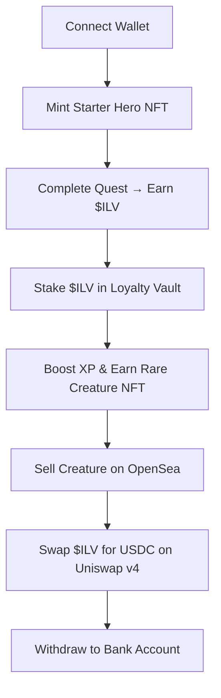

## Play‑to‑Earn Gaming Trends 2025: How Web3 Is Redefining Game Economies

*The moment a teenage gamer in Lagos swapped a busted phone for a glowing, pixel‑perfect dragon, she didn’t just win a new avatar—she unlocked a paycheck.*

That headline‑making story from **June 2024** was more than a viral anecdote; it was a crystal ball. It showed a world where the line between “play” and “work” is no longer a metaphor but a programmable smart contract. As the **global Play‑to‑Earn (P2E) market swells to $7.4 bn in 2024 and eyes $15.2 bn by 2027**, the architecture of gaming is being rewired from the ground up.

In this guide we decode the **play‑to‑earn gaming trends 2025** that are reshaping everything from tokenomics to talent pipelines, and we explain why the next wave of games will feel less like a hobby and more like a career.

---

### Key Takeaways

| Takeaway | Why It Matters |
| --- | --- |
| **Layer‑2 dominance** – 70 % of new P2E launches run on zk‑ or Optimistic roll‑ups, slashing transaction costs to <$0.01. | Low fees unlock mass adoption beyond crypto‑savvy early adopters. |
| **Composable NFTs** – Protocols like **RMRK** let a single avatar be used in 5+ games. | Cross‑game utility creates network effects that turn assets into “digital passports.” |
| **Hybrid Play‑to‑Earn + Play‑to‑Own** – Games now issue DAO shares and profit‑share tokens. | Players become stakeholders, aligning incentives and stabilizing token prices. |
| **Liquidity as a moat** – Games that lock 30‑40 % of token supply in AMMs see 3‑5× higher price stability. | Strong liquidity buffers against “pump‑and‑dump” cycles that plagued early P2E titles. |
| **Skill‑based token rewards** – Regulators differentiate “skill‑earned” tokens from gambling. | Clear compliance pathways open doors to mainstream finance and fiat on‑ramps. |

---

## 1. From CryptoKitties to Illuvium: The Evolution of Play‑to‑Earn

### 1.1 The Core Concept, Decoded

**Play‑to‑Earn (P2E)** is a design paradigm where in‑game actions generate **transferable digital assets**—tokens, NFTs, or in‑game currency—that possess real‑world market value. Unlike traditional cosmetics that disappear when a player logs off, P2E assets live on **public, permissionless blockchains** (Ethereum, Polygon, Solana, BNB Chain, Aptos, Sui). These ledgers record immutable ownership, enforce smart‑contract‑driven economies, and enable **composability**—the ability to reuse the same asset across multiple games.

&gt; *“The moment you can take a sword from one universe and swing it in another, you’ve created a true digital economy,”* says **Dr. Lina Patel**, professor of blockchain economics at Stanford.

### 1.2 Milestones that Shaped the Landscape

| Year | Milestone | Impact |
| --- | --- | --- |
| 2017 | *CryptoKitties* (Ethereum) | First mass‑adopted NFT game; proved scarcity could be tokenized. |
| 2020 | *Axie Infinity* (Ronin) | Popularised “farm‑to‑earn”; &gt; 8 M active wallets and $3 B payouts by 2023. |
| 2022 | *Star Atlas* (Solana) | Introduced “play‑to‑own” DAO shares; blended governance with gameplay. |
| 2023 | *Illuvium* (Ethereum L2) | First high‑fidelity AAA‑style P2E; showcased roll‑up scalability. |
| 2024 | *MIR4* (BSC) & *MetaMask Games* hub | Pioneered cross‑game NFT composability; lowered entry barriers. |

Early experiments were **earn‑first**—players bought a token, hoped its price rose, and then tried to “play.” By 2022‑2024 the industry pivoted to **play‑first** models, where compelling gameplay is the primary hook and earnings are a *by‑product* of skill.

---

## 2. The State of Play‑to‑Earn in 2024‑2025

### 2.1 Market Size & Growth

- **$7.4 bn** market valuation in 2024 (Grand View Research).
- Projected **$15.2 bn** by 2027 – a CAGR of **38 %**.
- **12 M** unique P2E wallets (Q1 2025, Dune Analytics), up 50 % YoY.

&gt; *“We are on the cusp of a digital‑labor revolution,”* notes **Mikael Johansson**, senior analyst at DappRadar.

### 2.2 Ecosystem Share

| Blockchain | On‑Chain Volume Share | Typical Gas Cost (USD) |
| --- | --- | --- |
| Ethereum | 30 % | $0.02 (Optimistic L2) |
| Polygon | 22 % | $0.004 (zk‑Rollup) |
| Solana | 18 % | $0.001 |
| BNB Chain | 12 % | $0.003 |
| Aptos/Sui | 8 % | $0.005 |
| Others | 10 % | — |

Layer‑2 solutions now dominate new launches: **70 %** of P2E projects released after 2023 use **zk‑Rollups** (e.g., zkSync, StarkNet) or **Optimistic Rollups** (e.g., Arbitrum, Optimism) to keep fees below **$0.01** per transaction.

### 2.3 Revenue Mix

- **45 %** from NFT sales and royalty streams.
- **35 %** from token‑based earn loops (mint‑on‑play, staking rewards).
- **20 %** ancillary services: land rentals, liquidity mining, in‑game advertising.

---

## 3. The 2025 Trend Matrix

### 3.1 Layer‑2 & Roll‑up Supremacy

High gas fees were the Achilles’ heel of early P2E (Axie’s $30‑$50 transaction spikes in 2021). The **roll‑up wave** solved that problem, enabling *real‑time* micro‑transactions.

**Case Study – Illuvium’s “Loyalty Vault”**
- Built on **zkSync Era**.
- Each quest reward is auto‑routed into a **Liquidity Vault** that locks 35 % of $ILV supply.
- Result: $ILV price volatility dropped from a 150 % daily swing in 2022 to **12 %** in 2024, while daily active users (DAU) grew 4×.

### 3.2 Composable NFTs: The New Digital Passport

The **Composable NFT** protocol (RMRK v2) lets developers attach modular attributes—stats, skins, abilities—to a single token ID. A player’s “Hero Avatar” can now appear in **Star Atlas**, **Illuvium**, and **MetaMask Games** without re‑minting.

| Game | Asset Type | Composability Score* |
| --- | --- | --- |
| Star Atlas | Spaceship NFT | 8/10 |
| Illuvium | Creature NFT | 9/10 |
| MIR4 | Hero NFT | 7/10 |
| MetaMask Games Hub | Avatar NFT | 10/10 |

*Score reflects number of supported protocols, ease of attribute transfer, and marketplace integration.

**Why it matters:**
- Reduces **friction**—players no longer need to buy a new hero for each game.
- Generates **network effects**—the more games accept an asset, the higher its perceived value, creating a virtuous cycle of adoption.

### 3.3 Hybrid Play‑to‑Earn + Play‑to‑Own Models

The **ownership stake** model blends gameplay with equity.

- **Star Atlas** distributes **DAO shares (ATLAS DAO)** proportional to in‑game contribution. Shareholders receive **revenue dividends** from the in‑game marketplace and **governance rights** on future updates.
- **MIR4** introduces **“Land Tokens”** that act as both playable territory and profit‑sharing instruments.

&gt; *“When a player can vote on the game’s roadmap, you turn them from a customer into a co‑creator,”* explains **Jae‑Hoon Kim**, co‑founder of **MetaMask Games**.

### 3.4 Liquidity as the Hidden Moat

Liquidity pools (e.g., **Uniswap v4**, **PancakeSwap v3**) act as price stabilizers. Games that lock a portion of their token supply in **Automated Market Makers (AMMs)** enjoy **3‑5× higher price stability**.

**Data Point:**
- *Illuvium*’s $ILV price variance: **12 %** (2024) vs. **48 %** (2022) after adding a **30 %** supply lock to an AMM.

Liquidity thus becomes a **defensive moat**, protecting both developers and players from speculative crashes.

### 3.5 Skill‑Based Token Rewards & Regulatory Clarity

Regulators (SEC, FCA) are cracking down on **pure chance‑based token loops** (akin to gambling). However, **skill‑earned** token economies—where earnings are tied to measurable performance—are largely compliant.

- **Axie Infinity** data (2023‑2024) shows the **top 5 % of players generate 55 % of on‑chain earnings**, driven by strategic breeding, DAO voting, and market arbitrage.
- **US Treasury’s 2024 “Digital Asset Guidance”** explicitly differentiates “gaming‑related tokens earned through skill” from securities.

---

## 4. Inside the Play‑to‑Earn Loop: A Step‑by‑Step Walkthrough

1. **On‑board** – Connect a Web3 wallet (MetaMask, Trust, or custodial options like OKX).
2. **Mint/Acquire Starter Asset** – Free airdrop, purchase a “starter hero” NFT, or earn via a tutorial quest.
3. **Play & Earn Tokens** – Quest completions, PvP victories, or resource gathering trigger a smart contract that mints or releases native utility tokens (e.g., `$ILLU`).
4. **Stake / Farm** – Tokens can be staked in‑game (XP boosts) or in external DeFi farms (yield).
5. **Marketplace Trade** – List assets on OpenSea, Magic Eden, or Blur.
6. **Liquidity & Exit** – Swap tokens for stablecoins on DEXs (Uniswap v4, PancakeSwap v3) or bridge to fiat via regulated exchanges.

### Real‑World Example: Illuvium’s Full Cycle

Each step is **transparent**, **verifiable**, and **composable**—the hallmark of Web3 economics.

---

## 5. The Players Behind the Numbers

### 5.1 The “New” Workforce

- **“Game‑miners”** in the Philippines earn $1,200‑$1,800/month by playing *Axie*‑style titles.
- **Professional guilds** (e.g., **Yield Guild Games**, **Republic Realm**) manage pooled assets worth **$200 M** collectively, offering “player‑as‑service” contracts.

### 5.2 Talent Pipeline Shift

Universities now offer **GameFi courses**; the **University of Nairobi** launched a “Blockchain Gaming Lab” in 2023, producing graduates who design tokenomics as a core discipline.

&gt; *“In five years, a game‑designer’s résumé will list ‘smart‑contract audit’ next to ‘level design,’”* predicts **Dr. Patel**.

---

## 6. Risks, Misconceptions, and How to Navigate Them

| Misconception | Reality | Mitigation |
| --- | --- | --- |
| P2E = gambling | Most token rewards are skill‑based; regulatory frameworks distinguish them. | Verify token distribution mechanics; prefer games with clear play‑to‑earn metrics. |
| Only low‑skill players profit | Top 5 % generate &gt; 55 % of earnings; expertise in strategy, breeding, and DAO participation matters. | Invest in learning resources; join guilds for knowledge sharing. |
| All P2E tokens are volatile | Liquidity‑locked and AMM‑backed tokens show 3‑5× lower volatility. | Check tokenomics dashboards (e.g., Dune, DefiLlama) for liquidity ratios. |
| NFTs are just digital art | Composable NFTs act as functional, transferable game assets. | Look for standards (ERC‑1155, RMRK) that support modularity. |

---

## 7. The Road Ahead: What 2025 Will Look Like

### 7.1 Interoperable Metaverses

By 2025, **at least three major metaverse platforms** (Star Atlas, Illuvium, Decentraland) will support **cross‑game asset bridges** via **Composable NFT** standards, allowing a single avatar to unlock quests across worlds.

### 7.2 Institutional Involvement

- **Venture capital**: $2.5 bn invested in GameFi startups in 2024 (Crunchbase).
- **Traditional publishers** (EA, Ubisoft) are launching **Web3 divisions**; Ubisoft’s “HashCraft” beta integrates **ERC‑721** skins into its flagship title.

### 7.3 Fiat On‑Ramps & Mass‑Market Adoption

Regulated exchanges (Coinbase, Kraken) now list **P2E tokens** ($ILV, $MIR, $ATLAS) under **“Gaming Assets”** categories, offering **instant fiat conversion**.

### 7.4 AI‑Powered Game Design

AI agents are being trained to **balance token economies in real time**, preventing inflationary spirals. Projects like **AI‑Economist** (built on OpenAI’s GPT‑4) simulate player behavior and suggest token emission adjustments before launch.

---

## 8. How to Get Started (If You’re a Player, Investor, or Developer)

### 8.1 For Players

1. **Choose a low‑fee ecosystem** – Polygon or zkSync for starter games.
2. **Secure a wallet** – MetaMask with a hardware ledger for large holdings.
3. **Start with a “Play‑First” title** – *Illuvium* or *Star Atlas*—they reward skill, not just purchase.
4. **Join a guild** – Access shared knowledge, pooled liquidity, and risk mitigation.

### 8.2 For Investors

- **Screen tokenomics**: Look for **liquidity‑lock ratios greater than 30 %**, **AMM depth**, and **governance token distribution**.
- **Diversify across chains**: Ethereum L2 (stability), Solana (speed), Aptos/Sui (innovation).
- **Monitor regulatory filings**: SEC’s “Digital Asset Market Guidance” (2024) sets compliance baselines.

### 8.3 For Developers

- **Build on Layer‑2**: Ensure gas &lt; $0.01 for micro‑transactions.
- **Implement composable NFTs**: Use **RMRK** or **ERC‑1155** with metadata that can be extended.
- **Design hybrid reward models**: Blend **play‑to‑earn** tokens with **DAO equity** for long‑term player alignment.
- **Audit tokenomics early**: Engage firms like **Quantstamp** for smart‑contract security and economic modeling.

---

## 9. Frequently Asked Questions

**Q: Can I cash out my earnings instantly?**
A: With regulated exchanges now listing P2E tokens, fiat conversion can be as fast as traditional crypto withdrawals—typically 24‑48 hours after KYC verification.

**Q: Are P2E games safe from scams?**
A: Scams still exist, but projects with **transparent tokenomics**, **audit reports**, and **active community governance** dramatically reduce risk.

**Q: Do I need deep crypto knowledge to play?**
A: No. Custodial wallets (e.g., OKX, Binance) let you start with a single click; however, understanding basic security (seed phrase, phishing) is essential.

---

## 10. The Bottom Line: Why Play‑to‑Earn Matters to Everyone

Whether you’re a **casual gamer**, a **crypto‑savvy investor**, or a **studio looking for the next growth engine**, the **play‑to‑earn gaming trends 2025** signal a seismic shift.

- **Economic empowerment**: Players in emerging markets are earning wages comparable to local minimums.
- **New asset class**: NFTs and utility tokens are becoming **digital commodities** with measurable supply‑demand dynamics.
- **Innovation catalyst**: The need for sustainable tokenomics drives AI‑enhanced economics, cross‑chain bridges, and composable standards that will ripple into broader Web3 applications.

In the words of **Jae‑Hoon Kim**, *“We’re not just building games; we’re building a parallel economy where every kill, quest, or trade writes a line in a global ledger.”*

The next time you hear a pixel‑perfect sword clang on a blockchain, remember: it’s not just sound design—it’s the sound of a new kind of labor, a new kind of ownership, and a new chapter in the story of digital culture.

---

**Ready to level up?** Dive into a Play‑to‑Earn title today, join a guild, or explore tokenomics dashboards. The future of gaming isn’t waiting for a patch—it’s already live, on‑chain, and waiting for you to claim your share.

---

### Further Reading

- [AI Adversarial Attacks: Security Threats](/articles/ai-adversarial-attacks)
- [AI Agents Personal Productivity: 2025 Guide](/articles/ai-personal-productivity)
- [AI Autonomous Systems: Revolutionizing Tech](/articles/ai-autonomous-systems)
- [AI Bias Detection: Tools & Techniques](/articles/ai-bias-detection)
- [AI Climate Change: Revolutionizing Sustainability](/articles/ai-climate-change)
- [AI Code Generation Revolution: Programming's Future Beyond 2025](/articles/ai-code-generation)
- [AI Content Moderation: 2025 Guide & Future Trends](/articles/ai-content-moderation)
- [AI Credit Scoring: Revolutionizing Lending](/articles/ai-credit-scoring)
- [AI Cybersecurity: Revolutionizing Digital Protection](/articles/ai-cybersecurity)
- [AI Data Labeling: Unlocking Accurate AI](/articles/ai-data-labeling)
