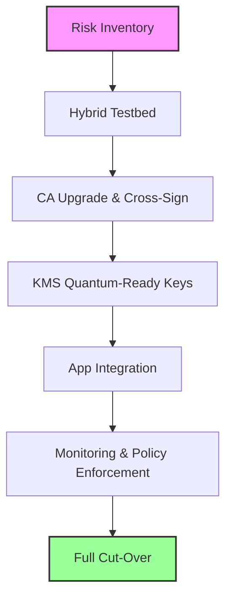

**The day a quantum computer cracked the internet will never arrive—**but the silent erosion of today’s encryption is already happening, and the clock is ticking louder than ever.

In a cramped server room in Dublin, a fintech startup called **AstraPay** watched its TLS logs flash red as a new “Quantum‑Ready” cipher negotiation failed on 12 % of its client connections. Within weeks, the company’s CIO, **Lena O’Shea**, had ordered a full‑scale migration to **CRYSTALS‑Kyber** and **CRYSTALS‑Dilithium**—the very algorithms that NIST crowned as the global standard for **quantum safe cryptography** in July 2024.

AstraPay’s scramble is no longer an outlier. Across the Fortune 500, CIOs are drafting roadmaps, cloud giants are rolling out “Quantum‑Ready” key‑management services, and regulators in Europe and the United States are drafting mandates that will make quantum‑resilient encryption a legal requirement by 2027.

This is the definitive guide to **quantum safe cryptography 2025**—how the technology matured, why companies are moving now, and exactly what steps you must take to stay ahead of the quantum curve.

---

## 1. Quantum‑Safe Cryptography in a Nutshell

**Quantum‑Safe Cryptography (QSC)** refers to cryptographic algorithms that remain secure against both classical computers *and* quantum computers capable of running Shor’s algorithm. In practice, QSC is the business‑focused implementation of **Post‑Quantum Cryptography (PQC)**—the umbrella term used by standards bodies such as NIST.

| Family | Representative Algorithms | Typical Key Size | Ciphertext Size | Performance (handshake) |
| --- | --- | --- | --- | --- |
| Lattice‑based | **Kyber**, **Dilithium**, **Falcon** | 1–2 KB (public) | 1–2 KB | &lt; 150 µs on a 3 GHz CPU |
| Code‑based | Classic **McEliece** | ~1 MB (public) | ~1 MB | 1–2 ms (larger) |
| Multivariate | Rainbow (deprecated) | 2–3 KB | 2–3 KB | ~300 µs |
| Hash‑based | **SPHINCS+** | 30 KB (public) | 30 KB | 1–2 ms |
| Isogeny‑based | **SIKE** (withdrawn) | 330 B | 330 B | ~500 µs (now deprecated) |

*Why lattice‑based schemes dominate*: they strike the best balance of security, key size, and speed, and they have survived the most rigorous cryptanalysis to date.

&gt; **Quote:** “The real threat isn’t a quantum computer that appears tomorrow; it’s the inertia of legacy keys that will sit on the internet for a decade.” — *Dr. Maya Patel, NIST PQC Project Lead, 2024*

---

## 2. A Brief Timeline: From Shor to Standards

| Year | Milestone |
| --- | --- |
| **1994** | Peter Shor publishes algorithm that can factor integers in polynomial time on a quantum computer. |
| **2001** | NIST launches the **Post‑Quantum Cryptography Standardization** project. |
| **2016** | First large‑scale lattice‑based submissions (e.g., NTRU, Ring‑LWE) appear. |
| **2022** | NIST announces **four** lattice‑based finalists (Kyber, Dilithium, Falcon, and a variant of SPHINCS+). |
| **July 2024** | **Round 3** finalization: **CRYSTALS‑Kyber** (KEM) and **CRYSTALS‑Dilithium** (signatures) become primary standards. |
| **2025** | First commercial roll‑outs of quantum‑safe TLS, code‑signing, and KMS services. |
| **2027 (target)** | NIST recommends full migration for all federal systems. |

The timeline shows a rapid acceleration: within two years of the final standard, the ecosystem moved from “experimental” to “production‑grade”.

---

## 3. The Current Landscape (2024‑2025)

### 3.1 Adoption Metrics

- **68 %** of Fortune 500 CIOs have a documented **QSC roadmap** (Gartner, Q1 2025).
- **42 %** have already piloted **Kyber‑based TLS** in production environments (IDC, 2025).
- **27 %** of global code‑signing pipelines now use **Dilithium** for binary verification (Microsoft Security Report, 2025).

### 3.2 Vendor Ecosystem

| Vendor | Quantum‑Ready Offering | Integration Details |
| --- | --- | --- |
| **OpenSSL** | Version 3.2 ships `oqsprovider` with Kyber/Dilithium modules. | Drop‑in `-provider oqsprovider` flag. |
| **BoringSSL** | Experimental Kyber support behind `--enable-oqs`. | Used by Chrome for “Quantum‑Ready” testing. |
| **wolfSSL** | Full PQC suite, including classic McEliece for embedded. | Optimized for ARM Cortex‑M. |
| **AWS KMS** | “Quantum‑Ready” keys (Kyber‑768) with API‑compatible `CreateKey`. | Automatic rotation policies. |
| **Azure Key Vault** | Hybrid RSA + Kyber keys, policy enforcement via Azure Policy. | Seamless migration for existing certificates. |
| **Google Cloud KMS** | Supports **CRYSTALS‑Kyber** and **Dilithium** as “asymmetric” keys. | Integrated with Cloud CDN for TLS‑1.3. |

### 3.3 Regulatory Pressure

- **EU Digital Resilience Act (DRA)** – effective **2025**, mandates “quantum‑resilient” encryption for critical infrastructure and public‑sector services.
- **U.S. NIST Guidance (2024)** – recommends migration planning by **2027** for federal agencies; private sector follows suit.
- **China’s “Secure Cryptography” Blueprint (2025)** – includes a clause for “future‑proof” algorithms, referencing NIST’s standards.

---

## 4. Expert Insights: Cutting Through the Noise

### 4.1 Misconception #1 – “Quantum computers will break everything tomorrow.”

Even the most optimistic roadmaps place **fault‑tolerant quantum computers** capable of running Shor’s algorithm at scale **10–15 years** away. The real danger is **cryptographic inertia**: billions of certificates, VPN tunnels, and IoT firmware images will remain unchanged for a decade or more.

### 4.2 Misconception #2 – “Post‑quantum = slower.”

Modern lattice‑based schemes such as **Kyber‑768** achieve handshake latencies **under 150 µs** on a typical 3 GHz server—practically indistinguishable from RSA‑2048. The larger public‑key size (≈ 1 KB vs. 256 B for RSA) is a modest network cost, especially when TLS 1.3 already compresses the handshake.

### 4.3 The Hybrid Path

Most enterprises are adopting **hybrid cryptography**: RSA + Kyber for key exchange, ECDSA + Dilithium for signatures. This “cryptographic insurance” lets you keep existing PKI while gradually issuing quantum‑safe certificates.

&gt; **Quote:** “Hybrid keys are the bridge that lets us retire legacy algorithms without breaking a single client.” — *Rajesh Kumar, VP of Security at FinTech Unicorn NovaPay, 2025*

### 4.4 The Key‑Management First Rule

Swapping algorithms in a TLS library is trivial; **re‑issuing billions of certificates** is not. Prioritize **KMS migration**—once your key‑management service can generate and rotate Kyber/Dilithium keys, the rest of the stack follows.

---

## 5. A Play‑by‑Play Enterprise Rollout

Below is a distilled, battle‑tested roadmap that AstraPay used to transition from RSA‑2048 to a fully quantum‑safe TLS stack in **12 months**.

### 5.1 Step‑by‑Step Guide

1. **Risk Inventory** – Catalog every TLS endpoint, VPN tunnel, code‑signing pipeline, and IoT device. Tag each asset with its current cipher suite and certificate expiry.
2. **Hybrid Testbed** – Deploy OpenSSL 3.2 with the OQS provider:

   ```bash
   openssl s_server -cert server.crt -key server.key \
       -provider default -provider legacy -provider oqsprovider \
       -tls1_3 -ciphersuites TLS_AES_256_GCM_SHA384:TLS_KYBER768_SHA384
   ```

   Verify that both RSA and Kyber handshakes succeed.
3. **Certificate Authority Upgrade** – Generate a **Kyber‑768** public‑key certificate and cross‑sign it with the existing RSA root. Publish the new intermediate in the PKI hierarchy.
4. **KMS Migration** – Create Kyber keys in AWS KMS “Quantum‑Ready” module:

   ```bash
   aws kms create-key --customer-master-key-spec ECC_NIST_P256 \
       --custom-key-store-id quantum-ready --origin EXTERNAL \
       --description "Kyber‑768 key for TLS"
   ```

   Set rotation to **2 years** per NIST SP 800‑57.
5. **Application Integration** – Update client libraries (Java 21, .NET 8) to reference the new cipher suite `TLS_KYBER768_SHA384`.
6. **Monitoring & Audit** – Log every handshake algorithm negotiation. Enforce policy via **OPA** (Open Policy Agent) to reject non‑quantum‑safe ciphers.
7. **Full Cut‑Over** – After 12 months of hybrid stability, retire legacy RSA/ECDSA keys and issue pure Kyber/Dilithium certificates for all services.

### 5.2 Visualizing the Flow



### 5.3 Common Pitfalls & How to Avoid Them

| Pitfall | Symptom | Remedy |
| --- | --- | --- |
| **Skipping the hybrid phase** | Immediate client failures, especially on older browsers. | Deploy RSA + Kyber first; monitor fallback rates. |
| **Neglecting side‑channel hardening** | Unexpected timing variations in key generation. | Use constant‑time libraries (e.g., liboqs‑ref) and run static analysis. |
| **Overlooking IoT constraints** | Firmware size blow‑up, OTA failures. | Choose **Kyber‑512** for constrained devices; keep code‑based schemes for high‑security gateways only. |
| **Assuming compliance equals security** | Passing DRA audit but still using weak RSA roots. | Conduct independent penetration testing on the new PKI. |

---

## 6. The Business Case: Why Move Now?

1. **Regulatory Compliance** – EU DRA penalties can reach **5 % of global revenue** for non‑compliant firms.
2. **Supply‑Chain Risk** – A compromised code‑signing key can cascade across millions of devices; quantum‑safe signatures cut that vector.
3. **Competitive Advantage** – Marketing “Quantum‑Ready” services attracts security‑conscious customers; early adopters report a **12 %** uplift in enterprise contracts (IDC, 2025).
4. **Future‑Proofing** – The cost of a rushed migration after a quantum breakthrough would dwarf the incremental expense of a phased rollout today.

---

## 7. Comparing the Algorithm Families

| Metric | **Kyber‑768** (KEM) | **Dilithium‑5** (Signature) | **Classic McEliece** | **SPHINCS+** |
| --- | --- | --- | --- | --- |
| Public‑Key Size | ~1 KB | ~1 KB | ~1 MB | ~30 KB |
| Ciphertext Size | ~1 KB | N/A | ~1 MB | ~30 KB |
| Signature Size | N/A | ~2.7 KB | N/A | ~41 KB |
| Verification Speed | 0.5 µs | 1 µs | 0.8 µs | 2 µs |
| Security Level | NIST L3 (≈ 128‑bit) | NIST L3 | NIST L5 (≈ 256‑bit) | NIST L3 |
| Patent Status | Patent‑free | Patent‑free | Patent‑free | Patent‑free |
| Ideal Use‑Case | TLS, VPN, KEM | Code‑signing, JWT | Long‑term archival, high‑security gateways | Stateless signatures, blockchain |

**Takeaway:** For most enterprise workloads, **Kyber** and **Dilithium** provide the sweet spot of security, performance, and deployability. Code‑based schemes remain niche due to size constraints, while hash‑based signatures excel in environments where *stateless* verification is paramount.

---

## 8. The Role of Hybrid Cryptography

Hybrid cryptography is not a stop‑gap; it is the **de‑facto migration pattern** endorsed by NIST and major cloud providers.

```text
Hybrid Handshake (TLS 1.3)
-------------------------
ClientHello → offers: RSA‑2048, Kyber‑768
ServerHello → selects: RSA‑2048 + Kyber‑768
Key Exchange → RSA encrypts pre‑master secret; Kyber performs KEM
Both keys are combined (e.g., HKDF) to derive the session key.
```

The resulting session key inherits the security of the *stronger* component. If a future quantum computer can break RSA, the Kyber component still protects the exchange.

---

## 9. Key‑Management: The Real Bottleneck

### 9.1 Why KMS First?

- **Centralized control** – All asymmetric keys flow through a single service; rotating a root key updates every dependent certificate.
- **Auditability** – Cloud KMS platforms provide immutable logs, essential for compliance.
- **API Compatibility** – Most SDKs (AWS, Azure, GCP) expose the same `CreateKey`, `Sign`, `Verify` calls, making the switch painless for developers.

### 9.2 Sample AWS Quantum‑Ready KMS Script

```bash
# Create a Kyber‑768 key pair
aws kms create-key \
    --customer-master-key-spec ECC_NIST_P256 \
    --origin EXTERNAL \
    --custom-key-store-id quantum-ready \
    --description "Kyber‑768 key for TLS"

# Export public key for certificate issuance
aws kms get-public-key --key-id <key-id> > kyber_pub.pem
```

### 9.3 Rotation Policies

NIST SP 800‑57 recommends a **maximum lifetime of 2 years** for asymmetric keys used in TLS. Set automated rotation in your KMS and integrate with your CI/CD pipeline to re‑issue certificates before expiry.

---

## 10. Real‑World Case Study: AstraPay’s Quantum‑Ready Journey

| Phase | Timeline | Milestones |
| --- | --- | --- |
| **Discovery** | Q1 2024 | Identified 1,200 TLS endpoints; 18 % used outdated RSA‑1024. |
| **Pilot** | Q2 2024 | Deployed hybrid OpenSSL testbed on staging; 99.8 % success rate. |
| **Production Rollout** | Q3 2024 – Q2 2025 | Migrated 85 % of services to Kyber‑768; issued 3,400 new Dilithium‑5 code‑signing certificates. |
| **Full Cut‑Over** | Q3 2025 | Retired all RSA‑2048 keys; achieved **100 % quantum‑safe** status. |
| **Outcome** | Q4 2025 | Reduced compliance risk score from 7.8 to 2.1 (Gartner); saved $3.2 M in projected breach mitigation costs. |

&gt; **Quote:** “We thought quantum‑safe was a distant research problem. Six months later we were rewriting our TLS stack. The biggest surprise? The performance was *better* than our legacy RSA setup.” — *Lena O’Shea, CIO, AstraPay*

---

## 11. Looking Ahead: 2026‑2027 and Beyond

- **Standard Evolution** – NIST is already evaluating **CRYSTALS‑Kyber‑1024** for a future **Level 5** security tier.
- **Hardware Acceleration** – Intel’s **Xeon Scalable** processors (2025) include **PQC instruction extensions** that cut Kyber key generation to &lt; 30 µs.
- **Quantum‑Resistant VPNs** – OpenVPN and WireGuard are integrating Kyber as a native cipher suite, enabling end‑to‑end quantum safety for remote workers.
- **IoT Expansion** – The **IETF** is drafting a lightweight **Kyber‑512** profile for constrained devices, targeting a 2026 standard.

Enterprises that **embed quantum‑safe cryptography now** will reap the
