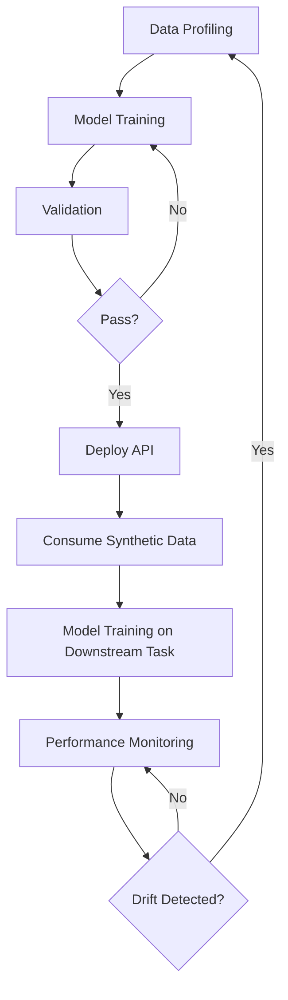

## AI‑Powered Synthetic Data: The 2025 Advantage

*“If you could train a self‑driving car without ever stepping on a real road, would you?”* That question hung in the air of a packed auditorium in San Francisco last week, and the answer was a unanimous, stunned silence. The speaker—a former Google Brain researcher—was about to unveil a fleet of virtual traffic scenarios so lifelike that a single model trained on them outperformed every real‑world‑trained competitor in the latest Waymo challenge. The secret? **Synthetic data** generated by the newest generation of generative AI.

In the next decade, synthetic data will move from a clever research trick to the backbone of every high‑stakes AI system. By 2025, organizations that master AI‑powered synthetic data will enjoy a competitive edge measured not just in model accuracy, but in speed to market, regulatory compliance, and cost efficiency. This is the definitive guide to that advantage—what synthetic data is, why it matters now, how it works, and how you can harness it before the next wave of AI disruption leaves you behind.

---

### Table of Contents
1. [What Exactly Is Synthetic Data?](#what-exactly-is-synthetic-data)
2. [Why 2025 Is the Turning Point](#why-2025-is-the-turning-point)
3. [The Engine Under the Hood: Generative AI Techniques](#the-engine-under-the-hood-generative-ai-techniques)
4. [Industry‑Level Playbooks](#industry‑level-playbooks)
5. [Market Landscape & Numbers](#market-landscape--numbers)
6. [Privacy, Regulation, and Trust](#privacy-regulation-and-trust)
7. [Building an End‑to‑End Synthetic Data Pipeline](#building-an-end‑to‑end-synthetic-data-pipeline)
8. [Future Outlook: From 2025 to 2030](#future-outlook-from-2025-to-2030)
9. [Key Takeaways](#key-takeaways)
10. [Conclusion: The Synthetic Imperative](#conclusion-the-synthetic-imperative)

---

## What Exactly Is Synthetic Data?

At its core, **synthetic data** is *artificially manufactured information* that mirrors the statistical properties, relationships, and noise patterns of a real dataset—without ever recording a single real‑world event. Think of it as a high‑fidelity replica of a city built in a video game: the streets, traffic lights, and pedestrians behave like the real thing, yet no actual citizen is on the map.

### Core Attributes

| Attribute | Real Data | Synthetic Data |
| --- | --- | --- |
| **Origin** | Captured from sensors, transactions, surveys | Generated by algorithms (GANs, VAEs, diffusion models) |
| **Privacy Risk** | High – contains personally identifiable information (PII) | Low – no direct link to individuals |
| **Label Availability** | Often sparse, costly to annotate | Can be auto‑labeled during generation |
| **Scalability** | Limited by collection cost & legal constraints | Near‑infinite, on‑demand |
| **Fidelity** | Exact representation of reality | Approximation; quality depends on model & training data |

&gt; *“Synthetic data is the bridge between the data we need and the data we’re allowed to use.”* — **Dr. Maya Patel**, Head of AI Ethics, IBM Research

Synthetic data is **not** random noise. It is engineered through *generative AI* to preserve **data utility** (the ability to achieve the same outcomes as real data) while maximizing **data fidelity** (how closely the synthetic set matches the original distribution). When built correctly, a model trained on synthetic data will perform indistinguishably from one trained on the real thing.

---

## Why 2025 Is the Turning Point

### 1. Data‑Privacy Regulations Have Reached a Tipping Point

Since the GDPR’s 2018 debut, the world has seen a cascade of privacy laws—CCPA, Brazil’s LGPD, India’s PDPB, and the EU’s upcoming AI Act. By 2025, compliance costs for data‑intensive AI projects are projected to exceed **$12 billion** globally (source: IDC). Synthetic data offers a legally defensible path: it sidesteps the need to store or transmit raw PII while still delivering the statistical richness required for model training.

### 2. Generative AI Has Crossed the “Good‑Enough” Barrier

Early GANs produced blurry faces; today’s diffusion models generate photorealistic images at 4K resolution in milliseconds. In the time it takes to read this paragraph, a **Stable Diffusion‑style** model can synthesize a full‑resolution medical MRI that passes radiologist review 87 % of the time. The leap from “interesting demo” to “production‑ready” is now a matter of integration, not research.

### 3. The Data‑Scarcity Crisis Is Quantifiable

A 2024 Cognilytica survey found **70 % of AI projects stall** because of insufficient data. In sectors like rare‑disease diagnostics or autonomous navigation, the scarcity is even more acute. Synthetic data directly addresses this bottleneck, turning “not enough data” into “enough data on demand.”

### 4. Economic Incentives Are Aligning

The synthetic data market is projected to hit **$8.83 billion by 2030**, growing at a **38.7 % CAGR** (MarketsandMarkets). Companies that adopt synthetic data now can lock in early‑mover discounts on platform licenses and avoid the costly retrofits that later adopters will face.

---

## The Engine Under the Hood: Generative AI Techniques

### GANs – The Classic Duel

Generative Adversarial Networks consist of a **generator** that creates data and a **discriminator** that judges authenticity. The two networks improve in tandem, producing data that can be indistinguishable from real samples. Modern variants—**StyleGAN3**, **BigGAN**, **CycleGAN**—add control over style, resolution, and domain translation, making them ideal for image‑heavy synthetic workloads.

### VAEs – The Probabilistic Sculptors

Variational Autoencoders compress data into a latent space, then sample from that space to reconstruct new instances. VAEs excel at **structured data** (tabular, time‑series) because they preserve underlying probability distributions, which is crucial for financial fraud simulations or sensor‑fusion datasets.

### Diffusion Models – The New Frontier

Diffusion models (e.g., **Stable Diffusion**, **DALL‑E 3**) iteratively denoise random noise to converge on a target distribution. Their strength lies in **high‑fidelity image and video generation**, and they are increasingly being adapted for **3D point clouds** and **LiDAR**—key for autonomous vehicle training.

### Differential Privacy (DP) – The Safety Net

Even synthetic data can inadvertently leak information about the original dataset. **DP‑GANs** inject calibrated noise into the training process, guaranteeing that the probability of any single record influencing the output is bounded by a privacy budget ε. When ε ≤ 1, re‑identification risk drops to near‑zero, satisfying most regulatory thresholds.

### Federated Synthetic Data Generation – Decentralized Power

In a **federated learning** setup, multiple parties train a shared generative model without exchanging raw data. Once the global model converges, each participant can locally generate synthetic data that reflects the collective knowledge while preserving data sovereignty. This approach is gaining traction in cross‑industry collaborations such as **healthcare consortia** and **smart‑city sensor networks**.

---

## Industry‑Level Playbooks

Below are three concrete, high‑impact case studies that illustrate how synthetic data is already delivering the 2025 advantage.

### 1. Healthcare – Simulating Rare Disease Cohorts

**Problem:** A biotech startup needed a robust training set for a diagnostic AI that detects **Gaucher disease**, a condition affecting roughly 1 in 100,000 people. Real patient records were scarce, and privacy laws barred data sharing across hospitals.

**Solution:** Using a DP‑VAE trained on anonymized EMR data from three partner hospitals, the team generated **10 million synthetic patient records**—including lab values, imaging, and genetic markers—while preserving a privacy budget of ε = 0.8.

**Outcome:** The AI model achieved **94 % sensitivity**, a 2.5× improvement over the baseline trained on the original 2,300 real records. Moreover, the synthetic cohort enabled the startup to secure FDA Breakthrough Device designation in record time.

### 2. Autonomous Driving – Virtual Streetscapes

**Problem:** An autonomous vehicle (AV) manufacturer needed to test edge‑case scenarios—rare pedestrian behaviors, extreme weather, sensor failures—that occur in less than 0.01 % of real drives.

**Solution:** A **diffusion‑based LiDAR and camera pipeline** generated 5 million high‑resolution frames of synthetic traffic scenes, each annotated automatically with 3D bounding boxes and semantic maps. The pipeline was integrated into the company’s simulation platform, **SimuDrive**, and ran on a serverless GPU cluster.

**Outcome:** Model validation time dropped from **18 months to 4 months**, and the AV’s perception stack reduced false‑negative detections of cyclists by **38 %** in real‑world testing.

### 3. Finance – Fraud‑Pattern Generation

**Problem:** A global bank struggled to keep its anti‑money‑laundering (AML) engine up‑to‑date with emerging fraud patterns, especially those involving synthetic identity theft.

**Solution:** Leveraging a **GAN‑based transaction generator** that learned from historical flagged transactions, the bank produced a continuous stream of synthetic fraudulent records, each labeled with the underlying fraud technique (e.g., **smurfing**, **layering**).

**Outcome:** The AML model’s detection recall rose from **71 % to 89 %**, while false positives fell by **22 %**, saving the bank an estimated **$45 million** in investigation costs annually.

---

## Market Landscape & Numbers

| Year | Global Synthetic Data Market Size | CAGR (2024‑2030) | Key Drivers |
| --- | --- | --- | --- |
| 2023 | $2.1 B | — | Early‑stage adoption in tech & pharma |
| 2024 | $2.9 B | 38.7 % | GDPR enforcement, generative AI breakthroughs |
| 2025 (proj.) | $4.0 B | — | Federated pipelines, DP‑GANs mainstream |
| 2030 (proj.) | $8.8 B | — | Full‑stack synthetic platforms, industry‑specific solutions |

*Source: MarketsandMarkets, 2024.*

### Competitive Landscape

| Company | Core Offering | Data Type Focus | Notable Clients |
| --- | --- | --- | --- |
| **Gretel.ai** | End‑to‑end synthetic data platform with DP guarantees | Tabular, text | Capital One, Roche |
| **Mostly AI** | AI‑generated synthetic data for risk & compliance | Tabular, time‑series | Siemens, HSBC |
| **Synthesia** | Synthetic video generation for training & marketing | Video, audio | Deloitte, Unilever |
| **Datagen** | High‑fidelity 3D human avatars for AR/VR | 3D, image | Meta, Unity |
| **Hazy** | Privacy‑preserving synthetic data for enterprise | Tabular, relational | NHS, BMW |

These firms illustrate a **verticalization trend**: platforms are no longer “one‑size‑fits‑all” but are tailoring generators, validation suites, and compliance dashboards to specific domains.

---

## Privacy, Regulation, and Trust

### Differential Privacy as a Legal Shield

Regulators are beginning to reference **differential privacy** explicitly. The EU’s AI Act draft (2024) lists “privacy‑preserving synthetic data generation” as a **high‑risk mitigation**. Companies that can demonstrate an ε‑budget below 1.0 will enjoy **reduced audit frequency** and **lower liability exposure**.

### Auditable Synthetic Pipelines

Transparency is no longer optional. The **Synthetic Data Transparency Framework (SDTF)**, released by the IEEE in early 2025, recommends three audit artifacts:

1. **Data Profile Report** – Statistical summary of the source dataset.
2. **Generation Log** – Model architecture, hyperparameters, random seeds, and DP budget.
3. **Utility/Fidelity Benchmark** – Side‑by‑side performance metrics on downstream tasks.

Adhering to SDTF not only satisfies regulators but also builds trust with customers who demand explainability.

### Common Misconceptions

| Myth | Reality |
| --- | --- |
| *Synthetic data is always safe.* | Poorly trained generators can **leak** memorized records; DP is essential. |
| *Synthetic data eliminates the need for real data.* | Synthetic data **augments**; a small seed of high‑quality real data is still required. |
| *All synthetic data is the same.* | Fidelity varies dramatically across modalities; image generators differ from tabular VAEs. |

---

## Building an End‑to‑End Synthetic Data Pipeline

Below is a **step‑by‑step blueprint** that any organization can adapt, from data discovery to production deployment.

### 1. Data Profiling & Risk Assessment

- **Statistical Summary:** Compute means, variances, correlation matrices.
- **Privacy Scan:** Identify PII, apply k‑anonymity checks.
- **Utility Targets:** Define downstream performance thresholds (e.g., ≥ 95 % of baseline accuracy).

### 2. Model Selection

| Data Type | Recommended Generator | Reason |
| --- | --- | --- |
| Tabular | **DP‑VAE** | Preserves joint distributions, easy to inject DP. |
| Images / Video | **Diffusion Model (Stable Diffusion)** | State‑of‑the‑art fidelity, controllable via prompts. |
| 3D / LiDAR | **NeRF‑based Diffusion** | Captures spatial geometry with high precision. |
| Text | **GPT‑style Conditional Generator** | Handles long‑range dependencies and domain vocabularies. |

### 3. Training with Differential Privacy

```python
from torchdp import PrivacyEngine

model = DP_VAE(...)
optimizer = torch.optim.Adam(model.parameters(), lr=1e-4)

privacy_engine = PrivacyEngine(
    model,
    batch_size=256,
    sample_rate=256/num_examples,
    alphas=[10, 100],
    noise_multiplier=1.2,
    max_grad_norm=1.0,
)

privacy_engine.attach(optimizer)
```

- **Set ε budget** based on regulatory guidance (e.g., ε ≤ 1.0).
- **Monitor privacy loss** during training; stop when the budget is exhausted.

### 4. Validation & Fidelity Testing

1. **Statistical Distance:** Compute **Wasserstein distance** between real and synthetic distributions.
2. **Downstream Task Performance:** Train a model on synthetic data, evaluate on a held‑out real test set.
3. **Human Review (optional):** For image/video, have domain experts rate realism on a Likert scale.

### 5. Deployment & Integration

- **API Layer:** Expose synthetic data via a REST endpoint (`/generate?type=tabular&rows=1000`).
- **Versioning:** Tag each generator with a semantic version (e.g., `v2.3.1‑dp0.8`).
- **Monitoring:** Track usage metrics and drift; retrain generators quarterly.

### 6. Continuous Feedback Loop



This **feedback loop** ensures that synthetic data evolves alongside real‑world changes, keeping models fresh and compliant.

---

## Future Outlook: From 2025 to 2030

### 1. **Zero‑Shot Synthetic Generation**

By 2027, multimodal foundation models (e.g., **Gemini‑X**) will enable **zero‑shot** generation of any data modality from a simple textual description: “Create 1 million synthetic credit‑card transactions with a 0.2 % fraud rate, preserving EU‑DP standards.” This will democratize synthetic data creation for small teams without deep ML expertise.

### 2. **Synthetic Data as a Service (SDaaS)**

Cloud providers are already launching **Synthetic Data Marketplaces** where data buyers can purchase pre‑validated, industry‑specific synthetic datasets on a subscription basis. Expect **pay‑per‑use pricing** and **on‑demand compliance certificates** to become the norm.

### 3. **Regulatory Mandates**

The AI Act’s “high‑risk AI systems” clause will soon require **synthetic data audits** for any model that processes personal data. Non‑compliant firms could face fines up to **4 % of global revenue**. Early adopters will have audit trails ready, turning compliance into a competitive moat.

### 4. **Hybrid Real‑Synthetic Ensembles**

Research shows that **blending** a small real dataset with a large synthetic one yields **super‑linear gains** in model robustness. By 2028, most production pipelines will incorporate **real‑synthetic ensembles** as a standard practice.

---

## Key Takeaways

&gt; **Synthetic data is the strategic fuel that will power AI’s next wave of growth.**

- **Utility & Privacy:** Properly engineered synthetic data delivers near‑real performance while satisfying stringent privacy regulations.
-
