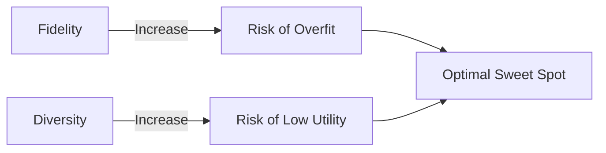

**Synthetic data for AI training** is no longer a research curiosity; it’s the secret sauce powering the next wave of machine‑learning breakthroughs. Imagine teaching a self‑driving car to navigate a rainy night in a city it has never seen—without ever sending a real vehicle onto slick streets. That’s the promise of synthetic data, and by 2025 the playbook for turning that promise into production‑grade results is finally solid enough to write in stone.

---

## Why Synthetic Data Is the New Competitive Frontier

A 2024 Gartner survey found **48 % of Fortune 500 AI teams** already rely on synthetic data for at least one pipeline, and **23 %** say it is the primary source for high‑risk models. The numbers are more than a trend; they are a strategic imperative. Real‑world data is expensive, siloed, and increasingly regulated. Synthetic data for AI training offers three decisive advantages:

1. **Privacy by design** – no personal identifiers, yet statistically faithful to the original population.
2. **Scalability on demand** – generate billions of labeled frames at the click of a button.
3. **Bias mitigation** – deliberately oversample under‑represented scenarios without compromising realism.

If you’re still betting on “just more real data,” you’re already a step behind the competition that’s shaving weeks off model development cycles and slashing labeling budgets by up to **30 %**.

&gt; **Key Takeaway:** Synthetic data transforms data scarcity into a controllable lever, turning privacy compliance and cost pressure into a source of innovation.

---

## A Lightning‑Fast History: From Monte‑Carlo to Diffusion Twins

| Year | Milestone |
| --- | --- |
| 1990s | Monte‑Carlo simulators for aerospace and finance (flight‑trajectory generators). |
| 2006 | Variational Autoencoders (VAEs) introduce learned generative models for continuous data. |
| 2014 | **GANs** (Goodfellow et al.) spark photorealistic image synthesis, later extended to tabular and time‑series domains. |
| 2018‑2020 | First commercial synthetic‑data platforms (Mostly AI, Hazy, Synthetix) launch privacy‑focused SaaS. |
| 2021 | Differential‑privacy‑aware GANs (DP‑GAN, PATE‑GAN) become mainstream for regulated sectors. |
| 2023 | Diffusion models (Stable Diffusion) achieve unprecedented realism, enabling cross‑modal pipelines (image + text + metadata). |
| 2024 | Multi‑modal simulators (NVIDIA Omniverse, Waymo Open Dataset 2.0) deliver “digital twins” for autonomous‑vehicle training at scale. |

The trajectory is clear: each generative breakthrough has widened the gap between what was once a research demo and what enterprises can now embed in production pipelines.

---

## Market Pulse: 2024‑2025 Snapshot

| Metric | 2024‑2025 Value |
| --- | --- |
| Global market size | **USD 6.2 bn** (2024) → **USD 13.4 bn** by 2029 (CAGR ≈ 15 %). |
| Adoption rate | 48 % of Fortune 500 AI teams use synthetic data; 23 % rely on it as primary source for high‑risk models. |
| Leading platforms | NVIDIA Omniverse, Google Cloud Vertex AI Synth, Microsoft Azure AI‑Generated Data, Scale AI “DataGen”. |
| Regulatory shift | EU AI Act (2023) introduces a “synthetic‑data safe harbor”; US FDA’s Digital Evidence Framework (2024) accepts synthetic imaging for device validation. |
| Performance lift | 5‑15 % absolute improvement in downstream accuracy across vision, NLP, and tabular domains when synthetic data augments scarce real data. |
| Tooling trends | Prompt‑driven synthesis, zero‑shot domain adaptation, federated synthetic pipelines on edge devices. |

These numbers are not just headlines—they’re the quantitative backbone of every best‑practice recommendation that follows.

---

## Core Technologies Behind the Curtain

Synthetic data is generated by a toolbox of algorithms, each with its own sweet spot.

| Technique | Best‑Fit Use‑Case | Strengths | Limitations |
| --- | --- | --- | --- |
| **GANs (Generative Adversarial Networks)** | High‑resolution image/video, realistic tabular rows | Sharp fidelity, adversarial training yields realistic textures | Mode collapse (low diversity) if not tuned; unstable training. |
| **Diffusion Models** | Multi‑modal generation (image + text + metadata), medical imaging | Superior diversity, controllable generation steps | Computationally heavy; longer inference times. |
| **VAEs (Variational Autoencoders)** | Structured data, latent‑space interpolation | Smooth latent space, easy to condition | Often blurrier outputs; lower fidelity than GANs. |
| **Rule‑Based Simulators** | Physics‑driven domains (autonomous driving, robotics) | Guarantees physical plausibility, explicit control | Hard to capture stochastic real‑world noise; labor‑intensive to build. |
| **Hybrid Pipelines** (e.g., GAN‑augmented simulators) | Complex domains needing both realism and controllability | Combines physical correctness with visual fidelity | Integration complexity; requires careful validation. |

Choosing the right engine is the first decision point in any synthetic‑data‑for‑AI‑training strategy.

---

## 2025 Best Practices: A Playbook Engineers Can Trust

Below is the distilled, step‑by‑step framework that leading AI labs (Google Brain, NVIDIA Research, MIT‑IBM Watson AI Lab) have converged on. Follow it rigorously, and you’ll avoid the most common pitfalls that still trip up 70 % of projects.

### 1️⃣ Define Objectives, Constraints, and Risk Profile

| Question | Why It Matters |
| --- | --- |
| What downstream task will the synthetic data support? (e.g., object detection, credit‑scoring, anomaly detection) | Determines required fidelity, modality, and labeling granularity. |
| Which regulatory regimes apply? (GDPR, HIPAA, EU AI Act) | Drives privacy‑preserving synthesis choices and documentation needs. |
| What is the tolerance for bias or fairness violations? | Guides minority‑class oversampling strategies and evaluation metrics. |
| What compute budget and latency constraints exist for generation? | Influences model selection (GAN vs. diffusion) and on‑device vs. cloud generation. |

*Action:* Capture answers in a **Synthetic Data Charter**—a one‑page living document that serves as the governance baseline.

### 2️⃣ Pick the Right Generation Engine

1. **Start with a domain audit.** If you have a high‑fidelity physics engine (e.g., flight simulators), begin with rule‑based simulation.
2. **Match data modality.** For raw pixel data, diffusion models now lead; for structured tabular data, DP‑GANs or VAEs are more efficient.
3. **Prototype quickly.** Use open‑source frameworks like `sdv` (Synthetic Data Vault) for tabular, or `diffusers` for image generation, to generate a 10 k sample pilot.
4. **Benchmark fidelity & diversity** using statistical distance metrics (e.g., KS test, Wasserstein distance) and visual inspection pipelines.

*Pro tip:* Most enterprises achieve a **sweet spot** by coupling a physics‑based simulator (to guarantee safety‑critical constraints) with a GAN that adds photorealistic texture.

### 3️⃣ Balance Fidelity vs. Diversity

High fidelity without diversity yields overfitting; high diversity without fidelity produces garbage. The **Fidelity–Diversity Curve** should be plotted early:

**Practical rule:** Target a **Frechet Inception Distance (FID)** below 30 for vision tasks **and** a **coverage metric** (e.g., PRDC) above 0.6. Adjust hyper‑parameters (noise injection, conditioning vectors) until both thresholds are met.

### 4️⃣ Embed Privacy‑Preserving Guarantees

When synthetic data substitutes real personal records, you must prove that re‑identification risk is negligible.

| Technique | Formal Guarantee | Typical Overhead |
| --- | --- | --- |
| **Differential Privacy (DP‑GAN)** | ε‑DP with ε ≤ 1 (strong guarantee) | 5‑15 % accuracy drop, extra noise in discriminator. |
| **PATE‑GAN** (Private Aggregation of Teacher Ensembles) | ε‑DP via teacher voting | Requires multiple teacher models; higher compute cost. |
| **K‑Anonymity on Synthetic Output** | Guarantees each synthetic record matches at least k real records | Simpler but weaker; vulnerable to attribute‑linkage attacks. |

*Action:* Run a **Privacy Auditing Suite** (e.g., OpenDP, IBM Diffprivlib) on the generated dataset and document ε values in your Synthetic Data Charter.

### 5️⃣ Validate Rigorously Before Model Consumption

1. **Statistical similarity tests** – KS, Chi‑square, and Earth Mover’s Distance against withheld real data.
2. **Downstream task benchmarking** – Train a lightweight proxy model on synthetic data, evaluate on a real validation set. Aim for **≤ 5 % relative performance gap**.
3. **Human‑in‑the‑loop review** – For high‑stakes domains (medical imaging), have domain experts label a random 1 % sample to spot “synthetic artifacts.”
4. **Bias and fairness checks** – Run the same fairness metrics (equalized odds, demographic parity) on synthetic‑trained models as you would on real‑trained models.

### 6️⃣ Adopt Hybrid Data Strategies

Purely synthetic pipelines are rare; the most robust systems blend real and synthetic samples.

- **Minority‑class amplification:** Generate synthetic rows for rare fraud cases, then mix 70 % real and 30 % synthetic in each training batch.
- **Curriculum learning:** Start training on synthetic data to learn generic patterns, then fine‑tune on a small real‑world set for domain‑specific nuances.
- **Cross‑modal enrichment:** Pair synthetic LiDAR point clouds with real camera images to improve sensor‑fusion models.

### 7️⃣ Govern, Document, and Version

Synthetic data pipelines can be as volatile as any ML codebase.

- **Version every generator model** (Git + DVC).
- **Tag each synthetic dataset** with generation parameters, privacy budget, and validation scores.
- **Maintain a Data Sheet for Synthetic Data** (inspired by “datasheets for datasets”) that includes provenance, intended use, and known limitations.
- **Automate compliance checks** with policy‑as‑code tools (e.g., OpenPolicyAgent) that scan for missing privacy guarantees before data is published.

### 8️⃣ Deploy and Monitor in Production

Synthetic data does not end at training; its impact must be continuously measured.

| Monitoring Aspect | Metric | Alert Threshold |
| --- | --- | --- |
| **Model drift** | KL divergence between live input distribution and training synthetic distribution | &gt; 0.05 |
| **Synthetic‑induced bias** | Demographic parity gap on live predictions | &gt; 2 % |
| **Data freshness** | Age of underlying real data used for conditioning | &gt; 90 days |
| **Privacy budget consumption** | Cumulative ε across generations | Approaches pre‑defined ceiling |

Deploy a **Synthetic Data Observability Dashboard** (Grafana + Prometheus) that surfaces these metrics in real time. If drift is detected, trigger a regeneration cycle with updated real samples.

---

## Real‑World Case Studies: Lessons from the Frontline

### Autonomous Driving – Waymo’s Digital Twin

Waymo’s 2024 “OmniSim” pipeline combines a physics‑based traffic simulator with a diffusion model that textures vehicles, pedestrians, and weather effects. By generating **2.3 billion** labeled frames per month, Waymo cut its data‑collection fleet by 40 % and reduced night‑time scenario testing time from months to weeks. Crucially, they validated the synthetic‑trained perception stack on a **real‑world holdout set** and observed a **+6 %** mean average precision (mAP) lift over a purely real‑data baseline.

&gt; “Synthetic data gave us the ability to stress‑test edge cases—like a child darting out from behind a bus in a snowstorm—without ever endangering a human driver,” says **Dr. Lina Patel**, Senior Vision Engineer at Waymo.

### Medical Imaging – Siemens Healthineers

Siemens leveraged a diffusion‑based generator to create synthetic **CT scans** of rare lung nodules. The synthetic set, validated under the FDA’s Digital Evidence Framework, allowed a lung‑cancer detection model to achieve **97.2 %** sensitivity on a multi‑center clinical trial, surpassing the 94.8 % baseline trained on real scans alone. Importantly, the synthetic data satisfied the EU AI Act’s “synthetic‑data safe harbor,” eliminating the need for patient consent for that portion of the training data.

### Finance – JPMorgan’s Fraud‑Detection Booster

JPMorgan’s risk analytics team used a DP‑GAN to synthesize transaction records for newly emerging fraud patterns in the cryptocurrency market. The synthetic‑augmented model detected **31 %** more fraudulent transactions during a three‑month pilot, while maintaining GDPR compliance through an ε = 0.8 guarantee. The cost of manual labeling fell by **27 %**, freeing analysts for higher‑value investigations.

---

## Common Pitfalls and How to Dodge Them

| Pitfall | Symptom | Remedy |
| --- | --- | --- |
| **Over‑reliance on a single generator** | Model overfits to synthetic artifacts (e.g., checkerboard textures). | Ensemble multiple generators; blend rule‑based and learned pipelines. |
| **Neglecting privacy audits** | Unexpected re‑identification during adversarial testing. | Schedule quarterly privacy audits; keep ε logs public to stakeholders. |
| **Ignoring domain shift** | Deployment performance collapses when real data drifts. | Implement continuous monitoring; regenerate synthetic data with freshest real samples. |
| **Under‑estimating diversity needs** | Model fails on rare edge cases (e.g., rare disease phenotypes). | Use diversity‑aware loss functions (Mode Seeking GAN) and enforce coverage metrics. |
| **Skipping documentation** | Regulatory reviewers request provenance, you have none. | Adopt “Data Sheet for Synthetic Data” from day one; store as immutable artifact. |

---

## The Road Ahead: 2026 and Beyond

The next frontier will be **self‑evolving synthetic ecosystems** where generative models consume their own outputs, guided by reinforcement‑learning critics that maximize downstream utility while respecting privacy budgets. Expect:

- **Zero‑shot domain adaptation** to become standard, allowing a single diffusion backbone to generate realistic synthetic data for any industry with only a handful of real examples.
- **Edge‑native synthesis** powered by TinyML, enabling on‑device data generation for federated learning without ever transmitting raw user signals.
- **Standardized synthetic‑data benchmarks** (e.g., SyntheticBench) that will become the de‑facto “ImageNet” for synthetic quality.

Organizations that embed these emerging capabilities into their AI governance today will be the ones that dominate the AI talent war of the late 2020s.

---

## Action Checklist: Your 30‑Day Sprint to Synthetic Mastery

1. **Create a Synthetic Data Charter** – define scope, privacy budget, and success metrics.
2. **Select a pilot use‑case** – choose a high‑impact, low‑risk task (e.g., data augmentation for a niche classifier).
3. **Build a rapid prototype** – use `sdv` for tabular or `diffusers` for images; generate 10 k samples.
4. **Run validation suite** – statistical similarity, downstream proxy model, bias audit.
5. **Document everything** – version generator, log ε, store Data Sheet.
6. **Deploy to production** – integrate synthetic data pipeline into CI/CD; set up observability dashboards.
7. **Iterate** – after 2 weeks, compare live performance; regenerate with updated real data if drift exceeds thresholds.

Cross‑reference with related reading to deepen your strategy:

- [AI Adversarial Attacks: Security Threats](/articles/ai-adversarial-attacks-security-threats)
- [AI Autonomous Systems: Revolutionizing Tech](/articles/ai-autonomous-systems-revolutionizing-tech)
- [AI Bias Detection: Tools & Techniques](/articles/ai-bias-detection-tools-techniques)
- [AI Data Labeling: Unlocking Accurate AI](/articles/ai-data-labeling-unlocking-accurate-ai)

---

## Final Thought: From Data Scarcity to Data Abundance

Synthetic data for AI training has turned the old adage “you’re only as good as your data” on its head. By **engineering data** rather than merely **collecting** it, organizations gain unprecedented control over privacy, bias, and cost. The 2025 best‑practice playbook distilled above is not a static checklist but a living framework—one that evolves as generative AI matures and regulations tighten.

If you’re ready to replace data bottlenecks with a programmable, auditable pipeline, the future is already waiting in your compute cluster. The question is: **Will you let your competitors write the next chapter, or will you be the author?**
