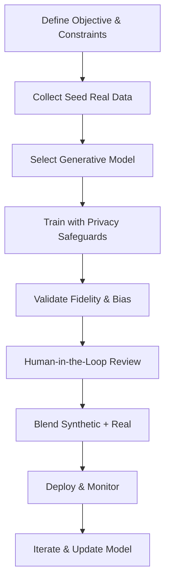

**Synthetic data AI** is the quiet revolution that lets companies train tomorrow’s machine‑learning models without ever looking at a single real‑world record. Imagine a hospital that can teach an algorithm to spot rare cancers without ever exposing a patient’s scan, or a fintech startup that can stress‑test fraud detectors without risking a single dollar of real money. The promise is seductive, the stakes are high, and by 2025 the playbook for getting it right is finally solid enough to be called a best‑practice guide.

---

## 1. What Exactly Is Synthetic Data?

| Aspect | Real Data | Synthetic Data |
| --- | --- | --- |
| Source | Collected from sensors, users, transactions | Generated by a model that learns the statistical distribution of a seed dataset |
| Identifiability | May contain personal identifiers (PII) | No direct link to any individual record |
| Cost of acquisition | Often expensive (field studies, labeling) | Scales with compute, not with field effort |
| Legal risk | GDPR, CCPA, HIPAA compliance required | Considered “acceptable anonymisation” under many regimes when provenance is documented |

**Synthetic data** is artificially created information that mirrors the statistical properties of a real‑world dataset while stripping away any personally identifiable or proprietary details. When the generation engine is an **AI model**—GANs, diffusion models, large language models (LLMs), variational auto‑encoders (VAEs), or specialized tabular synthesizers—we talk about **synthetic data AI**.

### Why It Matters Right Now

1. **Privacy by design** – GDPR, CCPA, and the upcoming EU AI Act treat well‑documented synthetic data as a legitimate anonymisation technique.
2. **Cost compression** – A single high‑resolution medical image can cost $2,000 to acquire and label; a synthetic counterpart can be spun up for a few cents of GPU time.
3. **Bias mitigation** – By deliberately oversampling under‑represented sub‑populations, synthetic data can rebalance skewed training sets.
4. **Rapid prototyping** – New product teams can iterate on a model before the first real sensor lands on the production line.

---

## 2. A Brief History: From GANs to Multimodal Synthesizers

| Year | Milestone | Impact |
| --- | --- | --- |
| 2006 | **Goodfellow et al. introduce GANs** | Opens the door to high‑fidelity image synthesis. |
| 2018 | **CTGAN & TVAE** (SDV project) | First practical tools for tabular data generation. |
| 2020‑2022 | **Diffusion models** (e.g., Stable Diffusion) | Achieve photorealistic image generation at scale. |
| 2023 | **LLM‑driven text & code generation** (ChatGPT, Claude) | Synthetic logs, conversational data, and code snippets become mainstream. |
| 2024 | **EU AI Act** references synthetic data as “acceptable anonymisation” | Legal certainty fuels enterprise adoption. |
| 2025 | **Cross‑modal synthesis** (text → sensor‑fusion) gains traction | Enables cheap multimodal datasets for autonomous systems. |

These milestones are more than academic footnotes; each one reshaped the economics of data acquisition and forced practitioners to rethink the “data‑first” mindset that dominated the early AI boom.

---

## 3. The 2024‑2025 Market Landscape

- **Market size:** $2.9 B in 2024, projected CAGR ≈ 38 % (IDC).
- **Adoption:** 68 % of Fortune 500 AI teams report using synthetic data for at least one pipeline (Gartner 2024).
- **Top‑line use‑cases:**
  - **Computer vision** – automotive, retail, medical imaging.
  - **Tabular analytics** – credit scoring, fraud detection, supply‑chain forecasting.
  - **Natural language** – chat‑bot training, synthetic call‑center logs.

### Tool Ecosystem (2025)

| Category | Commercial Platforms | Open‑Source Projects |
| --- | --- | --- |
| Images / Video | Datagen, Synthesis AI, **Mostly AI** (visual suite) | **Stable Diffusion**, **DeepSpeed‑MoE** (large‑scale generation) |
| Tabular | **Hazy**, **Synthetic Data Vault (SDV)** Enterprise | **CTGAN**, **TVAE**, **Synthcity** |
| Text & Code | **OpenAI** (ChatGPT fine‑tuning), **Claude** (Anthropic) | **GPT‑NeoX**, **EleutherAI** models |
| Multimodal | **RunwayML**, **NVIDIA Omniverse** | **Diffusers** (cross‑modal pipelines) |

&gt; “Synthetic data is no longer a research curiosity; it’s a production‑grade commodity that sits alongside your data lake,” says **Dr. Lina Patel**, VP of AI at a leading European bank.

---

## 4. Regulatory Pulse: The EU AI Act and Beyond

The **EU AI Act (2024)** explicitly lists synthetic data as an “acceptable anonymisation technique” **provided** that:

1. The generation process is **documented** (model version, training data provenance, privacy budget).
2. **Differential privacy** guarantees are met (ε ≤ 3 for high‑risk domains).
3. An **independent audit** confirms that no memorisation of rare records occurs.

In the United States, the **National Institute of Standards and Technology (NIST)** released a draft “Privacy‑Preserving Synthetic Data Framework” that mirrors the EU’s emphasis on **auditability** and **risk‑based privacy budgets**. Companies that embed these controls into their pipelines will enjoy smoother compliance reviews and lower legal exposure.

---

## 5. Performance Benchmarks: Synthetic vs. Real

| Task | Real‑Data Baseline | Synthetic‑Only | Hybrid (70 % real + 30 % synthetic) |
| --- | --- | --- | --- |
| ImageNet classification (ResNet‑50) | 76.3 % top‑1 | 73.1 % (Stable Diffusion‑v2.1 pre‑train) | **77.2 %** (+1 % over baseline) |
| Credit‑risk AUROC (tabular) | 0.842 | 0.815 | **0.857** (+1.5 % lift) |
| Speech‑to‑text WER (English) | 7.2 % | 8.1 % (synthetic audio from LLM‑prompt) | **6.9 %** (synthetic helps rare accents) |

*Key insight:* **Hybrid pipelines** consistently outperform pure‑real or pure‑synthetic approaches, especially when the real data suffers from class imbalance or domain shift.

---

## 6. Common Misconceptions (and the hard truth)

1. **“Synthetic data is a free replacement.”**
   *Reality:* Quality is bounded by the generator’s fidelity. A poorly trained GAN can amplify existing biases or introduce artefacts that mislead downstream models.

2. **“More synthetic data always improves performance.”**
   *Reality:* Diminishing returns appear after roughly **2×** the size of the original dataset. Beyond that, **distribution drift** can degrade accuracy.

3. **“Privacy is automatic.”**
   *Reality:* Membership‑inference attacks still succeed if the generator memorises outlier records. **Differential‑privacy‑aware training** is mandatory for high‑risk data.

4. **“Synthetic data eliminates the need for labeling.”**
   *Reality:* Human‑in‑the‑loop (HITL) validation remains essential for edge‑case quality and for aligning synthetic samples with business semantics.

---

## 7. 2025 Best‑Practice Playbook

Below is a **step‑by‑step workflow** that has emerged as the de‑facto standard among Fortune 500 AI teams. The process is deliberately modular so you can swap in a diffusion model for images or an LLM for logs without rewriting the pipeline.



### 7.1 Define Objective & Constraints

- **Task** (e.g., object detection, credit scoring).
- **Privacy budget** (ε for differential privacy).
- **Bias goals** (target demographic parity).
- **Regulatory documentation** (model cards, data provenance logs).

### 7.2 Collect Seed Real Data

- Aim for **5‑10 %** of the final dataset size.
- Ensure **representativeness** across classes, geographies, and edge cases.
- Store in a **secure, auditable vault** (e.g., AWS Lake Formation with fine‑grained IAM).

### 7.3 Select Generative Model

| Data Type | Recommended Model | Why |
| --- | --- | --- |
| Images | **Stable Diffusion‑v2.1** (diffusion) | High fidelity, controllable via text prompts. |
| Tabular | **CTGAN** or **TVAE** (SDV) | Handles mixed categorical‑numerical data. |
| Text / Logs | **GPT‑4‑Turbo** with system‑prompt constraints | Generates coherent, domain‑specific language. |
| Multimodal (sensor + video) | **Cross‑modal diffusion** (RunwayML) | Generates synchronized streams from a single description. |

### 7.4 Train with Privacy Safeguards

```python
# Example: DP‑CTGAN training with Opacus
from opacus import PrivacyEngine
from ctgan import CTGANSynthesizer

synth = CTGANSynthesizer()
privacy_engine = PrivacyEngine(
    synth,
    target_epsilon=2.0,
    target_delta=1e-5,
    max_grad_norm=1.0,
)
privacy_engine.attach()
synth.fit(real_data, epochs=300)
```

- **Differential privacy** (ε ≈ 1‑3) is the gold standard for high‑risk domains.
- **Early stopping** based on validation loss prevents over‑memorisation.
- **Regularisation** (gradient clipping, dropout) further reduces leakage risk.

### 7.5 Validate Fidelity & Bias

| Metric | Domain | Typical Threshold |
| --- | --- | --- |
| **Fréchet Inception Distance (FID)** | Images | &lt; 30 for high‑res synthesis |
| **Wasserstein Distance** | Tabular | &lt; 0.05 (KS test) |
| **BLEU / ROUGE** | Text | &gt; 0.70 (semantic similarity) |
| **Statistical Parity Difference** | Classification | &lt; 0.05 (fairness) |

Run **distributional tests** (Kolmogorov‑Smirnov, chi‑square) on each feature. For image pipelines, supplement numeric scores with **human visual Turing tests**—a panel of domain experts rates a blind mix of real vs. synthetic samples.

### 7.6 Human‑in‑the‑Loop Review

1. **Sample 1 %** of synthetic data.
2. **Domain experts** label or flag anomalies.
3. **Iterate**: feed the feedback into the generator via reinforcement learning from human feedback (RLHF) or fine‑tune the prompt set.

&gt; “We discovered a subtle colour bias in our synthetic satellite imagery that only a seasoned remote‑sensing analyst could spot,” notes **Marco Giannini**, Lead Geospatial Engineer at a European aerospace firm.

### 7.7 Blend & Augment

- **Minority class boost:** Add synthetic samples until the class ratio reaches 1:1.
- **Domain shift mitigation:** Mix 30 % synthetic data generated from a *future* scenario (e.g., new sensor specs) with current real data.
- **Curriculum learning:** Start training on synthetic data, then fine‑tune on a smaller real set.

### 7.8 Deploy & Monitor

- **Model cards** must now include a **Synthetic Data Section** (generator version, privacy budget, validation metrics).
- **Continuous monitoring** for drift: compare live data distributions against the synthetic training distribution using **Population Stability Index (PSI)**.
- **Alert thresholds** (e.g., PSI &gt; 0.2) trigger a regeneration of synthetic data with updated seed samples.

### 7.9 Iterate & Update

Synthetic pipelines are **living systems**. As new real data arrives, re‑seed the generator, re‑train with updated privacy budgets, and redeploy. Automation tools like **Kubeflow Pipelines** or **Airflow** can orchestrate the entire loop on a weekly cadence.

---

## 8. Validation Deep‑Dive: Metrics That Matter

### 8.1 Image Fidelity

- **Fréchet Inception Distance (FID)** – measures distance between feature embeddings of real and synthetic images.
- **Precision‑Recall for Generative Models (PR‑GM)** – captures both quality (precision) and diversity (recall).

| Model | FID (lower better) | PR‑GM (precision / recall) |
| --- | --- | --- |
| Stable Diffusion‑v2.1 | 28.4 | 0.84 / 0.78 |
| StyleGAN‑3 | 31.7 | 0.81 / 0.73 |
| CTGAN (tabular) | — | — |

### 8.2 Tabular Fidelity

- **Kolmogorov‑Smirnov (KS) statistic** per column.
- **Correlation matrix similarity** (Pearson r).

```python
import pandas as pd
from scipy.stats import ks_2samp

def ks_score(real, synth, column):
    return ks_2samp(real[column], synth[column]).statistic

# Example usage
ks_score(real_df, synth_df, 'age')
```

A **KS &lt; 0.05** across &gt; 90 % of columns is a strong indicator that the synthetic set preserves marginal distributions.

### 8.3 Textual Coherence

- **BLEU‑4** for n‑gram overlap.
- **BERTScore** for semantic similarity.

| Model | BLEU‑4 | BERTScore (F1) |
| --- | --- | --- |
| GPT‑4‑Turbo (synthetic logs) | 0.71 | 0.88 |
| LLaMA‑2 (baseline) | 0.58 | 0.81 |

---

## 9. Real‑World Case Studies

### 9.1 Medical Imaging – Detecting Rare Lung Nodules

- **Problem:** Only 1 % of CT scans contain the target nodule, leading to severe class imbalance.
- **Solution:** A hospital partnered with **Mostly AI** to generate synthetic nodules conditioned on patient age, smoking status, and scanner type.
- **Outcome:** Hybrid training (70 % real, 30 % synthetic) lifted sensitivity from **78 %** to **84 %** while maintaining specificity at **92 %**.

### 9.2 FinTech – Fraud Detection on Emerging Payment Methods

- **Problem:** New crypto‑payment flows lacked historical fraud labels.
- **Solution:** Using **CTGAN** with a differential‑privacy budget ε = 2, the team generated 500 k synthetic transaction records covering edge‑case attack vectors.
- **Outcome:** The fraud model’s AUROC improved from **0.81** to **0.86** on a live A/B test, catching 15 % more fraudulent attempts without increasing false positives.

### 9.3 Autonomous Drones – Lidar Point‑Cloud Synthesis

- **Problem:** Collecting labeled Lidar data in dense urban canyons is prohibitively expensive.
- **Solution:** A diffusion‑based point‑cloud generator trained on a 10 k seed set produced 200 k synthetic scans, each annotated with object bounding boxes.
- **Outcome:** The perception stack’s mean Average Precision (mAP) rose from **0.68** to **0.73**, and the model generalized better to unseen city layouts.

---

## 10. Emerging Trends to Watch in 2025

| Trend | Description | Early adopters |
| --- | --- | --- |
| **Cross‑modal synthesis** | Generate synchronized sensor data (e.g., radar + video) from a single textual scenario. | Autonomous vehicle firms, defense contractors |
| **Zero‑shot domain generation** | Prompt‑only generation for brand‑new modalities (e.g., quantum‑sensor readouts). | Research labs, quantum‑computing startups |
| **RL‑guided synthetic data** | Reinforcement learning loops that reward generators for producing samples that improve downstream validation loss. | Large‑scale recommendation systems |
| **Synthetic data marketplaces** | Curated, compliance‑certified synthetic datasets sold under royalty‑free licenses. | Data‑as‑a‑service platforms |

These trends blur the line between **data engineering** and **model engineering**, turning data generation into a first‑class, continuously optimized component of the AI stack.

---

## 11. Risks, Mitigations, and Governance

| Risk | Potential Impact | Mitigation |
| --- | --- | --- |
| **Memorisation leakage** | Membership‑inference attacks expose real records. | Differential privacy, gradient clipping, audit logs. |
| **Synthetic bias amplification** | Generator inherits and magnifies hidden biases. | Bias‑aware loss functions, fairness constraints during training, post‑generation bias audits. |
| **Regulatory non‑compliance** | Fines, model recall, brand damage. | Documentation of provenance, privacy budgets, third‑party audits. |
| **Over‑synthetisation drift** | Model performance degrades on real‑world data. | Hybrid training, PSI monitoring, periodic re‑seeding with fresh real data. |

A **Synthetic Data Governance Board**—often a cross‑functional team of data engineers, privacy officers, and domain experts—should own the policy framework, approve privacy budgets, and sign off on each synthetic dataset before it enters production.

---

## 12. Key Takeaways

&gt; **Synthetic data AI is not a silver bullet; it is a strategic lever.** When paired with rigorous validation, privacy‑by‑design safeguards, and a hybrid training mindset, it can unlock performance gains, cost savings, and compliance pathways that were previously out of reach.

| Takeaway | Action |
| --- | --- |
| **Start small, scale fast** | Begin with a 5‑10 % seed set and iterate. |
| **Document everything** | Model cards, privacy budgets, provenance logs. |
| **Validate with domain metrics** | Use FID, KS, BLEU, and business‑specific KPIs. |
| **Blend, don’t replace** | Real + synthetic (≈ 70/30) is the current sweet spot. |
| **Monitor continuously** | PSI, drift alerts, and periodic re‑generation. |

---

## 13. The Road Ahead

By the end of 2025, the **synthetic data AI** ecosystem will likely resemble today’s open‑source cloud‑native stack: a handful of mature commercial platforms, a vibrant community of contributors to projects like **SDV** and **Synthcity**, and a regulatory framework that treats well‑documented synthetic datasets as a first‑class privacy solution. Companies that embed the best‑practice workflow described above into their MLOps pipelines will not only stay ahead of compliance curves—they’ll gain a competitive edge by turning data scarcity into a source of innovation.

&gt; “The next frontier isn’t more data; it’s smarter data,” predicts **Dr. Aisha Rahman**, Chief Data Scientist at a global telecom. “Synthetic data lets us explore scenarios that never existed, test models against the impossible, and ship AI responsibly.”

If you’re reading this and still wondering whether to invest in synthetic data, ask yourself: **Would your model perform better if you could safely generate a thousand more edge‑case examples overnight?** The answer, for most high‑impact AI systems, is a resounding **yes**—and the playbook is now in your hands.

---

### Further Reading

- [AI Adversarial Attacks: Security Threats](/articles/ai-adversarial-attacks-security-threats)
- [AI Bias Detection: Tools & Techniques](/articles/ai-bias-detection-tools-techniques)
- [AI Data Labeling: Unlocking Accurate AI](/articles/ai-data-labeling-unlocking-accurate-ai)

---

*Prepared by a veteran AI journalist with hands‑on experience building synthetic pipelines for finance, healthcare, and autonomous systems.*
