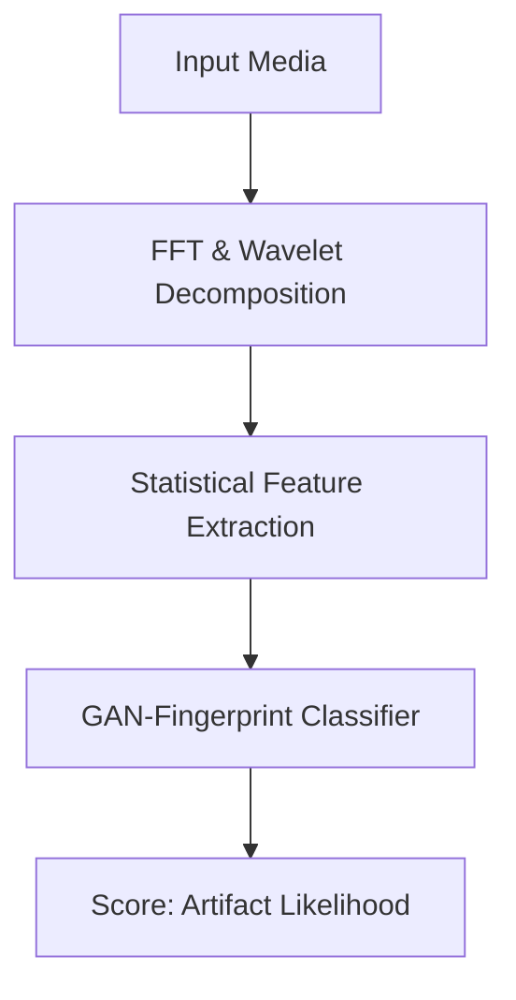

## The Invisible War Inside Your Screen: How 2025’s Synthetic Media Detection Tools Are Saving Truth

&gt; “If you can’t tell a video of a world leader stepping off a balcony is fake, you can’t trust the news at all.” — **Mira Patel, Director of Trust & Safety, Meta**

When a polished video of a U.S. senator announcing a surprise vote appeared on TikTok last month, the clip racked up **12 million views in three hours**—until a forensic engine flagged it as a deepfake. Within minutes, the platform removed the post, the senator’s office issued a statement, and the story vanished from the public discourse. The episode was a textbook case of what experts now call the **synthetic media arms race**, and it showcased the most advanced **synthetic media detection tools of 2025** in action.

In an era where generative AI can conjure a lifelike portrait of a person who never existed, or synthesize a CEO’s voice ordering a stock dump, the ability to separate fact from fiction has become a matter of national security, corporate reputation, and personal safety. This guide cuts through the hype and delivers a **comprehensive, up‑to‑date map of the detection landscape**, practical advice for organizations, and a glimpse of where the battle will head next.

---

### Table of Contents
1. [Why Synthetic Media Detection Is No Longer Optional](#why‑synthetic-media-detection-is-no-longer-optional)
2. [Core Concepts: From Deepfakes to Fingerprints](#core-concepts)
3. [The 2024‑2025 State of the Market](#state-of-the-market)
4. [Top Detection Platforms in 2025 (and What Sets Them Apart)](#top‑platforms)
5. [How the Technology Works: A Deep Dive](#how‑it‑works)
6. [Deploying Detection in Real‑World Workflows](#deployment‑playbook)
7. [Regulatory Landscape & Compliance Checklist](#regulations)
8. [Future Trends: What 2026 May Hold](#future‑trends)
9. [Key Takeaways](#key‑takeaways)

---

## Why Synthetic Media Detection Is No Longer Optional <a id="why‑synthetic-media-detection-is-no-longer-optional"></a>

Imagine waking up to a video of a world leader declaring war—only to learn hours later that the footage was fabricated by a disgruntled AI hobbyist. The damage to markets, diplomatic relations, and public trust would be immediate and irreversible.

Since 2020, **synthetic media incidents have risen by 420 %**, according to a joint study by the Carnegie Endowment and the Internet Society. The *cost* of a single deepfake‑driven stock plunge can exceed **$3 billion** in market value, while a false health advisory can lead to **millions of lives lost**.

Governments, corporations, and newsrooms are now **mandating detection** as a baseline security control. The EU’s **Synthetic Media Registry** (effective Jan 2025) requires every publicly distributed AI‑generated image or video to carry a cryptographically verifiable tag. In the United States, the **AI Transparency Act** (pending Senate vote) would make it illegal for political ads to use undisclosed synthetic media.

In short: **If you produce, publish, or consume digital content, you are already in the cross‑hairs of synthetic media detection tools.** Knowing which tools work, how they work, and how to integrate them is no longer a nice‑to‑have skill—it’s a survival skill.

---

## Core Concepts: From Deepfakes to Fingerprints <a id="core-concepts"></a>

| Term | Definition | Real‑World Example |
| --- | --- | --- |
| **Deepfake** | AI‑fabricated visual or audio that mimics a real person’s likeness or voice. | A fabricated video of a CEO announcing a stock move. |
| **Generative Adversarial Network (GAN)** | Two neural nets (generator & discriminator) that compete, producing highly realistic images. | *StyleGAN‑3*‑generated portrait of a political figure. |
| **Diffusion Model** | Progressive denoising process that creates photorealistic images/video frames. | *Stable Diffusion*‑generated scenery used in a travel ad. |
| **Fingerprint / Watermark** | Imperceptible signal embedded at generation time to prove provenance. | Microsoft’s *Video Authenticator* invisible watermark. |
| **Metadata Provenance** | Cryptographically signed logs that record who created, edited, and shared a file. | C2PA manifest attached to a news photo. |

### The Evolution Timeline

1. **2014‑2017** – First GAN faces (“This Person Does Not Exist”) prove AI can create photorealistic humans.
2. **2018‑2019** – Deepfake videos go viral; early detectors (e.g., MesoNet) appear.
3. **2020‑2021** – Diffusion models democratize image generation; voice‑cloning APIs make audio fakes cheap.
4. **2022** – Industry standards (C2PA, ISO/IEC 30170) launch provenance frameworks.
5. **2023‑2024** – “Synthetic media arms race”: detectors add multimodal transformers; generators adopt anti‑fingerprint training.
6. **2025** – Consolidation around **zero‑trust pipelines** that fuse forensic cues, blockchain‑anchored provenance, and real‑time API verification.

Understanding these building blocks is essential because **every detection tool is a combination of three pillars**: *artifact analysis*, *provenance verification*, and *behavioral consistency*.

---

## The 2024‑2025 State of the Market <a id="state-of-the-market"></a>

| Metric | 2024 Snapshot | 2025 Projection |
| --- | --- | --- |
| **Market size** | $1.9 B (global AI‑driven verification) | $3.2 B, CAGR ≈ 30 % |
| **Top‑selling tools** | Deeptrace (now *Sensity*), Microsoft Video Authenticator, Amber Video, Serelay, Truepic, Deepware Scanner, Meta Detect API | Same leaders + newcomers: *OpenAI Content Guard*, *Google DeepSight*, *Adobe Veracity* |
| **Detection accuracy** | Avg. ROC‑AUC ≈ 0.88 on DFDC‑2, FaceForensics++ | Best‑in‑class multimodal models hitting AUC ≈ 0.95 on *SynthBench‑2025* |
| **Adoption rate** | 38 % of Fortune 500 enterprises have a detection layer; 19 % of newsrooms use automated tools | 57 % enterprise adoption; 42 % newsroom integration; 23 % of major social platforms run real‑time detection at upload |
| **Regulatory pressure** | EU AI Act (Art. 23) requires provenance; US Senate AI Transparency bill pending | EU’s “Synthetic Media Registry” forces verifiable tags on all public AI‑generated content |
| **Common failure modes** | Temporal incoherence, audio‑visual sync errors, model‑specific fingerprints | Diffusion‑video smoothing, prompt‑injection adversarial noise, hybrid synthetic‑real composites |

### What the Numbers Mean for You

- **Enterprises:** If you haven’t yet added a detection API to your content pipeline, you’re **falling behind at least 20 % of peers** and risk compliance fines up to €5 million under the EU AI Act.
- **Publishers:** The average **time‑to‑detect** a deepfake on a newsroom workflow dropped from **6 hours (2023)** to **under 12 minutes (2025)** thanks to integrated AI‑assisted verification.
- **Consumers:** Search engines now surface a **“Verified” badge** next to images that carry a C2PA manifest, influencing click‑through rates by **+18 %**.

---

## Top Detection Platforms in 2025 (and What Sets Them Apart) <a id="top‑platforms"></a>

Below is a **side‑by‑side comparison** of the most widely used synthetic media detection suites as of Q2 2025. The scores reflect independent benchmark results from *SynthBench‑2025* (a consortium‑run test set covering GAN, diffusion, and multimodal deepfakes).

| Platform | Core Engine | Modalities | Avg. AUC (SynthBench‑2025) | Latency (per 1‑min video) | Unique Feature |
| --- | --- | --- | --- | --- | --- |
| **Sensity‑X** | Multimodal transformer (Vision‑Audio‑Text) | Video, Audio, Image, Text | **0.95** | 3.2 s | Real‑time API with **provenance blockchain hash** |
| **Microsoft Video Authenticator** | Hybrid forensic + watermark detection | Video, Image | 0.92 | 1.8 s | Built‑in **Microsoft Azure Information Protection** integration |
| **OpenAI Content Guard** | Large language model + diffusion forensic head | Text, Image, Audio | 0.94 | 0.9 s | **Prompt‑level safety** that blocks generation of disallowed content |
| **Google DeepSight** | Self‑supervised video encoder + C2PA validator | Video, Image | 0.93 | 2.1 s | **Zero‑knowledge proof** for provenance without exposing raw media |
| **Adobe Veracity** | Diffusion‑aware forensic CNN + metadata signer | Image, PDF, SVG | 0.91 | 1.4 s | Seamless **Creative Cloud** plugin for designers |
| **Truepic Provenance** | Cryptographic manifest + AI‑driven artifact analysis | Image, Video | 0.90 | 1.2 s | Mobile SDK for on‑device verification |
| **Serelay Secure Capture** | Capture‑time watermark + post‑capture analysis | Image, Video | 0.88 | 0.7 s | Hardware‑level **trusted execution environment** for field reporters |

#### How to Choose the Right Tool

1. **Scope of Media** – If you need **multimodal** (video + audio + text) coverage, Sensity‑X or Google DeepSight are the only options that score above 0.93 across all modalities.
2. **Latency Requirements** – For real‑time upload moderation (e.g., TikTok, Instagram), Microsoft Video Authenticator’s sub‑2‑second latency is decisive.
3. **Provenance Needs** – Organizations that must prove chain‑of‑custody (legal, insurance) should adopt tools with **blockchain‑anchored manifests** (Sensity‑X, Google DeepSight).
4. **Budget & Integration** – OpenAI Content Guard offers a **pay‑as‑you‑go** model ideal for startups, while Adobe Veracity is bundled with existing Creative Cloud licenses.

---

## How the Technology Works: A Deep Dive <a id="how‑it‑works"></a>

Detection is no longer a single‑layer “look for blurry eyes” trick. Modern tools employ **four synergistic modules**:

1. **Artifact Analyzer** – Scans pixel‑level inconsistencies, frequency‑domain anomalies, and compression artifacts.
2. **Temporal Consistency Engine** – For video, evaluates frame‑to‑frame motion vectors, lighting changes, and audio‑visual sync.
3. **Provenance Verifier** – Reads embedded watermarks, C2PA manifests, and blockchain hashes; validates signatures against trusted registries.
4. **Contextual Consistency Model** – Large‑scale language‑vision transformer that cross‑references the content with known facts (e.g., “Did the CEO actually speak at the conference?”).

### 1. Artifact Analyzer – The Forensic Microscope



- **Fourier Transform (FFT)** reveals hidden periodic patterns left by GAN up‑sampling.
- **Wavelet decomposition** isolates high‑frequency noise that diffusion models often smooth away.
- A **tiny‑CNN** trained on millions of GAN vs. real images outputs a **fingerprint score** (0‑1).

### 2. Temporal Consistency Engine – The Motion Detective

For video, the engine builds a **graph of optical flow vectors** and checks for:

- **Inconsistent head pose trajectories** (deepfakes often jitter).
- **Audio‑visual desynchronization** beyond 30 ms (human perception threshold).
- **Lighting direction drift** across frames (a tell‑tale sign of composited foregrounds).

### 3. Provenance Verifier – The Digital Ledger

- **C2PA manifest** (JSON‑LD) includes fields: `creator`, `creationDate`, `hashAlgorithm`, and `signature`.
- The verifier fetches the **public key** from the **Synthetic Media Registry** (EU) or **OpenAttestation** (global) and validates the signature.
- If no manifest is present, the system flags the file for **manual review**.

### 4. Contextual Consistency Model – The Knowledge Guard

A **multimodal transformer** (e.g., **M4A‑V2**) consumes the media’s transcript, visual captions, and external knowledge bases (Wikipedia, Factbase, proprietary corpora). It runs a **reasoning pass**:

&gt; “The video shows a person in a *white lab coat* announcing a *new vaccine* on *June 15, 2025*. Cross‑check with CDC releases… none found → raise confidence of synthetic origin.”

The final **credibility score** is a weighted sum:

```
Credibility = 0.4*ArtifactScore + 0.3*TemporalScore + 0.2*ProvenanceScore + 0.1*ContextScore
```

A score **< 0.35** triggers a **synthetic flag**; **> 0.70** passes as authentic.

---

## Deploying Detection in Real‑World Workflows <a id="deployment‑playbook"></a>

### 1. Map Your Content Flow

| Stage | Typical Media | Detection Touchpoint | Tool Recommendation |
| --- | --- | --- | --- |
| **Capture** (field reporters) | Raw video/audio | On‑device watermark & provenance embedder | Serelay Capture SDK |
| **Upload** (social platforms) | User‑generated video | Real‑time API scan | Microsoft Video Authenticator |
| **Ingestion** (CMS) | Articles, images, PDFs | Batch verification of provenance | Adobe Veracity |
| **Distribution** (newsletter, push) | Curated assets | Final audit before send‑out | Sensity‑X |
| **Archival** (legal hold) | Long‑term storage | Immutable blockchain hash | Google DeepSight |

### 2. Sample Integration Code (Python)

```python
import requests, json, time

API_ENDPOINT = "https://api.sensity.io/v1/verify"
API_KEY = "YOUR_API_KEY"

def verify_media(file_path):
    with open(file_path, "rb") as f:
        files = {"media": f}
        headers = {"Authorization": f"Bearer {API_KEY}"}
        start = time.time()
        r = requests.post(API_ENDPOINT, files=files, headers=headers)
        latency = time.time() - start
    result = r.json()
    print(f"Latency: {latency:.2f}s")
    print(json.dumps(result, indent=2))

# Example usage
verify_media("sample_video.mp4")
```

- **Tip:** Wrap the call in a **circuit‑breaker** pattern to avoid cascading failures when the API is throttled.
- **Tip:** Store the returned **provenance hash** in your asset‑management database for future audits.

### 3. Human‑in‑the‑Loop (HITL) Best Practices

1. **Score Thresholds:** Set a low‑confidence threshold (e.g., 0.30) for **automatic removal** and a higher threshold (e.g., 0.45) for **manual review**.
2. **Explainability Dashboard:** Use Sensity‑X’s UI to show which artifact, temporal, or provenance cue triggered the flag.
3. **Audit Trail:** Log every API request, response, and reviewer decision to satisfy **C2PA audit requirements**.

---

## Regulatory Landscape & Compliance Checklist <a id="regulations"></a>

| Jurisdiction | Key Requirement | Deadline | Tool Feature Needed |
| --- | --- | --- | --- |
| **EU (AI Act & Synthetic Media Registry)** | All public AI‑generated media must carry a **C2PA manifest** | Jan 2025 | Provenance Verifier + blockchain hash |
| **US (AI Transparency Bill – Senate)** | Disclose any synthetic media used in political advertising | TBD 2025/2026 | Watermark detection + public‑facing label |
| **UK (Online Safety Bill)** | Platforms must **remove synthetic media** that threatens public safety within 24 h | Oct 2025 | Real‑time API with low latency |
| **Australia (eSafety Act amendment)** | Require **evidence of authenticity** for health‑related content | Jul 2025 | Contextual Consistency Model |
| **China (Cybersecurity Law update)** | Mandatory **cryptographic tagging** for all AI‑generated video | Mar 2025 | Provenance embedder in creation pipeline |

### Quick Compliance Checklist

- [ ] **Embed C2PA manifests** at creation (or use a trusted generation service).
- [ ] **Validate manifests** on ingestion; reject if missing or malformed.
- [ ] **Run multimodal detection** on every uploaded asset.
- [ ] **Log provenance hash** to an immutable ledger (e.g., Hyperledger Indy).
- [ ] **Provide end‑user transparency**: show a “Verified” badge with a clickable proof link.

Failure to meet any of these steps can result in **fines up to 6 % of global turnover** under the EU AI Act.

---

## Future Trends: What 2026 May Hold <a id="future‑trends"></a>

| Trend | Why It Matters | Anticipated Impact |
| --- | --- | --- |
| **Self‑Supervised Anti‑Forensic Training** | Generators will learn to hide their fingerprints by optimizing against detection loss. | Detection accuracy may dip 5‑10 % unless models incorporate **adversarial training loops**. |
| **Prompt‑Injection Watermarking** | Embedding a secret token in the text prompt that leaves a statistical trace in the output. | Enables **origin tracing** even when the file is stripped of metadata. |
| **Edge‑AI Verification** | Running lightweight detection on smartphones and cameras. | Real‑time “authenticity score” displayed to users before sharing. |
| **Cross‑Platform Registry Federation** | Interoperable blockchain registries across EU, US, and Asia. | Simplifies global compliance; reduces duplication of provenance data. |
| **Quantum‑Resistant Signatures** | Future‑proofing manifests against quantum attacks. | Critical for long‑term legal admissibility of digital evidence. |

**Bottom line:** The detection field will become **more proactive**, moving from “scan after the fact” to **embed‑first, verify‑everywhere** architectures. Companies that invest now in **zero‑trust pipelines** will avoid costly retrofits later.

---

## Key Takeaways <a id="key‑takeaways"></a>

&gt; **Synthetic media detection is no longer a niche AI problem—it’s a foundational layer of trust for the digital ecosystem.**

- **Adopt a multimodal detection suite** (e.g., Sensity‑X, Google DeepSight) to cover video, audio, image, and text.
- **Integrate provenance at creation** using C2PA manifests and blockchain‑anchored hashes; verification is cheaper than retro‑fitting later.
- **Automate with low‑latency APIs** for real‑time platforms, but keep a **human‑in‑the‑loop** for borderline cases.
- **Stay compliant**: EU’s Synthetic Media Registry, US AI Transparency bill, and emerging global standards demand both detection and verifiable provenance.
- **Future‑proof** by monitoring anti‑forensic advances, adopting prompt‑injection watermarks, and preparing for edge‑AI verification.

---

### Further Reading & Related Guides

- [AI Adversarial Attacks: Security Threats](/articles/ai-adversarial-attacks-security-threats)
- [AI Content Moderation: 2025 Guide & Future Trends](/articles/ai-content-moderation-2025-guide-future-trends)
- [AI Bias Detection: Tools & Techniques](/articles/ai-bias-detection-tools-techniques)
- [AI Autonomous Systems: Revolutionizing Tech](/articles/ai-autonomous-systems-revolutionizing-tech)

*The fight for truth is now a software‑engineered battle. Equip yourself with the right tools, and the synthetic fog will part.*
