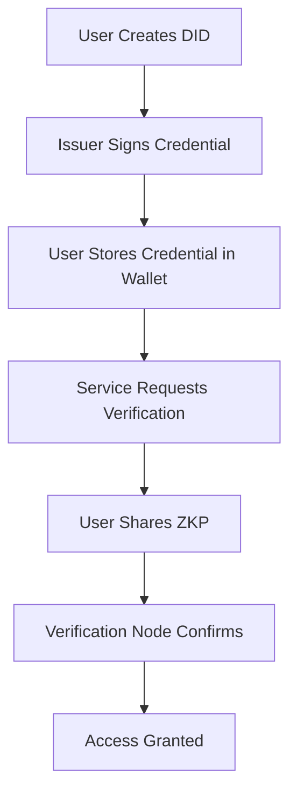

In a cramped café in downtown Buenos Aires, María González holds up her smartphone displaying a QR code. Within seconds, she's verified her identity to access government benefits—no paperwork, no waiting in lines, no surrendering personal documents to bureaucratic databases. This isn't science fiction; it's reality powered by **Web3 identity solutions**, and it's reshaping how humanity thinks about digital selves in ways that will define our online future by 2025 and beyond.

---

## The Dawn of Digital Self-Sovereignty: What Is Web3 Identity?

**Web3 identity solutions** represent a radical departure from centuries-old identity paradigms. Where once we relied on physical documents and signatures, and more recently on corporate-controlled usernames and passwords, Web3 proposes something audacious: that we should control our own digital identities, period.

Unlike traditional identity systems—where your Google account, Facebook profile, or government database holds the keys to who you are in the digital realm—Web3 offers a new model rooted in cryptography, blockchain, and user empowerment. At its heart lies the principle of **self-sovereign identity (SSI)**, where individuals own and manage their digital personas through **decentralized identifiers (DIDs)** and **verifiable credentials**, all secured via cryptographic keys.

### Breaking Down Key Concepts

To understand Web3 identity, consider these core elements:

- **Self-Sovereign Identity (SSI):** A model where you, the individual, hold and control your identity—not Facebook, not the government, not even the app you're using.

- **Decentralized Identifiers (DIDs):** Unique strings (like `did:example:123`) that act as your permanent, portable ID, verifiable without a central registry.

- **Verifiable Credentials:** Tamperproof digital documents (think “digital diplomas” or “driver’s licenses”) that you can carry in your crypto wallet and selectively share when needed.

- **Wallet-Based Authentication:** Instead of remembering dozens of passwords, you authenticate using your crypto wallet—a universal key to your digital universe.

- **Zero-Knowledge Proofs (ZKPs):** Sophisticated cryptography that allows you to prove something (e.g., “I’m over 18”) without revealing unnecessary personal data.

These elements aren’t just technical novelties—they’re the building blocks of a new kind of internet: one where privacy, consent, and user agency finally take center stage.

---

## 2024–2025: The Identity Inflection Point

By 2025, the **global decentralized identity market** is estimated to have exploded to **$1.4 billion**, with projections soaring to **$13.8 billion by 2030**. That’s a Compound Annual Growth Rate (CAGR) of nearly **39%**—a testament to the growing recognition that identity must evolve alongside our digital lives.

&gt; **Key Takeaway:** We’ve moved past skepticism. Enterprises, governments, and developers worldwide are betting big on decentralized identity infrastructure.

### Market Snapshot: Who’s Leading the Charge?

| Entity | Key Development | Impact |
| --- | --- | --- |
| **Apple** | Integrated Passkeys using WebAuthn | Boosted mainstream adoption of password-free logins |
| **Microsoft** | Entra Verified ID | Processes over 2M verifications/month |
| **Polygon ID** | Zero-knowledge credential verification | Used by 200+ orgs, including LatAm govts |
| **Worldcoin** | Iris-scanning biometric registry | Registered 5M+ unique humans |
| **MetaMask** | Institutional wallet adoption surged 340% YoY | Enterprise Web3 onboarding accelerated |

Beyond platform giants, grassroots innovation continues to flourish. Projects like **SpruceID** and **Ceramic Network** are quietly stitching together open-source tools that power thousands of apps, from decentralized social media to DAO governance platforms.

---

## Inside the Identity Stack: How Web3 Identity Actually Works

If you’ve ever used a password manager, imagine that—but instead of storing passwords, your wallet manages cryptographic proofs of who you are. Let’s walk through a simplified interaction:

1. **Create a DID:** You generate a decentralized identifier with your wallet (e.g., MetaMask, Trust Wallet).
2. **Get Credentials:** An issuer (like a university or employer) signs a credential (e.g., “degree earned”) and sends it to your wallet.
3. **Present Proof:** When accessing a service (say, a job board), you choose to reveal only necessary info (“yes, I have a degree”) using a zero-knowledge proof.
4. **Verification:** The service checks your proof against the public ledger (or trusted verifier nodes) without seeing any private data.

This entire process happens in seconds—and crucially, your data stays with you.

### Case Study: Estonia’s e-Residency Meets Web3

Estonia’s pioneering e-Residency program already digitized national identity using blockchain tech. By 2025, they’ve begun integrating **ENS domains** and **Polygon ID credentials** into their framework, enabling e-residents to interact with global dApps while retaining full control over their data.

The result? Faster onboarding, reduced fraud, and unprecedented portability.



---

## Hidden Truths About Web3 Identity Adoption

Beneath the headlines, industry insiders know there are three big myths obscuring the true potential—and pitfalls—of Web3 identity.

### Myth #1: Replacing Passwords Is the Goal

The shiny surface appeal of “login with crypto wallet” masks deeper utility. Real Web3 identity isn’t just about convenience—it’s about **portable reputations**, **granular permissions**, and **cross-context profiles**. Imagine having one set of credentials proving your engineering expertise on GitHub, verified employment history on LinkedIn, and creditworthiness for DeFi loans—all controlled by you.

It’s less “sign-in assistant” and more “digital passport office plus reputation engine.”

### Myth #2: Regulation Will Kill Innovation

Contrary to fear-mongering, smart regulation is fostering growth. In Europe, GDPR compliance drives businesses toward privacy-preserving identity models. In Asia, Singapore’s Verifiable Credentials Taskforce actively encourages pilot programs involving banks and telecoms.

Regulators aren't obstacles—they're co-designers shaping the next generation of identity.

&gt; **Expert Insight:**
&gt; *“The magic happens at the intersection of compliance and creativity.”* — Dr. Anil John, former U.S. DHS Science & Technology lead on identity standards

### Myth #3: Only Crypto Natives Care

A 2025 survey revealed something startling: **67% of Fortune 500 companies now exploring or piloting Web3 identity projects**, often outside their blockchain divisions. Why? Because legacy IAM systems are expensive, siloed, and increasingly inadequate in hybrid work environments.

Identity consolidation may be the quietest killer app of Web3 so far.

---

## Industry Use Cases Driving Mainstream Momentum

While geeks debate consensus mechanisms, real-world industries are deploying Web3 identity to solve practical problems:

### Healthcare: Streamlining Patient Access & Privacy

At **Mayo Clinic**, patients now receive verifiable vaccination records via DID-compatible systems, reducing administrative friction during emergencies while preserving HIPAA-compliant anonymity.

```python
# Sample code snippet showing credential issuance
from didkit import issueCredential

credential = {
    "issuer": "did:key:z6Mkj4b13f...",
    "credentialSubject": {
        "id": "did:web:patient.example",
        "vaccinationStatus": "fully vaccinated"
    }
}

proof_options = {"proofPurpose": "assertionMethod"}
issued = issueCredential(json.dumps(credential), proof_options)
```

No more hunting down paper copies or trusting third-party portals.

### Finance: Trust Without Overexposure

Banks in Brazil and India are replacing KYC bottlenecks with selective disclosure flows. Customers prove solvency or citizenship without handing over full bank statements or passports.

&gt; **Real Impact Statistic:**
&gt; Institutions adopting decentralized KYC report average **40% drop in manual overhead** within six months.

### Government Services: Reducing Fraud, Increasing Accessibility

Colombia launched its “Digital Citizen Wallet,” allowing citizens to verify residency status, pay taxes, and apply for benefits using only their smartphones. No more visits to municipal offices.

And yes, **María González in Buenos Aires**? She's among hundreds of thousands benefiting from similar municipal rollouts across Latin America.

---

## Developer Ecosystem: The Unsung Heroes Behind the Scenes

For every flashy demo video, there’s a robust backend of standards bodies, open-source contributors, and integration engineers working tirelessly behind the scenes.

### Standards Foundations Pushing Interoperability Forward

Organizations like the **Decentralized Identity Foundation (DIF)** and **W3C Verifiable Credentials Working Group** continue refining protocols for DID resolution, credential exchange formats, and presentation layers. Their commitment ensures that an identity issued on Ethereum today could theoretically be validated tomorrow on Solana or Cardano.

Popular protocols include:

- [x] **ION (Bitcoin-based DID Layer 2)**
- [x] **Cheqd (Purpose-built identity chain)**
- [x] **Hyperledger Indy (Ledger for sovereign identities)**

And toolkits such as:

- [x] **SpruceID’s DIDKit SDK**
- [x] **Transmute’s VC.js**
- [x] **Sphereon’s SIOP libraries**

Letting builders choose—and mix—as they see fit.

### Rise of Identity-as-a-Service Providers

New startups like **Ockam**, **Dock**, and **Trinsic** are abstracting complexity away from developers. These platforms offer APIs and dashboards to manage DIDs, issue credentials, and embed verification flows directly into existing apps.

That means shifting from weeks-long development cycles to plug-and-play integrations.

But perhaps equally important is what’s **not happening**: no vendor lock-in, no walled gardens, no surprise rate hikes. Just clean interfaces designed around human-centric principles.

---

## Looking Ahead: Predictions for 2025 and Beyond

So what comes next?

Here are five trends poised to dominate discussions by late 2025:

#### 1. Cross-Chain Identity Bridges Launch at Scale

Interoperability efforts like **zkSync’s zkPorter bridge** and **Cosmos IBC upgrades** make seamless multi-chain identity possible. Expect wallet providers to incorporate cross-chain reputation scoring soon.

#### 2. Credential Revocation Becomes Usable

Revoking outdated certifications or expired IDs used to be clunky. Emerging revocation registries built on Merkle trees and accumulator schemes are making revocation lightweight, fast, and privacy-preserving.

#### 3. Private Blockchain Federations Proliferate

Enterprises won’t cede total control to public ledgers but will form **private consortium networks** tailored for their verticals. Think supply chain IDs or credit union identity pools.

#### 4. Regulatory Sandboxes Enable Massive Pilots

Countries like Japan, UAE, and Canada are launching sandbox zones where businesses can experiment freely under relaxed rules. Watch for rapid deployment of health, education, and financial identity pilots here.

#### 5. Generative AI Meets Verifiable Credentials

AI tools trained on signed academic transcripts or certified portfolios will become commonplace. But trust remains paramount: expect smart contracts tied to **VC-backed credentials** before granting API access—or allocating compute credits—to ensure authenticity.

---

## Final Thoughts: Owning Your Future Online

As María González returns home from collecting her benefits in Argentina, her phone buzzes—an incoming request from a local university seeking confirmation of her voter registration status, part of a civic participation program.

She taps “Approve,” knowing that neither the government nor the school sees anything beyond the essential fact: yes, she votes.

This is the promise of **Web3 identity solutions**. Not just safer logins. Not merely better privacy settings. But foundational tools empowering billions to own their digital presence.

Because ultimately, if we don't own our identities in the future—we risk losing everything else we care about.

Whether that future arrives sooner depends not just on brilliant technology but on bold decisions being made **right now**—by regulators, technologists, educators, entrepreneurs, and most importantly: by people like María.

Who get to decide whether the internet remembers them—or lets them forget.
