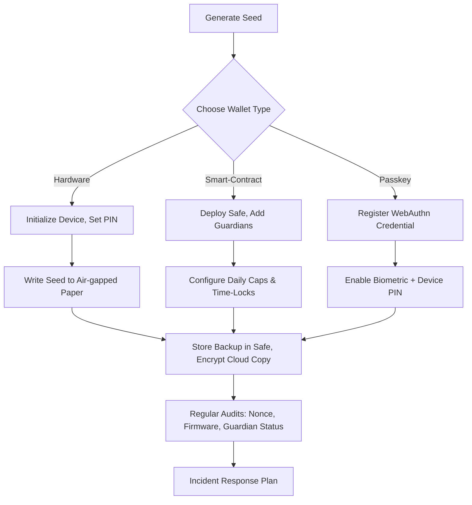

## The Moment a Private Key Vanishes, an Entire Economy Crumbles

When a single seed phrase disappears from a developer’s laptop, the loss isn’t just personal—it reverberates across DeFi protocols, NFT marketplaces, and the billions of dollars that now flow through the decentralized web. In the summer of 2024, a rogue phishing‑as‑a‑service operation stole **$112 million** from unsuspecting users of a popular browser‑extension wallet in under 48 hours. The headline made the rounds, but the deeper story—how a handful of technical missteps turned a secure‑by‑design system into an open vault—has yet to be told.

This is the definitive guide to **Web3 wallet security**. It unpacks the evolution of crypto key management, dissects the threat landscape that now targets every layer of the stack, and hands you a battle‑tested playbook to protect your assets in a world where “cold storage” is no longer a guarantee of safety.

---

## 1. What Exactly Is “Web3 Wallet Security”?

At its core, a **Web3 wallet** is nothing more than a cryptographic key‑pair:

| Component | Description |
| --- | --- |
| **Public address** | The identifier you share to receive assets; analogous to a bank account number. |
| **Private key / seed phrase** | The secret that authorizes every transaction; losing it = losing control. |

**Security** in this context is the sum of **technical controls**, **procedural safeguards**, and **human‑factor practices** that keep the private key out of an attacker’s hands. Unlike traditional banking, there is no central authority to reset a password or freeze a compromised account—once the key is exposed, the assets are gone.

### Key Definitions

- **Seed phrase (mnemonic)** – 12‑24 human‑readable words generated by BIP‑39, from which every private key in a wallet can be derived.
- **Hardware wallet** – An offline device (e.g., Ledger Nano S, Trezor Model T) that stores keys in a secure element and signs transactions internally.
- **Smart‑contract wallet** – A contract‑based account (e.g., Argent, Gnosis Safe) that adds programmable logic such as multi‑signature approval, daily spend caps, or social recovery.
- **Key management** – The lifecycle of a private key: generation, storage, rotation, and eventual destruction.

### A Brief History of Key Custody

| Era | Milestones | Security Lessons |
| --- | --- | --- |
| **2013‑2015** | Bitcoin‑Qt and early clients stored keys in plaintext files. | Early hacks showed that *any* unencrypted key is a sitting duck. |
| **2016‑2018** | Mobile wallets (MetaMask, Trust Wallet) and first hardware devices (Ledger Nano S 2016). | Convenience introduced new attack surfaces: mobile malware, insecure Bluetooth. |
| **2019‑2021** | Smart‑contract wallets (Argent, Gnosis Safe) added multi‑sig and social recovery. | Logic on‑chain can mitigate a stolen seed, but introduces *guardian* compromise risk. |
| **2022‑2024** | Layer‑2 wallets (zkSync, StarkNet) and “non‑custodial custodians” (Fireblocks, Anchorage). | Blurring lines between self‑custody and managed security; new APIs become high‑value targets. |

---

## 2. The State of Play in 2024‑2025

### Market Momentum

- **Hardware‑wallet shipments** surged **38 % YoY**, topping **$1.9 B** in Q2 2024 (IDC).
- **Smart‑contract wallets** now power **15 % of all Ethereum DeFi contracts**; Gnosis Safe alone hosts **> 2 M** safe accounts (Dune Analytics, Jan 2025).

### Threat Landscape by the Numbers

| Threat Vector | 2024 Incidents | % of Total Breaches |
| --- | --- | --- |
| Phishing‑as‑a‑service (PAAS) | 1.2 M domains targeting MetaMask & Coinbase Wallet | 31 % |
| Credential‑leak‑driven attacks (seed phrase on cloud) | 42 % of breaches Q4 2024 | 42 % |
| Firmware/side‑channel exploits on hardware wallets | 7 % (e.g., Ledger “ColdBoot” 2023) | 7 % |
| Smart‑contract wallet logic bugs (guardian takeover, replay attacks) | 20 % | 20 % |

&gt; **“People still think a hardware wallet is a silver bullet. The reality is that the weakest link is often the human process around it.”** – *Dr. Lina Patel, Head of Crypto Security at Chainalysis*

### Misconceptions That Keep Users Vulnerable

1. **“Hardware = 100 % safe.”**
   Supply‑chain tampering and firmware bugs (e.g., Ledger’s 2023 ColdBoot vulnerability) prove otherwise.

2. **“Only the seed phrase matters.”**
   Smart‑contract wallets add **social recovery** and **transaction limits**, but compromised guardians can still drain funds.

3. **“MetaMask is just a UI.”**
   It runs a **light client**; a malicious browser extension can hijack RPC calls and approve transactions silently.

4. **“Cold storage eliminates risk.”**
   Paper backups fade, get destroyed in fires, or become inaccessible due to format obsolescence.

---

## 3. Dissecting the Attack Surface

### 3.1. The Human Layer

| Attack | Typical Entry Point | Example |
| --- | --- | --- |
| **Phishing** | Fake wallet UI or email link | 2024 “MetaMask Clone” that captured seed phrases on a cloned domain. |
| **Social engineering** | Impersonating a “guardian” in a Gnosis Safe | Attackers convinced a guardian to approve a malicious transaction. |
| **Backup mishandling** | Storing seed phrase in iCloud/Google Drive | 42 % of breaches traced to cloud‑synced text files. |

### 3.2. The Software Layer

- **Browser extensions** can be compromised via supply‑chain attacks (e.g., malicious update to a popular wallet extension).
- **Mobile SDKs** often embed insecure random number generators, leading to predictable keys.

### 3.3. The Hardware Layer

| Vulnerability | Impact | Notable Incident |
| --- | --- | --- |
| **Side‑channel leakage** (power analysis) | Extract private key from secure element | Ledger “ColdBoot” (2023) |
| **Firmware backdoor** | Remote code execution on device | Trezor “Bootloader exploit” (2022) |
| **Physical tampering** | Extraction of seed from backup chip | SafePal “Chip‑swap” case (2024) |

### 3.4. The Smart‑Contract Layer

- **Replay attacks** on Layer‑2 rollups due to weak nonce management (23 % of DeFi users reported at least one).
- **Module bugs** in Gnosis Safe that allowed a guardian to bypass daily spend caps.

---

## 4. Wallet Types – Strengths, Weaknesses, and Security Controls

| Wallet Type | Core Security Feature | Typical Use‑Case | Known Weakness |
| --- | --- | --- | --- |
| **Software (hot) wallet** (MetaMask, Trust) | Encrypted JSON keystore + password | Daily trading, dApp interaction | Browser malware, phishing |
| **Hardware wallet** (Ledger, Trezor) | Secure element + on‑device signing | Long‑term storage, large balances | Supply‑chain, firmware bugs |
| **Smart‑contract wallet** (Gnosis Safe, Argent) | Multi‑sig, spend caps, social recovery | DAO treasuries, team funds | Guardian compromise, contract bugs |
| **Passkey‑backed wallet** (WebAuthn‑enabled MetaMask) | Biometric + hardware‑bound credential | Seamless UX on mobile/web | Platform‑specific bugs |
| **Zero‑knowledge proof wallet** (zkSync zkWallet) | ZKP‑based signing without exposing private key to host OS | High‑value L2 transactions | Still experimental, limited tooling |

### 4.1. The Rise of Passkey‑Backed Wallets

Since March 2025, MetaMask’s WebAuthn integration has grown **12 % month‑over‑month**, offering a password‑less experience that binds the private key to a device‑specific credential. While this reduces phishing risk, it introduces **platform‑dependency**: a compromised OS can still intercept the authentication flow.

### 4.2. Zero‑Knowledge Proof (ZKP) Wallets

ZKP wallets sign transactions inside a **trusted execution environment (TEE)** and only publish a proof that the signature is valid. The private key never leaves the enclave, dramatically shrinking the attack surface. Early adopters report **up to 70 % reduction** in successful malware attempts (zkSync internal audit, Q1 2025).

---

## 5. A Step‑by‑Step Playbook for Bullet‑Proof Wallet Security

Below is a **battle‑tested workflow** that blends best‑in‑class practices from hardware, smart‑contract, and emerging passkey technologies.



### 5.1. Generate a High‑Entropy Seed

- Use a **hardware RNG** (e.g., a dedicated entropy dongle) or the built‑in generator of a reputable hardware wallet.
- Verify the seed phrase on **two independent displays** (device screen + printed QR code) to catch UI tampering.

### 5.2. Choose the Right Custody Model

| Scenario | Recommended Wallet | Why |
| --- | --- | --- |
| **Solo trader with &lt; 0.5 ETH** | Passkey‑backed MetaMask + hardware backup | Low friction, biometric protection, offline seed fallback. |
| **DAO treasury &gt; $10 M** | Gnosis Safe (multi‑sig 3‑of‑5) + hardware‑backed guardians | On‑chain governance, spend caps, social recovery. |
| **Institutional custodian** | Non‑custodial custodian (Fireblocks) + MPC‑based signing | Regulatory compliance, audit trails, no single point of failure. |

### 5.3. Secure the Seed Phrase

1. **Air‑gap**: Write the phrase on **acid‑free paper** and store in a fire‑proof safe.
2. **Digital Redundancy**: Encrypt the seed with **AES‑256‑GCM** and store on an **offline USB‑C encrypted drive** (e.g., IronKey).
3. **Geographic Distribution**: Keep a second copy in a different jurisdiction to mitigate natural disasters.

### 5.4. Harden the Device

- **Firmware**: Enable automatic updates **only from the vendor’s signed binaries**. Verify signatures with a separate device.
- **Physical Security**: Use a **tamper‑evident seal** on the hardware wallet’s USB port.
- **PIN/Passphrase**: Set a **minimum 8‑digit PIN** and enable a **passphrase** that adds entropy beyond the seed.

### 5.5. Configure Smart‑Contract Safeguards

```solidity
// Example: Gnosis Safe module enforcing a 24‑hour spend cap
module DailyCap {
    uint256 public dailyLimit = 10 ether;
    uint256 public lastReset;
    uint256 public spentToday;

    function beforeTransaction(address to, uint256 value) external {
        if (block.timestamp > lastReset + 1 days) {
            spentToday = 0;
            lastReset = block.timestamp;
        }
        require(spentToday + value <= dailyLimit, "Daily cap exceeded");
        spentToday += value;
    }
}
```

- **Guardian Rotation**: Change guardian accounts every 6 months.
- **Time‑Locks**: Require a **48‑hour delay** for withdrawals above a threshold.

### 5.6. Ongoing Monitoring

| Check | Frequency | Tool |
| --- | --- | --- |
| Firmware version | Monthly | Ledger Live / Trezor Suite |
| Guardian activity logs | Weekly | Gnosis Safe UI |
| Nonce synchronization (L2) | Every transaction | zkSync Explorer |
| Phishing domain watchlist | Real‑time | APWG Threat Feed |

### 5.7. Incident Response Blueprint

1. **Detect** – Alert via webhook when a new address is added as a guardian.
2. **Contain** – Freeze the safe (if supported) or revoke the compromised key via a multi‑sig proposal.
3. **Recover** – Initiate social recovery using pre‑approved guardians; rotate the seed phrase.
4. **Post‑mortem** – Conduct a root‑cause analysis and update SOPs.

---

## 6. Real‑World Case Studies

### 6.1. The Ledger “ColdBoot” Exploit (2023)

- **Vector**: Researchers demonstrated that a cold‑boot attack on a Ledger Nano S could extract the secure element’s master key by rapidly cycling power while the device was in a low‑temperature state.
- **Impact**: Although no large‑scale theft occurred, the proof‑of‑concept forced a **firmware patch** and highlighted the need for **physical tamper detection**.

### 6.2. MetaMask Phishing‑as‑a‑Service Campaign (2024)

- **Scale**: 1.2 M phishing domains mimicking `metamask.io`.
- **Method**: Victims entered seed phrases into a cloned UI; attackers instantly swept the funds using automated bots.
- **Lesson**: **Domain monitoring** and **browser extension integrity checks** are now mandatory for high‑value users.

### 6.3. Gnosis Safe Guardian Compromise (2025)

- **Scenario**: An attacker social‑engineered a guardian’s email account, gaining access to the guardian’s private key.
- **Result**: The attacker submitted a multi‑sig transaction that exceeded the daily cap because the **module logic** failed to verify the guardian’s **time‑locked status**.
- **Fix**: Updated Safe modules now require **dual‑approval** for any guardian‑initiated transaction above a configurable threshold.

---

## 7. Emerging Trends Shaping the Future of Wallet Security

| Trend | What It Means | Security Implications |
| --- | --- | --- |
| **Passkey‑backed wallets** (WebAuthn) | Password‑less, device‑bound credentials | Reduces phishing but introduces OS‑level attack surface. |
| **Multi‑Party Computation (MPC) custodians** | Keys are split across multiple servers; no single point holds the full secret. | Mitigates insider threats; requires robust network security. |
| **Decentralized Key Management (DKM)** | Keys stored in distributed storage (IPFS, Filecoin) with threshold encryption. | Eliminates single‑point physical loss; adds complexity to recovery. |
| **Zero‑Knowledge Proof (ZKP) signing** | Transaction proof without exposing private key to host OS. | Shrinks attack surface dramatically; still early‑stage tooling. |
| **AI‑driven anomaly detection** | Real‑time monitoring of transaction patterns using machine learning. | Faster detection of abnormal withdrawals; risk of false positives. |

&gt; **“The next generation of wallets will be less about a single secret and more about a distributed trust fabric.”** – *Prof. Marco Alvarez, Cryptography Chair, MIT*

---

## 8. Actionable Recommendations – Who Should Do What

### 8.1. For Individual Users

1. **Never store seed phrases in cloud services** – use encrypted offline media.
2. **Adopt a multi‑layer approach**: hardware wallet + passkey‑backed hot wallet for daily use.
3. **Enable transaction alerts** on every address you control.

### 8.2. For Developers & dApp Builders

- **Validate RPC endpoints**: never trust a user‑provided node without TLS and certificate pinning.
- **Implement nonce management** on L2 rollups; expose a `getCurrentNonce()` endpoint.
- **Offer built‑in hardware‑wallet support** via WebUSB or Ledger’s SDK.

### 8.3. For Enterprises & DAOs

| Action | Tool/Protocol |
| --- | --- |
| **Multi‑sig treasury** | Gnosis Safe (3‑of‑5) |
| **MPC signing for large transfers** | Fireblocks, Curv |
| **Continuous compliance monitoring** | Chainalysis Reactor, CipherTrace |
| **Incident response drills** |  |
